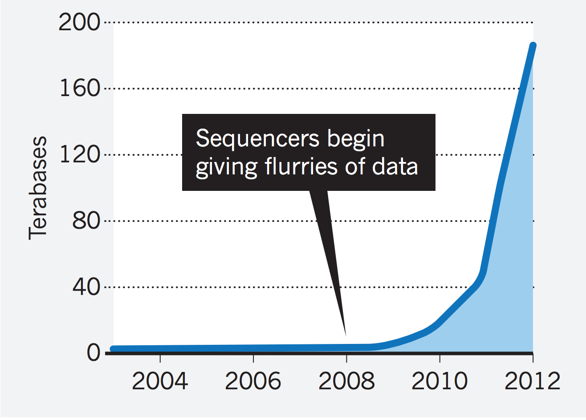
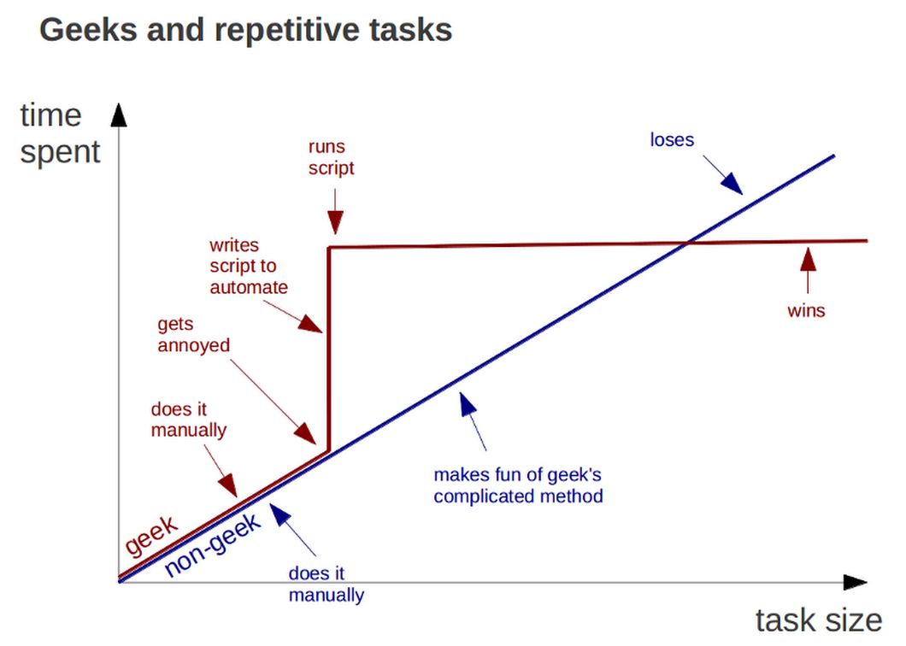
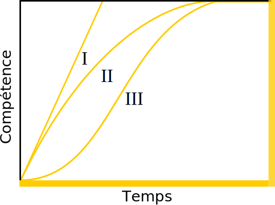
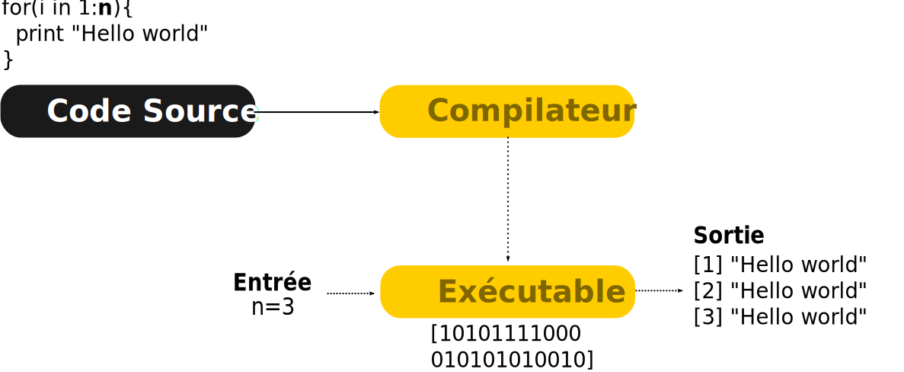

--- .transition

# La place de la programmation en écologie

---

# Des modèles mathématiques simples

Des modèles mathématiques simples:
  - Skelman 1951,
  - Lokta voltera (deux espèces)
  - Gausse

---

# Aujourd'hui

- Incorporer d'avantage d'espèces, échelle spatial et temporelle plus large.
- Un exemple d'étude non réalisable sans programmation (Albouy?)
- KeyNote: Dominique


--- &twocol

# Et demain, la modélisation de la biosphère?

*** =left

</img>

*** =right

- GEM
- Discussion lors de la retraite BOREAS

---

# Progression de la puissance de calcul

<div style='text-align:center;'>
  </img>
</div>

<!-- Ces questions sont rendu possible en partie grâce à l'augmentation de la puissance de nos ordinateurs et l'accessibilité aux données -->

---

# Utilisation en science au quotidien

La programmation est outil indispensable au biologiste 2.0, elle permet:

- Tâches répétitives et/ou complexes (e.g. Nettoyage des données, Simulations stochastiques)
- Visualisation et exploration des données
- Analyses statistiques (e.g. multivariée)

--- &twocol

# La programmation en science

*** =left

## Avantages

- Gain de temps
- Limiter les erreurs
- Formaliser les opérations
- Archiver, reproduire et partager
- Tâches intensives (e.g. en génomique)

*** =right

<div class="caption">Augmentation du volume de données génomiques</div>
</img>
<span style="font-size:small;text-transform:uppercase;text-align:right;">
[Nature 2013](http://www.nature.com/nature/journal/v498/n7453/full/498255a.html)
</span>


---

# Étude de cas: Tableau croisé dynamique


1. Ouvrir le fichier `cor.txt` avec MS Excel ou OpenOffice.
2. Réaliser un tableau de corrélation entre les variables.
$$
r = \frac{\sum (y_1 - \bar{y}_1)(y_2 - \bar{y}_2)/(n-1)}{S_1 \cdot S_2}
$$

### Entête du tableau `cor.txt`

```{r echo=FALSE}
df <- data.frame(x=rnorm(100),y=rnorm(100),z=rnorm(100))
## Matrice de correlation en espèce
head(df)
```
 <!-- TODO: Mettre les données de Sutton -->

---

# La programmation en science


<div style='text-align:center;'>
  </img>
</div>

<!-- L'effort en vaut la peine: Sur le long terme le geek est gagnant -->


--- &twocol

# La programmation en science


*** =left

## Inconvénients

- L'erreur est avant tout humaine, avant d'être informatique
- La courbe apprentissage peut être difficile

*** =right

</img>

<!-- Différente entre les individus -->

--- .transition

# Les languages de programmation

---

# Deux grandes familles de language

1. Les languages compilés
2. Les languages interprétés

---

# 1. Les languages compilés

<div style='text-align:center;'>
  </img>
</div>


---

# 2. Les languages interprétés

<div style='text-align:center;'>
  </img>
</div>


---

# Interprété vs compilé

```{r, results='asis'}

df <- c(' ')

pander::pander()
```


---

# Ajouter de l'info sur les languages

- Arbre d'évolution des languages
- Performance/Benchmark des différents languages

---

# Et en science?


--- .transition

# Le Pseudo-Code

---

# Le `Pseudo-Code` et ses **algorithmes**


## Définitions

- *En programmation, le `pseudo-code` est une façon de formuler un <b>algorithme</b> sans référence à un langage de programmation en particulier.*

> - *Un <b>algorithme</b> est une suite d'actions qui sont réalisées dans un ordre précis par l'ordinateur. C'est une séquence d'étapes dans la résolution d'un problème.*


---

# Le `Pseudo-Code`

## Exemple

```
PROGRAM DEMO
  FOR t IN 1:100
    n_t = n_t * lambda
    PRINT n_t
    IF n_t < 1
      BREAK
    ELSE
      CONTINUE
    END IF
  END FOR
```

Le programme `DEMO` fait croitre une population à un taux $\lambda$ et affiche à l'utilisateur si la population est éteinte ($n_t<1$) ou vivante ($n_t>1$).

---

# Le `Pseudo-Code`

## Exemple

```
PROGRAM DEMO
  FOR t IN 1:100 <------------- Opération itérative
    n_t = n_t * lambda
    PRINT n_t <---------------- Le programme affiche la valeur à l'écran
    IF n_t < 1 <--------------- Opération décisionnelle
      BREAK <------------------ Le programme arrête son éxécution
    ELSE
      CONTINUE <--------------- Le programme continue son éxécution
    END IF
  END FOR
```

Le programme `DEMO` fait croitre une population à un taux $\lambda$ et affiche à l'utilisateur si la population est éteinte ($n_t<1$) ou vivante ($n_t>1$).


---

# Les structures de base d'un algorithme

On retrouve 3 familles d'opérations:

1. Les opérations séquentielles
2. Les opérations itératives (`FOR`, `WHILE`)
3. Les opérations décisionnelles (`IF`, `SWITCH`)

<!-- ---

# Avant-propos

Avant de décrire chacune des opérations d'un algorithme, certaines instructions sont communes:

- `READ`: Le programme lit un fichier
- `WRITE`: Le programme écrit un fichier
- `PRINT`: Le programme écrit un message à l'écran pour l'utilisateur
- `BREAK`: Le programme stop son éxécution
- `CONTINUE`: Le programme continue son éxécution -->

---

# 1. Les opérations séquentielles

## Exemple: Calculer l'aire d'un rectangle

```
PROGRAM REC_AIRE
  READ hauteur
  READ largeur
  WRITE hauteur * largeur
```

C'est une progression linéaire car chaque opération est effectuée l'une après l'autre dans un ordre déterminé.

---

# 2. Les opérations itératives

## Exemple avec `FOR`: Croissance avec capacité de support (K)

```
PROGRAM DEMO
  FOR t IN 1:100
    n_t = n_t * lambda
  END FOR
```

La population va croître pendant 100 pas de temps.

---

# 2. Les opérations itératives

## Exemple avec `WHILE`: Croissance avec capacité de support (K)

```
PROGRAM DEMO
  WHILE n_t < K
    n_t = n_t * lambda
  END WHILE
```

---

# 3. Les opérations décisionnelles

## Exemple avec `IF`: quelques tests sur $\lambda$

```
PROGRAM DEMO
  IF lambda > 0
    PRINT "La population est croissante"
  ELSE lambda < 0
    PRINT "La population est décroissante"
  ENDIF
```

> - Et si le taux de croissance est nulle?

---

# 3. Les opérations décisionnelles

```
PROGRAM DEMO
  IF lambda > 0
    PRINT "La population est croissante"
  IF ELSE lambda < 0
    PRINT "La population est décroissante"
  ELSE
    PRINT "Absence de croissance"
  ENDIF
```

Avec la clause `ELSE`, l'absence de croissance est assumé (non-testé)

---

# Les règles du `pseudo-code`

## A garder en mémoire

1. N'écrivez qu'une seule instruction par ligne de pseudocode.
2. Écrivez en lettres capitales le verbe de chaque opération principale.
3. Soyez explicite en nommant les opérations et les variables.
4. Soyez le plus détaillé possible (c.a.d les plus petites étapes possibles)
5. Utilisez des structures de langages de programmation connus (c.a.d `WHILE`, `FOR`, `IF` etc.)
6. Délimitez les étapes en formant des blocs d'instructions par l'utilisation de l'indentation.


--- .transition

# Exercice
## Ordonner les lettres de Scrabble


--- &twocol

*** =left

Une situation qui peut arriver tous les jours:

1. On jette en face de vous 6 lettres d'un scrabble
2. Un joueur maniac vous demande d'écrire un programme permettant d'ordonner les 6 lettres

*** =right

**Image de scrabble**
