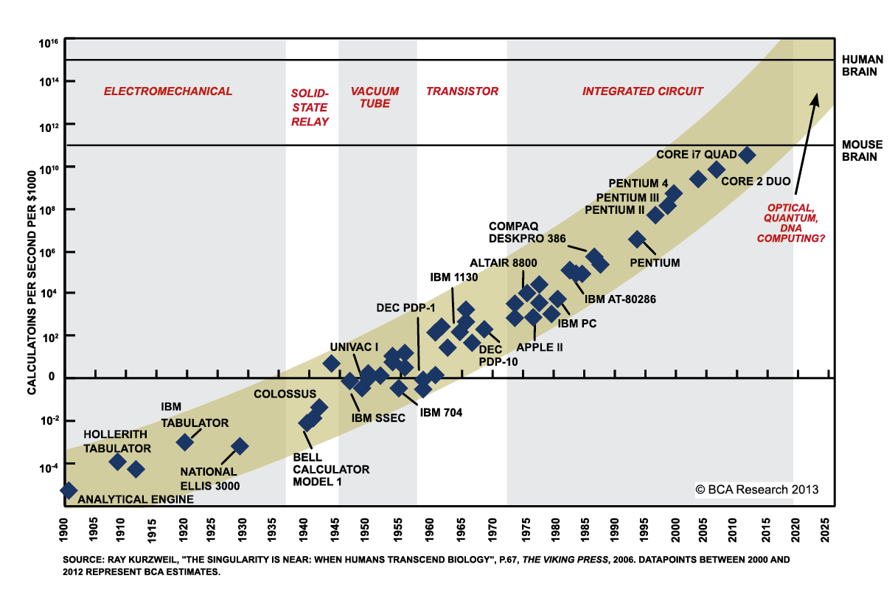

# Introduction

<div style='text-align:center;'>
</img>
</div>

---

# Introduction

<div style='text-align:center;'>
</img>
</div>

---

# Introduction

<div style='text-align:center;'>
</img>
</div>

---

# Introduction

<div style='text-align:center;'>
</img>
</div>

---

# Introduction

<div style='text-align:center;'>
</img>
</div>

---

# Introduction

<div style='text-align:center;'>
</img>
</div>

---

# Introduction

<div style='text-align:center;'>
</img>
</div>

---

# Introduction

<div style='text-align:center;'>
</img>
</div>

---

# Question de recherche

À quelle vitesse se réalisera la migration de l'érable à sucre, et des espèces associées, au sein de la sapinière de montagne du massif des Montagnes vertes ?

---

# Le type de données

```{r}
arbres = read.table(file = './donnees/arbres.txt', header = TRUE, sep=";")
head(arbres)
```

---

# Exercice 1

Ouvrir le fichier [arbres.txt](./donnees/arbres.txt) avec Excel et calculer le nombre d'individus de chaque espèce pour le quadrat 1.

---

# Exercice 1: solution sur R

```{r}
arbres = read.table(file = './donnees/arbres.txt', header = TRUE, sep=";")
quadrats = table(arbres$id_bor,arbres$esp)
head(quadrats)
```

```{r echo=FALSE}
write.table(quadrats, file="./donnees/quadrats.txt",sep=";",quote=TRUE)
```
---

# Exercice 2

Ouvrir le fichier [quadrats.txt](./donnees/quadrats.txt) avec Excel et calculer la corrélation entre toutes les paires d'espèces.

Petit truc: sur Excel, la fonction pour calculer une corrélation est:

```bash
=covariance.pearson(données_1; données_2)
```

---

# Exercice 2: solution sur R

```{r}
quadrats = read.table(file = './donnees/quadrats.txt', header = TRUE, sep= ";")
cor(quadrats)
```

---

# Exercice 2: visualisation sur R

```{r, fig.width= 6, fig.height= 6, fig.align='center'}
plot(quadrats)
```

---

# Objectif général

Au terme de ce cours, l'étudiant sera en mesure de conceptualiser un problème qui requiert de la programmation scientifique et de réaliser des tâches courantes de programmation.

---

# Objectifs spécifiques

1. Charger des données et exporter des résultats d'analyses au moyen du
    logiciel R;
2. Conceptualiser un problème au moyen de pseudo-code;
3. Manipuler des données;
4. Rédiger des fonctions;
5. Programmer des algorithmes afin de réaliser des tâches complexes,
    incluant des boucles et des énoncés conditionnels;
6. Réaliser des simulations de Monte Carlo;

---
# Contenu

1. Introduction et bonnes pratiques de programmation
2. Interagir avec R
3. Les fonctions
4. Algorithmique I: boucles et conditions
5. Alogithmique II: simulations de Monte Carlo

---

# Ce que le cours n'est pas ...

1. Des recettes
2. Un catalogue de fonctions R
3. Un cours de statistiques

---

# Approche

Les connaissances requises pour la programmation scientifique sont
minimales, l'apprentissage porte davantage sur l'acquisition de
compétences et le développement de capacités à la résolution de problèmes.
Les séances seront constituées de courtes leçons magistrales sur des
notions de bases de programmation, entre-coupées d'exercices spécifiques
destinés à pratiquer les éléments enseignés. Les séances se conclueront
sur la réalisation d'un exercice intégrateur à compléter à la maison.

L'ensemble du matériel du cours sera disponible sur un dépôt git à l'adresse :
https://github.com/EcoNumUdS/BIO109.git

---

# Évaluation

L'évaluation porte sur la participation aux exercices (20%) et sur un
travail final (80%). Un exercice simple sera présenté à la fin des
séances 1-4 et chaque étudiant devra remettre la solution de l'exercice sous
forme de script avant le début de la séance suivante. Les exercices
peuvent être réalisés en groupe, mais chaque étudiant devra remettre sa
propre copie, personnalisée. Les points sont attribués pour la
participation.

L'évaluation finale portera sur la réalisation d'un projet de
programmation en équipe de 4 à remettre deux semaines après la fin du
dernier cours, soit au plus tard le **21 février 2017 à 16:00**. La
pénalité sera de 10% par jour de retard. Le rapport final sera évalué à
parti de i) le pseudo-code pour le projet de programmation, ii) le respect
des bonnes pratiques de programmation et iii) la réussite de l'exercice
demandé. Les étudiants devront remettre le script nécessaire à la
réalisation du projet.

--- .transition

# La place de la programmation en écologie

---

# Hier

La dynamique d'une population:

$$
\frac{dN}{dt} = rN(1-\frac{N}{K})
$$

Qui donne pour solution à l'équilibre:

$$
N^* = K
$$

---

# Aujourd'hui

<div style='text-align:center;'>
</img>
</div>

---

# Aujourd'hui

<div style='text-align:center;'>
</img>
</div>

---

# Et demain, la modélisation de la biosphère?
<div style='text-align:center;'>
</img>
</div>

---

# Progression de la puissance de calcul

<div style='text-align:center;'>
  </img>
</div>

<!-- Ces questions sont rendu possible en partie grâce à l'augmentation de la puissance de nos ordinateurs et l'accessibilité aux données -->

---

# Utilisation en science au quotidien

La programmation est outil indispensable au biologiste 2.0, elle permet:

- Tâches répétitives et/ou complexes (e.g. Nettoyage des données, Simulations stochastiques)
- Visualisation et exploration des données
- Analyses statistiques avancées (e.g. tests par permutations, statistiques bayesiennes)

--- &twocol

# La programmation en science

*** =left

## Avantages

- Gain de temps
- Limiter les erreurs
- Formaliser les opérations
- Archiver, reproduire et partager
- Tâches intensives (e.g. en génomique)

*** =right

<div class="caption">Augmentation du volume de données génomiques</div>
</img>
<span style="font-size:small;text-transform:uppercase;text-align:right;">
[Nature 2013](http://www.nature.com/nature/journal/v498/n7453/full/498255a.html)
</span>


---

# La programmation en science


<div style='text-align:center;'>
  </img>
</div>

<!-- L'effort en vaut la peine: Sur le long terme le geek est gagnant -->


--- &twocol

# La programmation en science


*** =left

## Inconvénients

- L'erreur est avant tout humaine, avant d'être informatique
- La courbe apprentissage peut être difficile

*** =right

</img>

<!-- Différente entre les individus -->

--- .transition

# Les langages de programmation

---

# Deux grandes familles de langage

1. Les langages compilés
2. Les langages interprétés

---

# 1. Les langages compilés

<div style='text-align:center;'>
  </img>
</div>

---

# 2. Les langages interprétés

<div style='text-align:center;'>
  </img>
</div>

---

# La performance: un critère pour le choix d'un langage

<div style='text-align:center;'>
  </img>
</div>

---

# Un autre critère est le 'débugging'

<div style='text-align:center;'>
  </img>
</div>

---

# Et en écologie?

--- .transition

# Le Pseudo-Code

---

# Le `Pseudo-Code` et ses **algorithmes**


## Définitions

- *En programmation, le `pseudo-code` est une façon de formuler un <b>algorithme</b> sans référence à un langage de programmation en particulier.*

> - *Un <b>algorithme</b> est une suite d'actions qui sont réalisées dans un ordre précis par l'ordinateur. C'est une séquence d'étapes dans la résolution d'un problème.*


---

# Le `Pseudo-Code`

## Exemple

```
PROGRAM DEMO
  FOR t IN 1:100
    n_t = n_t * lambda
    PRINT n_t
    IF n_t < 1
      BREAK
    ELSE
      CONTINUE
    END IF
  END FOR
```

Le programme `DEMO` fait croitre une population à un taux $\lambda$ et affiche à l'utilisateur si la population est éteinte ($n_t<1$) ou vivante ($n_t>1$).

---

# Le `Pseudo-Code`

## Exemple

```
PROGRAM DEMO
  FOR t IN 1:100 <------------- Opération itérative
    n_t = n_t * lambda
    PRINT n_t <---------------- Le programme affiche la valeur à l'écran
    IF n_t < 1 <--------------- Opération décisionnelle
      BREAK <------------------ Le programme arrête son éxécution
    ELSE
      CONTINUE <--------------- Le programme continue son éxécution
    END IF
  END FOR
```

Le programme `DEMO` fait croitre une population à un taux $\lambda$ et affiche à l'utilisateur si la population est éteinte ($n_t<1$) ou vivante ($n_t>1$).


---

# Les structures de base d'un algorithme

On retrouve 3 familles d'opérations:

1. Les opérations séquentielles
2. Les opérations itératives (`FOR`, `WHILE`)
3. Les opérations décisionnelles (`IF`, `SWITCH`)

---

# Avant-propos

Avant de décrire chacune des opérations d'un algorithme, certaines instructions sont communes:

- `READ`: Le programme lit un fichier
- `WRITE`: Le programme écrit un fichier
- `PRINT`: Le programme écrit un message à l'écran pour l'utilisateur
- `BREAK`: Le programme stop son éxécution
- `CONTINUE`: Le programme continue son éxécution

---

# 1. Les opérations séquentielles

## Exemple: Calculer l'aire d'un rectangle

```
PROGRAM REC_AIRE
  READ hauteur
  READ largeur
  WRITE hauteur * largeur
```

C'est une progression linéaire car chaque opération est effectuée l'une après l'autre dans un ordre déterminé.

---

# 2. Les opérations itératives

## Exemple avec `FOR`: Croissance avec capacité de support (K)

```
PROGRAM DEMO
  FOR t IN 1:100
    n_t = n_t * lambda
  END FOR
```

La population va croître pendant 100 pas de temps.

---

# 2. Les opérations itératives

## Exemple avec `WHILE`: Croissance avec capacité de support (K)

```
PROGRAM DEMO
  WHILE n_t < K
    n_t = n_t * lambda
  END WHILE
```

---

# 3. Les opérations décisionnelles

## Exemple avec `IF`: quelques tests sur $\lambda$

```
PROGRAM DEMO
  IF lambda > 0
    PRINT "La population est croissante"
  ELSE lambda < 0
    PRINT "La population est décroissante"
  ENDIF
```

> - Et si le taux de croissance est nul?

---

# 3. Les opérations décisionnelles

```
PROGRAM DEMO
  IF lambda > 0
    PRINT "La population est croissante"
  IF ELSE lambda < 0
    PRINT "La population est décroissante"
  ELSE
    PRINT "Absence de croissance"
  ENDIF
```

Avec la clause `ELSE`, la croissance est nulle

---

# Les règles du `pseudo-code`

## A garder en mémoire

1. N'écrivez qu'une seule instruction par ligne de pseudo-code.
2. Écrivez en lettres capitales le verbe de chaque opération principale.
3. Soyez explicite en nommant les opérations et les variables.
4. Soyez le plus détaillé possible (c.a.d les plus petites étapes possibles)
5. Utilisez des structures de langages de programmation connues (c.a.d `WHILE`, `FOR`, `IF` etc.)
6. Délimitez les étapes en formant des blocs d'instructions par l'utilisation de l'indentation.

Ces règles sont générales, peu importe le langage de programmation utilisé.

--- .transition

# Les bonnes pratiques en programmation scientifique

---

# Les 10 commandements de la programmation

> <b>1.</b> Tu commenteras ton code pour que d'autres puissent le lire, le comprendre et le partager

---

# Les 10 commandements de la programmation

> <b>2.</b> Il faut prendre soin de l'environnement et nettoyer ses déchets

---

# Les 10 commandements de la programmation

> <b>3.</b> Ton script sera dur à avaler. Mieux vaut le découper

---

# Les 10 commandements de la programmation

> <b>4.</b> Plusieurs chiens s'appelle Fido, le tiens tu sauras le nommer

---

# Les 10 commandements de la programmation

> <b>5.</b> Fido tu éviteras d'écraser

---

# Les 10 commandements de la programmation

> <b>6.</b> Un bon programmeur est paresseux. Les opérations répétées doivent être définies sous forme de fonctions

---

# Les 10 commandements de la programmation

> <b>7.</b> La vie est trop courte, ton code sera optimisé

---

# Les 10 commandements de la programmation

> <b>8.</b> Et un jour tu disparaîtras, alors assure toi que ton code soit reproductible

---

# Les 10 commandements de la programmation

> <b>9.</b> En tout puissant que tu es, le tirage au sort tu pourras répéter

---

# Les 10 commandements de la programmation

> <b>10.</b>  Et dans le passé tu souhaiteras voyager, utilise le contrôle de versions

---

# Google R Style Rules

- File Names : end in .R
- Identifiers : variable.name (or variableName), FunctionName
- Line Length : maximum 80 characters
- Indentation : two spaces, no tabs
- Spacing : Place spaces around all binary operators
- Curly Braces : first on same line, last on own line
- else : Surround else with braces
- Assignment : use <-, not =
- Commenting : all comments begin with # followed by a space
- Function : should contain a comments section

--- .transition

# Exercice de la semaine

---

# Une situation qui peut arriver tous les jours

1. On jette en face de vous 5 lettres d'un scrabble
2. Un maniac vous demande d'écrire un programme permettant d'ordonner les 5 lettres

Prenez le temps de distinguer les étapes que vous réalisez lorsque vous triez les lettres. Essayez de les décrire sous forme de pseudo-code.

Note : cet exercice reviendra au cours 4, où vous programmerez cette fonction.
