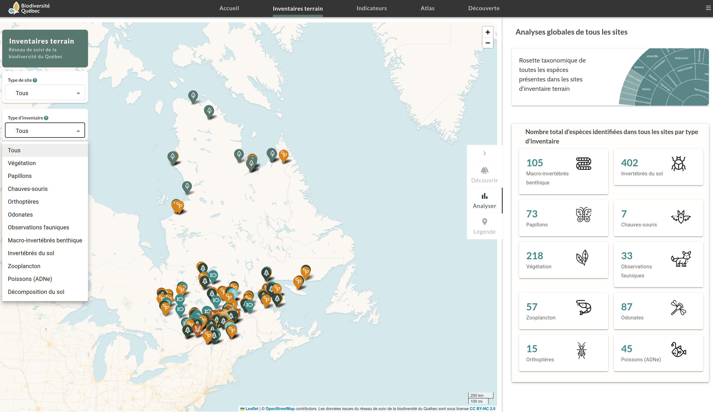
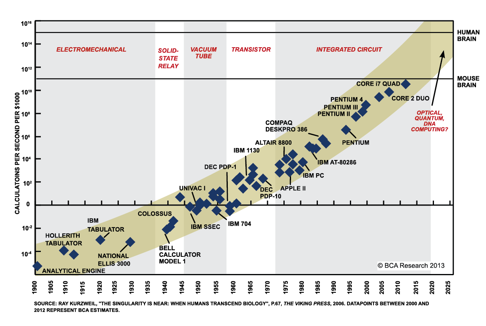
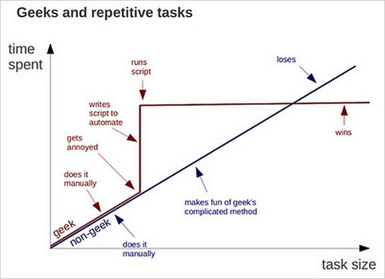
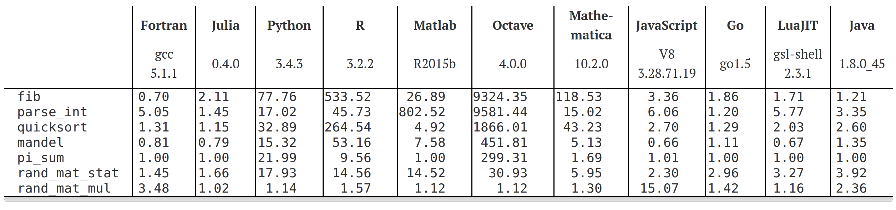

class: title-slide, middle

<style type="text/css">
  .title-slide {
    background-image: url('../assets/img/bg.jpg');
    background-color: #23373B;
    background-size: contain;
    border: 0px;
    background-position: 600px 0;
    line-height: 1;
  }
</style>

# Séance 1

<hr width="65%" align="left" size="0.3" color="orange"></hr>

## Introduction à la programmation scientifique

<hr width="65%" align="left" size="0.3" color="orange" style="margin-bottom:40px;" alt="@Martin Sanchez"></hr>

.instructors[
  **BIO109** - Dominique Gravel
]

</img>


---

# Introduction

<div style='text-align:center;'>
</img>
</div>

---

# Introduction

<div style='text-align:center;'>
</img>
</div>

---

# Introduction
<div style='text-align:center;'>
</img>
</div>

---

# Introduction

La programmation est un outil indispensable au biologiste 2.0, elle permet:

- Tâches **répétitives et/ou complexes** (p.ex. nettoyer, explorer et traiter de larges quantités de données)
- Faire des **analyses statistiques avancées** (p. ex. tests par permutations, statistiques bayésiennes)
- Créer des visualisations et des outils interactifs pour **communiquer et sensibiliser** efficacement
- Résoudre des **problèmes complexes** (p.ex. le suivi de la biodiversité, la modélisation de la dynamique des populations, la projection d'aires de distribution)

---

# Enseignant

## Dominique Gravel
- dominique.gravel@usherbrooke.ca
- D8-0012

## Victor Cameron (remplaçant)

## À déterminer (assistant)
- Contact à venir

Pour les questions d'intérêt général, vous pouvez utiliser le forum de discussion sur Moodle.

---

# Biodiversité Québec

<div style='text-align:center;'>
</img>
</div>

---

# Biodiversité Québec

<div style='text-align:center;'>
</img>
</div>

---

# Biodiversité Québec

<div style='text-align:center;'>
</img>
</div>

---

# La programmation en science

.pull-left[
## Avantages

- Gain de temps
- Limiter les erreurs
- Formaliser les opérations
- Archiver, reproduire et partager
- Tâches intensives (e.g. en génomique)
]


.pull-right[
## Capacité de calcul
</img>
<span style="font-size:small;text-transform:uppercase;text-align:right;">
</span>
]

---

# La programmation et les sciences des données

</img>

---

# La programmation en science

.pull-left[
## Inconvénients

- L'erreur est avant tout humaine, avant d'être informatique
- La courbe apprentissage peut être difficile
]

.pull-right[
</img>
]

---

# Instructions

- Présence en classe
- Un ordinateur portable
- Matériel du cours : https://github.com/EcoNumUdS/BIO109 et Moodle
- 3h de cours - 6h de travail personnel
- Lire les présentations avant le cours
- Faire les exercices
- Ressources additionnelles : R Cheat Sheet, R pour les débutants, exercies supplémentaires et matériel sur Moodle.

---

# Objectif général

Au terme de ce cours, l'étudiant sera en mesure de conceptualiser un problème qui requiert de la programmation scientifique et de réaliser des tâches courantes de programmation.

---

# Objectifs spécifiques

1. Conceptualiser un problème au moyen de pseudo-code;
2. Manipuler des données;
3. Rédiger des fonctions;
4. Programmer des algorithmes afin de réaliser des tâches complexes,
    incluant des boucles et des énoncés conditionnels;
5. Réaliser des simulations stochastiques.

---

# Ce que le cours n'est pas ...

1. Des recettes
2. Un catalogue de fonctions R
3. Un cours de statistiques

---

# Approche

Les connaissances requises pour la programmation scientifique sont
minimales, l'apprentissage porte davantage sur l'acquisition de
**compétences** et le développement de **capacités à la résolution de problèmes**.

Les séances sont constituées de courtes leçons magistrales sur des
notions de bases de programmation, entre-coupées d'exercices spécifiques
destinés à pratiquer les éléments enseignés. Les séances se conclueront
sur la réalisation d'un exercice intégrateur à compléter à la maison.

L'ensemble du matériel du cours sera disponible sur un dépôt Git à l'adresse :
https://github.com/EcoNumUdS/BIO109.git

---

# Évaluation

L'évaluation porte sur la participation (18%) et sur un travail de session (82%). Un exercice simple sera présenté à la fin des séances 1-3 et <b>chaque étudiant</b> devra remettre la solution de l'exercice sur Moodle sous forme de script <i>avant le début</i> de la séance suivante. <b>Les points sont attribués pour la participation.</b> Les solutions seront présentées au cours suivant.

- 3 exercies en classe (18%)
- Évaluation terminale : réalisation d'un projet de programmation <b>en équipe de 2</b> (82%)
  - Pseudo-code (22%) + programme (60%) à remettre le <b>20 février à 23h59</b>

Les évaluations sont à remettre sur Moodle.

---

# Évaluation terminale

La pénalité sera de 10% par jour de retard. Le rapport final sera évalué à
partir de

   1. le pseudo-code pour le projet de programmation,
   2. le respect des bonnes pratiques de programmation
   3. la réussite de l'exercice demandé.

Les étudiants devront remettre le script nécessaire à la
réalisation du projet.

---
class: inverse, center, middle

# Les langages de programmation
<hr width="65%" size="0.3" color="orange" style="margin-top:-20px;"></hr>

---

# Choix d'un langage : performance

<div style='text-align:center;'>
  </img>
</div>

---

# Choix d'un langage: 'débugging'

<div style='text-align:center;'>
  </img>
</div>

---

# Choix d'un langage : Statistiques et visualisation

Pour ce cours, nous utiliserons R :

- Langage de programmation open-source spécialisé en statistiques et en visualisation de données
- De nombreuses bibliothèques et packages disponibles pour effectuer diverses analyses statistiques
- Interface utilisateur RStudio pour faciliter l'utilisation de R
- Grand nombre de ressources en ligne et communauté active d'utilisateurs de R
- Création de sites Web et d'applications pour sensibiliser aux problèmes environnementaux et promouvoir des solutions durables.

> Langage utilisé dans le cadre de : biométrie, statistiques, méthodes en écologie computationnelle

---
class: inverse, middle, center

# Le Pseudo-Code
<hr width="65%" size="0.3" color="orange" style="margin-top:-20px;"></hr>

---

# Le `Pseudo-Code` et ses **algorithmes**


## Définitions

- *En programmation, le `pseudo-code` est une façon de formuler un <b>algorithme</b> sans référence à un langage de programmation en particulier.*

> - *Un <b>algorithme</b> est une suite d'actions qui sont réalisées dans un ordre précis par l'ordinateur. C'est une séquence d'étapes dans la résolution d'un problème.*

- Les principes de base seront les mêmes, d'un langage de programmation à l'autre. 

- Les éléments qui suivent résument les principales notions que vous aurez à maîtriser dans le cours. Il faut maîtriser ces notions *avant* de commencer la programmation sur R. 

---

# Le `Pseudo-Code`

**ATTENTION !!**

Le pseudo-code n'est pas du code. Il ne peut pas être exécuté. Il sert à décrire les étapes d'un algorithme.

Il est important de bien comprendre la différence entre les deux. 

---

# Le `Pseudo-Code`

## Exemple

```
PROGRAM HELLOWORLD
  FOR t IN 1:100
    PRINT "Hello World"
  END FOR
```

Le programme `HELLOWORLD` imprime à l'écran le message "Hello World" 100 fois.

---

# Le `Pseudo-Code`

## Exemple

```
PROGRAM HELLOWORLD
  FOR t IN 1:100 <------------- Opération itérative
    PRINT "Hello World" <------ Le programme affiche le message à l'écran
  END FOR <------------------- Fin de la boucle
```

Le programme `HELLOWORLD` imprime à l'écran le message "Hello World" 100 fois.

---

# Le `Pseudo-Code`

## Exemple

```
PROGRAM DEMO
  FOR t IN 1:100
    n_t = n_t * lambda
    PRINT n_t
    IF n_t < 1
      BREAK
    ELSE
      CONTINUE
    END IF
  END FOR
```

Le programme `DEMO` fait croitre une population à un taux $\lambda$ et affiche à l'utilisateur si la population est éteinte ( $n_t<1$ ) ou vivante ( $n_t>1$ ).

---

# Le `Pseudo-Code`

## Exemple

```
PROGRAM DEMO
  FOR t IN 1:100 <------------- Opération itérative
    n_t = n_t * lambda
    PRINT n_t <---------------- Le programme affiche la valeur à l'écran
    IF n_t < 1 <--------------- Opération décisionnelle
      BREAK <------------------ Le programme arrête son éxécution
    ELSE
      CONTINUE <--------------- Le programme continue son éxécution
    END IF
  END FOR
```

Le programme `DEMO` fait croitre une population à un taux $\lambda$ et affiche à l'utilisateur si la population est éteinte ( $n_t<1$ ) ou vivante ( $n_t>1$ ).


---

# Les structures de base d'un algorithme

On retrouve 3 familles d'opérations:

1. Les opérations séquentielles
2. Les opérations itératives (`FOR`, `WHILE`)
3. Les opérations décisionnelles (`IF`, `IFELSE`)

Les opérations répétées peuvent être organisées sous forme de <b> Fonctions </b>.

---

# Avant-propos

Avant de décrire chacune des opérations d'un algorithme, certaines instructions sont à connaitre pour écrire du pseudo-code :

- `READ`: le programme lit un fichier
- `WRITE`: le programme écrit un fichier
- `PRINT`: le programme écrit un message à l'écran pour l'utilisateur
- `BREAK`: le programme arrête son éxécution
- `CONTINUE`: le programme continue son éxécution
- `DEFINE`: définition d'une constante, d'un paramètre
- `SET` : initialise un objet

---

# Assignation des objets

Lorsque l'on crée un objet, il est initialement vide et il faut lui attribuer une valeur : 

```
a = 1
b = 2
```

On peut faire des opérations mathématiques sur ces objets : 

```
a * b
```

---

# Indexation des objets

Plus souvent, on travaille avec des tableaux de données :  

```
mat = [1 2 3
       4 5 6]
```

Cet objet a deux dimension, la première représentée par "i" et l'autre par "j". Sur R par exemple, on accède à la position définie par le couple i,j de la manière suivante : 

```
mat[i,j]
```

---

# Les types d'objets

Les objets en programmation sont définis en fonction de leur dimensionalité.

## Dimensionalité

- **Dimension 0** : Valeur unique
- **Dimension 1** : Vecteur
- **Dimension 2** : Matrice
- **Dimension 3** : ...

Bien qu'il n'y ait pas de limite à la dimension d'un objet en programmation,
pour le cours nous nous limiterons à des objets en deux dimensions
(c.à.d matrice)

---

# Dimension 0

Ces objets ne contiennent qu'une seule information

## Exemple

```
a = "toi"
b = 2
c = -3
d = 456457.678
```

---

# Dimension 1

Ces objets contiennent un série d'information. Chaque valeur
a une position dans le vecteur, laquelle peut être accédée.

## Exemple

```
lettre = ["A" "R" "C" "D" "A"]
lettre[3]
# "C"
```

---

# Dimension 2

Ayant deux dimensions, ces objets présentent les données sous forme de matrices et ont des lignes et des colonnes. Pour accéder à une valeur dans une matrice il faut donner la position de la <b>ligne</b> en premier suivit de la position de la <b>colonne</b>.

## Exemple

```
lettreTab = ["A" "R" "C"
             "D" "A" "T"
             "R" "A" "Q"]

lettreTab[2, 1]
# "D"
```

---

# Les opérations séquentielles

## Exemple: Calculer l'aire d'un rectangle

```
PROGRAM REC_AIRE
  READ hauteur
  READ largeur
  WRITE hauteur * largeur
```

Chaque opération est effectuée l'une après l'autre dans un ordre déterminé.

---

# Exercice

```
PROGRAM AIRE_CERCLE
  DEFINE pi <- 3.1416
  DEFINE d <- {1, 2, 3, 4, 5}
  DEFINE index <- 2
  CALCUL aire <- pi*(d[index]/2)*(d[index]/2)
  WRITE aire
```

Quel est le résultat de ce calcul ?

---

# Les opérations itératives

La boucle est une séquence de base utilisée par tous les langages de programmation. 

Elle permet de répéter une opération un grand nombre de fois automatiquement. 

La boucle est définie par un **point de départ**, un **point de d'arrivée** et la **séquence des opérations** à réaliser à chaque itération de la boucle. 

Un indice permet de suivre la position dans la boucle.

---

# Les opérations itératives

## Exemple avec `FOR`: Croissance exponentielle

```
FOR etape IN 1:100
  PRINT etape
END FOR
```

---

# Les opérations itératives

## Exemple avec `FOR`: Croissance exponentielle

```
PROGRAM DEMO
  DEFINE lambda = 1.1
  DEFINE n_t = 1
  FOR etape IN 1:100
    n_t = n_t * lambda
  END FOR
  WRITE n_t
```

La population va croître pendant 100 pas de temps.

---

# Exercice

```
PROGRAM FACTORIELLE
  depart = 1
  fin = 5
  x = 1
  FOR etape in depart:fin
    x = x * etape
  END FOR
  WRITE x
```

Quelle valeur prendra x au terme de l'exécution du programme ? 

---

# Exercice

```
PROGRAM FACTORIELLE
  depart = 1
  fin = 5
  x = 1
  FOR etape in depart:fin
    x = x * etape
  END FOR
  WRITE x
```

Quelle valeur prendra x au terme de l'exécution du programme ? 

- Entre 1 et 20
- Entre 20 et 100
- Entre 100 et 1000

---

# Les opérations itératives et l'indexation

## Exemple avec `FOR`: Croissance exponentielle

```
PROGRAM DEMO
  SET resultat
  resultat[1] = 1
  lambda = 1.1
  FOR etape IN 2:10
    resultat[etape] = resultat[etape-1] * lambda
  END FOR
  WRITE resultat
```

Quel sera le contenu de 'resultat' ?

---

# Les opérations itératives et l'indexation

## Exemple avec `FOR`: Croissance exponentielle

.pull-left[
```
PROGRAM DEMO
  SET resultat
  resultat[1] = 1
  lambda = 1.1
  FOR etape IN 2:10
    resultat[etape] = resultat[etape-1] * lambda
  END FOR
  WRITE resultat
```

Quel sera le contenu de 'resultat' ?
]

.pull-right[
**Valeur**

```
resultat = 1
```

**Vecteur**
  
```
resultat = [1 1.1 1.21 1.331 1.46 1.61 1.77 1.95 1.36]
```

**Matrice**

```
resultat = [1 1.1 1.21
            1.331 1.46 1.61
            1.77 1.95 1.36]
```
]

---

# Les opérations décisionnelles

Souvent un programme repose sur la réalisation d'une décision basée sur le résultat d'un calcul ou bien un paramètre défini par l'utilisateur. 

Les décisions sont binaires (oui/non, vrai/faux), mais plusieurs choix peuvent se combiner pour faire une décision entre plus de deux choix.

---

# Les opérations décisionnelles

## Exemple avec `IF`: quelques tests sur $\lambda$

```
PROGRAM DEMO
  IF lambda > 1
    PRINT "La population est croissante"
  ELSE lambda < 1
    PRINT "La population est décroissante"
  ENDIF
```

Et si le taux de croissance est nul?

---

# Les opérations décisionnelles

```
PROGRAM DEMO
  IF lambda > 1
    PRINT "La population est croissante"
  IF ELSE lambda < 1
    PRINT "La population est décroissante"
  ELSE
    PRINT "Absence de croissance"
  ENDIF
```

Avec la clause `ELSE`, la croissance est nulle

---

# Exemple : identifier un arbre

Écrire le pseudo-code qui permet d'identifier l'arbre avec le plus petit DHP parmi les trois suivants :

```
dhp1
dhp2
dhp3
```

---

# Exemple : identifier un arbre

```
PROGRAM ESPECE
  READ dhp1
  READ dhp2
  READ dhp3

  IF dhp1 < dhp2 
    IF dhp1 < dhp3 
      resultat = dhp1
    ELSE 
      resultat = dhp3
    END IF
  END IF

  IF dhp2 > dhp3
      resultat = dhp3
  ELSE 
    resultat = dhp2
  END IF
    
  WRITE resultat
```

---

# Les fonctions

Elles permettent de répéter rapidement des opérations, sous des conditions définies lorsqu'on les appelle. Ces conditions sont nommées des "arguments". 

```
FONCTION AIRE_CERCLE(rayon, pi)
  {
    aire = pi*rayon*rayon
    RETURN aire
  }
  
```

---

# Les fonctions

Le résultat de la fonction changera si on change les arguments.


```
  AIRE_CERCLE(rayon = 2, pi = 3.1416)

```

Ne donnera pas le même résultat que 

```
  AIRE_CERCLE(rayon = 1, pi = 3.1416)

```

---

# Les règles du `pseudo-code`

## À garder en mémoire

1. N'écrivez qu'une seule instruction par ligne de pseudo-code.
2. Écrivez en lettres majuscules le verbe de chaque opération principale (la fonction utilisée)
3. Soyez explicite en nommant les opérations et les variables.
4. Soyez le plus détaillé possible (c.à.d les plus petites étapes possibles)
5. Utilisez des structures de langages de programmation connues (c.à.d `FOR`, `IF`, etc.)
6. Délimitez les étapes en formant des blocs d'instructions par l'utilisation de l'indentation.

<b> Le pseudo-code doit demeurer général, peu importe le langage de programmation utilisé. </b>

---
class: inverse, middle, center

# Les bonnes pratiques en programmation scientifique
<hr width="65%" size="0.3" color="orange" style="margin-top:-20px;"></hr>


---

# Les 10 commandements de la programmation

> <b>1.</b> Commenter le code pour que d'autres puissent le lire, le comprendre et le partager

---

# Les 10 commandements de la programmation

> <b>1.</b> Commenter le code pour que d'autres puissent le lire, le comprendre et le partager

> <b>2.</b> Découper un script en blocs cohérents

---

# Les 10 commandements de la programmation

> <b>1.</b> Commenter le code pour que d'autres puissent le lire, le comprendre et le partager

> <b>2.</b> Découper un script en blocs cohérents

> <b>3.</b> Une seule opération par ligne

---

# Les 10 commandements de la programmation

> <b>1.</b> Commenter le code pour que d'autres puissent le lire, le comprendre et le partager

> <b>2.</b> Découper un script en blocs cohérents

> <b>3.</b> Une seule opération par ligne

> <b>4.</b> S'assurer qu'une instruction fonctionne avant de passer à l'étape suivante

---

# Les 10 commandements de la programmation

> <b>1.</b> Commenter le code pour que d'autres puissent le lire, le comprendre et le partager

> <b>2.</b> Découper un script en blocs cohérents

> <b>3.</b> Une seule opération par ligne

> <b>4.</b> S'assurer qu'une instruction fonctionne avant de passer à l'étape suivante

> <b>5.</b> Nommer adéquatement ses variables 

---

# Les 10 commandements de la programmation

> <b>1.</b> Commenter le code pour que d'autres puissent le lire, le comprendre et le partager

> <b>2.</b> Découper un script en blocs cohérents

> <b>3.</b> Une seule opération par ligne

> <b>4.</b> S'assurer qu'une instruction fonctionne avant de passer à l'étape suivante

> <b>5.</b> Nommer adéquatement ses variables 

> <b>6.</b> Un bon programmeur est paresseux. Les opérations répétées doivent être définies sous forme de fonctions

---

# Les 10 commandements de la programmation

> <b>1.</b> Commenter le code pour que d'autres puissent le lire, le comprendre et le partager

> <b>2.</b> Découper un script en blocs cohérents

> <b>3.</b> Une seule opération par ligne

> <b>4.</b> S'assurer qu'une instruction fonctionne avant de passer à l'étape suivante

> <b>5.</b> Nommer adéquatement ses variables 

> <b>6.</b> Un bon programmeur est paresseux. Les opérations répétées doivent être définies sous forme de fonctions

> <b>7.</b> La vie est trop courte, optimiser son code

---

# Les 10 commandements de la programmation

> <b>1.</b> Commenter le code pour que d'autres puissent le lire, le comprendre et le partager

> <b>2.</b> Découper un script en blocs cohérents

> <b>3.</b> Une seule opération par ligne

> <b>4.</b> S'assurer qu'une instruction fonctionne avant de passer à l'étape suivante

> <b>5.</b> Nommer adéquatement ses variables 

> <b>6.</b> Un bon programmeur est paresseux. Les opérations répétées doivent être définies sous forme de fonctions

> <b>7.</b> La vie est trop courte, optimiser son code

> <b>8.</b> S'assurer que le code soit reproductible par autrui

---

# Les 10 commandements de la programmation

> <b>9.</b> Contraindre les tirages au sort afin de le répéter

---

# Les 10 commandements de la programmation

> <b>9.</b> Contraindre les tirages au sort afin de le répéter

> <b>10.</b> Utiliser le contrôle de version afin de pouvoir revenir dans le passé

---

# Exercice

Calculez la moyenne de la série de valeurs (vecteur) suivante

```
series = [1, 9, NA, 21, 3, NA, 7]
```

**ATTENTION !!** Il y a des valeurs manquantes (`NA`) dans la série de chiffres. Il faut les exclure du calcul de la moyenne.

---

# Exercice

```
PROGRAM MOYENNE
  serie = [1, 9, NA, 21, 3, NA, 7]
  n = 7
  somme = 0
  FOR i IN 1:n
    IF serie[i] == NA 
      somme = somme 
    ELSE 
      somme = somme + serie[i]
    END IF
  END FOR
  moyenne = somme / n
  WRITE moyenne 
```

---

# Exercice

```
PROGRAM MOYENNE
  serie = [1, 9, NA, 21, 3, NA, 7]
  n = 7
  somme = 0
  FOR i IN 1:n <------------- Opération itérative
    IF serie[i] == NA <------ Opération décisionnelle
      somme = somme  <------- Si NA
    ELSE <------------------- Si pas NA
      somme = somme + serie[i]
    END IF
  END FOR
  moyenne = somme/n <-------- Le programme calcule la moyenne
  WRITE moyenne <------------ Le programme affiche la moyenne
```

---

# Exercice

**ATTENTION !!**

Le pseudo-code n'est pas du code. Il ne peut pas être exécuté. Il sert à décrire les étapes d'un algorithme.

Il est important de bien comprendre la différence entre les deux. 

---
class: inverse, middle, center

# Installation de R et de RStudio
<hr width="65%" size="0.3" color="orange" style="margin-top:-20px;"></hr>

À faire pour la <b>prochaine séance</b>

<!-- - Le débuggage se fera au prochain cours. -->
- Guide d'installation : [https://rstudio-education.github.io/hopr/starting.html](https://rstudio-education.github.io/hopr/starting.html)

---
class: inverse, middle, center

# Exercice de la semaine
<hr width="65%" size="0.3" color="orange" style="margin-top:-20px;"></hr>

---

# Une situation qui peut arriver tous les jours

Écrivez un pseudo-code pour générer une liste de 20 nombres aléatoires compris entre 1 et 100, puis afficher la moyenne de ces nombres.

Prenez le temps de distinguer les étapes que vous réalisez lorsque vous générez les chiffres et lorsque vous en calculez la moyenne.

<b>Note 1</b>: vous pouvez assumer que l'ordinateur peut produire un nombre alléatoire à l'aide de la fonction `RANDOM()`.

<b>Note 2</b>: vous pouvez assumer que l'ordinateur peut déterminer la longueur d'un vecteur à l'aide de la fonction `LENGTH()`.
