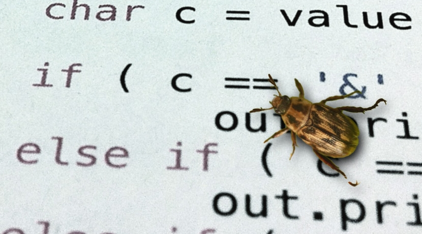

class: title-slide, middle

<style type="text/css">
  .title-slide {
    background-image: url('../assets/img/bg.jpg');
    background-color: #23373B;
    background-size: contain;
    border: 0px;
    background-position: 600px 0;
    line-height: 1;
  }
</style>

# Séance 1

<hr width="65%" align="left" size="0.3" color="orange"></hr>

## Introduction à la programmation scientifique

<hr width="65%" align="left" size="0.3" color="orange" style="margin-bottom:40px;" alt="@Martin Sanchez"></hr>

.instructors[
  **BIO109** - Dominique Gravel
]

</img>


---

# INSTRUCTIONS COVID

- En présence lorsque possible
- Matériel du cours : https://github.com/EcoNumUdS/BIO109
- Assistants en classe et sur le clavardage
- Lire les présentations avant le cours
- Lever la main pour des questions
- Utilisation du clavardage Teams (détailler votre question et fournir le code)
- Faire les exercices
- Ressources additionnelles : R Cheat Sheet et R pour les débutants

---

# Introduction

<div style='text-align:center;'>
</img>
</div>

---

# Introduction

<div style='text-align:center;'>
</img>
</div>

---

# Introduction

<div style='text-align:center;'>
</img>
</div>

---

# Introduction

<div style='text-align:center;'>
</img>
</div>

---

# Projet de session

## Question de recherche

À quelle vitesse se réalisera la migration de l'érable à sucre, et des espèces associées, au sein de la sapinière de montagne du massif des Montagnes vertes ?

---

# Le type de données

```{r}
arbres <- read.table(file = './donnees/arbres.txt', header = TRUE, sep=";")
head(arbres)
```

---

# Exercice 1

Ouvrir le fichier [arbres](./donnees/arbres.xlsx) avec Excel et calculer le nombre d'individus de chaque espèce pour le quadrat 1.

---

# Exercice 1: solution sur R

```{r}
arbres <- read.table(file = './donnees/arbres.txt', header = TRUE, sep=";")
quadrats <- table(arbres$id_bor,arbres$esp)
head(quadrats)
```

```{r, echo=FALSE}
write.table(quadrats, file="./donnees/quadrats.txt",sep=";",quote=TRUE)
```
---

# Exercice 2

Ouvrir le fichier [quadrats](./donnees/quadrats.xlsx) avec Excel et calculer la corrélation entre toutes les paires d'espèces.

Petit truc: sur Excel, la fonction pour calculer une corrélation est:

```bash
=COEFFICIENT.CORRELATION(données_1; données_2)
```

---

# Exercice 2: solution sur R

```{r,eval=FALSE}
quadrats <- read.table(file = './donnees/quadrats.txt', header = TRUE, sep= ";")
cor(quadrats)
```

```{r,eval=TRUE,echo=FALSE}
quadrats <- read.table(file = './donnees/quadrats.txt', header = TRUE, sep= ";")
round(cor(quadrats),6)
```

---

# Exercice 2: visualisation sur R

```{r,  fig.width= 6, fig.height= 6, fig.align='center'}
plot(quadrats)
```

---

# Objectif général

Au terme de ce cours, l'étudiant sera en mesure de conceptualiser un problème qui requiert de la programmation scientifique et de réaliser des tâches courantes de programmation.

---

# Objectifs spécifiques

1. Conceptualiser un problème au moyen de pseudo-code;
2. Manipuler des données;
3. Rédiger des fonctions;
4. Programmer des algorithmes afin de réaliser des tâches complexes,
    incluant des boucles et des énoncés conditionnels;
5. Réaliser des simulations de Monte Carlo;

---

# Ce que le cours n'est pas ...

1. Des recettes
2. Un catalogue de fonctions R
3. Un cours de statistiques

---

# Approche

Les connaissances requises pour la programmation scientifique sont
minimales, l'apprentissage porte davantage sur l'acquisition de
compétences et le développement de capacités à la résolution de problèmes.

Les séances sont constituées de courtes leçons magistrales sur des
notions de bases de programmation, entre-coupées d'exercices spécifiques
destinés à pratiquer les éléments enseignés. Les séances se conclueront
sur la réalisation d'un exercice intégrateur à compléter à la maison.

L'ensemble du matériel du cours sera disponible sur un dépôt Git à l'adresse :
https://github.com/EcoNumUdS/BIO109.git

---

# Évaluation

L'évaluation porte sur la participation (20%) et sur un travail de session (80%). Un exercice simple sera présenté à la fin des séances 1-4 et <b>chaque étudiant</b> devra remettre la solution de l'exercice sur Moodle sous forme de script <i>avant le début</i> de la séance suivante. <b>Les points sont attribués pour la participation.</b> Les solutions seront présentées au cours suivant.

L'évaluation finale portera sur la réalisation d'un projet de
programmation <b>en équipe de 4</b> à remettre deux semaines après la fin du
dernier cours, soit au plus tard le <b>22 février 2022 à 23:59</b>. La
pénalité sera de 10% par jour de retard. Le rapport final sera évalué à
partir de

   1. le pseudo-code pour le projet de programmation,
   2. le respect des bonnes pratiques de programmation
   3. la réussite de l'exercice demandé.

Les étudiants devront remettre le script nécessaire à la
réalisation du projet.

---
class: inverse, center, middle

# La place de la programmation en écologie
<hr width="65%" size="0.3" color="orange" style="margin-top:-20px;"></hr>


---

# Hier

La dynamique d'une population:

$$
\frac{dN}{dt} = rN(1-\frac{N}{K})
$$

Qui donne pour solution à l'équilibre:

$$
N^* = K
$$

$N =$ Taille d'une population

$t =$ temps

$r =$ taux de croissance

$K =$ capacité de support de l'environnement

---

# Aujourd'hui

.pull-left[
  <div style='text-align:center;'>
  </img>
  </div>
]

.pull-right[
- R: Regénération
- T: Forêts tempérées
- M: Forêts mixes
- B: Forêts boréale
]


---

# Aujourd'hui

<div style='text-align:center;'>
</img>
</div>

---

# Et demain, la modélisation de la biosphère?
<div style='text-align:center;'>
</img>
</div>

---

# Utilisation en science au quotidien

La programmation est outil indispensable au biologiste 2.0, elle permet:

- Tâches répétitives et/ou complexes (p.ex. Nettoyage des données, Simulations stochastiques)
- Visualisation et exploration des données
- Analyses statistiques avancées (p. ex. tests par permutations, statistiques bayésiennes)

---

# La programmation en science

.pull-left[
## Avantages

- Gain de temps
- Limiter les erreurs
- Formaliser les opérations
- Archiver, reproduire et partager
- Tâches intensives (e.g. en génomique)
]


.pull-right[
## Capacité de calcul
</img>
<span style="font-size:small;text-transform:uppercase;text-align:right;">
</span>
]

---

# La programmation et les sciences des données

</img>

---

# La programmation en science

.pull-left[
## Inconvénients

- L'erreur est avant tout humaine, avant d'être informatique
- La courbe apprentissage peut être difficile
]

.pull-right[
</img>
]


---
class: inverse, center, middle

# Les langages de programmation
<hr width="65%" size="0.3" color="orange" style="margin-top:-20px;"></hr>


---

# Deux grandes familles de langages

1. Les langages compilés
2. Les langages interprétés

---

# Les langages compilés

<div style='text-align:center;'>
  </img>
</div>

---

# Les langages interprétés

<div style='text-align:center;'>
  </img>
</div>

---

# Choix d'un langage : performance

<div style='text-align:center;'>
  </img>
</div>

---

# Choix d'un langage: 'débugging'

<div style='text-align:center;'>
  </img>
</div>

---
class: inverse, middle, center

# Le Pseudo-Code
<hr width="65%" size="0.3" color="orange" style="margin-top:-20px;"></hr>

---

# Le `Pseudo-Code` et ses **algorithmes**


## Définitions

- *En programmation, le `pseudo-code` est une façon de formuler un <b>algorithme</b> sans référence à un langage de programmation en particulier.*

> - *Un <b>algorithme</b> est une suite d'actions qui sont réalisées dans un ordre précis par l'ordinateur. C'est une séquence d'étapes dans la résolution d'un problème.*

- Les principes de base seront les mêmes, d'un langage de programmation à l'autre. 

- Les éléments qui suivent résument les principales notions que vous aurez à maîtriser dans le cours. Il faut maîtriser ces notions *avant* de commencer la programmation sur R. 

---

# Le `Pseudo-Code`

## Exemple

```
PROGRAM DEMO
  FOR t IN 1:100
    n_t = n_t * lambda
    PRINT n_t
    IF n_t < 1
      BREAK
    ELSE
      CONTINUE
    END IF
  END FOR
```

Le programme `DEMO` fait croitre une population à un taux $\lambda$ et affiche à l'utilisateur si la population est éteinte ( $n_t<1$ ) ou vivante ( $n_t>1$ ).

---

# Le `Pseudo-Code`

## Exemple

```
PROGRAM DEMO
  FOR t IN 1:100 <------------- Opération itérative
    n_t = n_t * lambda
    PRINT n_t <---------------- Le programme affiche la valeur à l'écran
    IF n_t < 1 <--------------- Opération décisionnelle
      BREAK <------------------ Le programme arrête son éxécution
    ELSE
      CONTINUE <--------------- Le programme continue son éxécution
    END IF
  END FOR
```

Le programme `DEMO` fait croitre une population à un taux $\lambda$ et affiche à l'utilisateur si la population est éteinte ( $n_t<1$ ) ou vivante ( $n_t>1$ ).


---

# Les structures de base d'un algorithme

On retrouve 3 familles d'opérations:

1. Les opérations séquentielles
2. Les opérations itératives (`FOR`, `WHILE`)
3. Les opérations décisionnelles (`IF`, `IFELSE`)

Les opérations répétées peuvent être organisées sous forme de <b> Fonctions </b>.

---

# Avant-propos

Avant de décrire chacune des opérations d'un algorithme, certaines instructions sont communes:

- `READ`: le programme lit un fichier
- `WRITE`: le programme écrit un fichier
- `PRINT`: le programme écrit un message à l'écran pour l'utilisateur
- `BREAK`: le programme arrête son éxécution
- `CONTINUE`: le programme continue son éxécution
- `DEFINE`: définition d'une constante, d'un paramètre
- `SET` : initialise un objet

---

# Assignation des objets

Lorsque l'on crée un objet, il est initialement vide et il faut lui attribuer une valeur. On peut créer un scalaire : 

```
a = 1
b = 2
```

Et faire des opérations mathématiques sur ces objets : 

```
a * b
```

---

# Indexation des objets

Plus souvent, on travaille avec des tableaux de données :  

```
mat = matrix(c(1,2,3,4), nr = 2, nc = 2)
```

Cet objet a deux dimension, la première représentée par "i" et l'autre par "j". Sur R par exemple, on accède à la position définie par le couple i,j de la manière suivante : 

```
mat[i,j]
```

---

# Les types d'objets

Les objets en programmation sont définis en fonction de leur dimensionalité.

## Dimensionalité

- **Dimension 0** : Valeur unique
- **Dimension 1** : Vecteur
- **Dimension 2** : Matrice
- **Dimension 3** : ...

Bien qu'il n'y ait pas de limite à la dimension d'un objet en programmation,
pour le cours nous nous limiterons à des objets en deux dimensions
(c.à.d matrice)

---

# Dimension 0

Ces objets ne contiennent qu'une seule information

## Exemple

```
bobo = "toi"
coco = 2
dodo = -3
fofo = 456457.678
```

---

# Dimension 1

Ces objets contiennent un série d'information. Chaque valeur
a une position dans le vecteur, laquelle peut être accédée.

## Exemple

```
lettre = ["A" "R" "C" "D" "A"]
lettre[3]
# "C"
```

---

# Dimension 2

Ayant deux dimensions, ces objets présentent les données sous forme de matrices et ont des lignes et des colonnes. Pour accéder à une valeur dans une matrice il faut donner la position de la <b>ligne</b> en premier suivit de la position de la <b>colonne</b>.

## Exemple

```
lettreTab = ["A" "R" "C"
             "D" "A" "T"
             "R" "A" "Q"]

lettreTab[2, 1]
# "D"
```

---

# Les opérations séquentielles

## Exemple: Calculer l'aire d'un rectangle

```
PROGRAM REC_AIRE
  READ hauteur
  READ largeur
  WRITE hauteur * largeur
```

Chaque opération est effectuée l'une après l'autre dans un ordre déterminé.

---

# Exercice

```
PROGRAM AIRE_CERCLE
  DEFINE pi <- 3.1416
  DEFINE d <- {1, 2, 3, 4, 5}
  DEFINE index <- 2
  CALCUL aire <- pi*(d[index]/2)*(d[index]/2)
  WRITE aire
```

Quel est le résultat de ce calcul ?

---

# Les opérations itératives

La boucle est une séquence de base utilisée par tous les langages de programmation. 

Elle permet de répéter une opération un grand nombre de fois automatiquement. 

La boucle est définie par un point de départ, un point de d'arrivée et la séquence des opérations à réaliser à chaque itération de la boucle. 

Un indice permet de suivre la position dans la boucle.

---

# Les opérations itératives

## Exemple avec `FOR`: Croissance exponentielle

```
PROGRAM DEMO
  DEFINE lambda = 1.1
  DEFINE n_t = 1
  FOR etape IN 1:100
    n_t = n_t * lambda
  END FOR
  WRITE n_t
```

La population va croître pendant 100 pas de temps.

---

# Exercice

```
PROGRAM FACTORIELLE
  DEFINE depart = 1
  DEFINE fin = 5
  x = 1
  FOR etape in depart:fin
    x = x*etape
  WRITE x
```

Quelle valeur prendra x au terme de l'exécution du programme ? 

---

# Les opérations itératives et l'indexation

## Exemple avec `FOR`: Croissance exponentielle

```
PROGRAM DEMO
  SET resultat
  DEFINE lambda = 1.1
  FOR etape IN 1:100
    resultat[etape] = resultat[etape-1] * lambda
  END FOR
  WRITE resultat
```

Quel sera le contenu de 'resultat' ?

---

# Les opérations décisionnelles

Souvent un programme repose sur la réalisation d'une décision basée sur le résultat d'un calcul ou bien un paramètre défini par l'utilisateur. 

Les décisions sont binaires (oui/non, vrai/faux), mais plusieurs choix peuvent se combiner pour faire une décision entre plus de deux choix.

---

# Les opérations décisionnelles

## Exemple avec `IF`: quelques tests sur $\lambda$

```
PROGRAM DEMO
  IF lambda > 1
    PRINT "La population est croissante"
  ELSE lambda < 1
    PRINT "La population est décroissante"
  ENDIF
```

Et si le taux de croissance est nul?

---

# Les opérations décisionnelles

```
PROGRAM DEMO
  IF lambda > 1
    PRINT "La population est croissante"
  IF ELSE lambda < 1
    PRINT "La population est décroissante"
  ELSE
    PRINT "Absence de croissance"
  ENDIF
```

Avec la clause `ELSE`, la croissance est nulle

---

# Exemple : identifier un arbre

Écrire le pseudo code qui permet de déterminer quelle est l'espèce parmi l'érable à sucre, le bouleau jaune, le sapin baumier et le mélèze laricin sachant si ces arbres gardent leurs feuilles en hiver, si ils ont des aiguilles et si ils ont des samarres. 

---

# Exemple : identifier un arbre

```
PROGRAM ESPECE
  READ hiver
  READ feuilles
  READ graines

  IF(hiver == non) 
    IF(feuilles == aiguilles) espece = meleze
      IF(graines == samarres) espece = erable
        ELSE espece = bouleau
    ELSE espece = sapin
  WRITE espece
```

Notons l'utilisation du '==' pour tester s'il y a égalité.

---

# Les fonctions

Elles permettent de répéter rapidement des opérations, sous des conditions définies lorsqu'on les appelle. Ces conditions sont nommées des "arguments". 

```
FONCTION AIRE_CERCLE(rayon, pi)
  {
    aire = pi*rayon*rayon
    RETURN aire
  }
  
```

---

# Les fonctions

Le résultat de la fonction changera si on change les arguments.


```
  AIRE_CERCLE(rayon = 2, pi = 3.1416)

```

Ne donnera pas le même résultat que 

```
  AIRE_CERCLE(rayon = 1, pi = 3.1416)

```

---

# Les règles du `pseudo-code`

## A garder en mémoire

1. N'écrivez qu'une seule instruction par ligne de pseudo-code.
2. Écrivez en lettres majuscules le verbe de chaque opération principale (la fonction utilisée)
3. Soyez explicite en nommant les opérations et les variables.
4. Soyez le plus détaillé possible (c.à.d les plus petites étapes possibles)
5. Utilisez des structures de langages de programmation connues (c.à.d `FOR`, `IF`, etc.)
6. Délimitez les étapes en formant des blocs d'instructions par l'utilisation de l'indentation.

<b> Ces règles sont générales, peu importe le langage de programmation utilisé. </b>

---
class: inverse, middle, center

# Les bonnes pratiques en programmation scientifique
<hr width="65%" size="0.3" color="orange" style="margin-top:-20px;"></hr>


---

# Les 10 commandements de la programmation

> <b>1.</b> Commenter le code pour que d'autres puissent le lire, le comprendre et le partager

---

# Les 10 commandements de la programmation

> <b>1.</b> Commenter le code pour que d'autres puissent le lire, le comprendre et le partager

> <b>2.</b> Découper un script en blocs cohérents

---

# Les 10 commandements de la programmation

> <b>1.</b> Commenter le code pour que d'autres puissent le lire, le comprendre et le partager

> <b>2.</b> Découper un script en blocs cohérents

> <b>3.</b> Une seule opération par ligne

---

# Les 10 commandements de la programmation

> <b>1.</b> Commenter le code pour que d'autres puissent le lire, le comprendre et le partager

> <b>2.</b> Découper un script en blocs cohérents

> <b>3.</b> Une seule opération par ligne

> <b>4.</b> S'assurer qu'une instruction fonctionne avant de passer à l'étape suivante

---

# Les 10 commandements de la programmation

> <b>1.</b> Commenter le code pour que d'autres puissent le lire, le comprendre et le partager

> <b>2.</b> Découper un script en blocs cohérents

> <b>3.</b> Une seule opération par ligne

> <b>4.</b> S'assurer qu'une instruction fonctionne avant de passer à l'étape suivante

> <b>5.</b> Nommer adéquatement ses variables 

---

# Les 10 commandements de la programmation

> <b>1.</b> Commenter le code pour que d'autres puissent le lire, le comprendre et le partager

> <b>2.</b> Découper un script en blocs cohérents

> <b>3.</b> Une seule opération par ligne

> <b>4.</b> S'assurer qu'une instruction fonctionne avant de passer à l'étape suivante

> <b>5.</b> Nommer adéquatement ses variables 

> <b>6.</b> Un bon programmeur est paresseux. Les opérations répétées doivent être définies sous forme de fonctions

---

# Les 10 commandements de la programmation

> <b>1.</b> Commenter le code pour que d'autres puissent le lire, le comprendre et le partager

> <b>2.</b> Découper un script en blocs cohérents

> <b>3.</b> Une seule opération par ligne

> <b>4.</b> S'assurer qu'une instruction fonctionne avant de passer à l'étape suivante

> <b>5.</b> Nommer adéquatement ses variables 

> <b>6.</b> Un bon programmeur est paresseux. Les opérations répétées doivent être définies sous forme de fonctions

> <b>7.</b> La vie est trop courte, optimiser son code

---

# Les 10 commandements de la programmation

> <b>1.</b> Commenter le code pour que d'autres puissent le lire, le comprendre et le partager

> <b>2.</b> Découper un script en blocs cohérents

> <b>3.</b> Une seule opération par ligne

> <b>4.</b> S'assurer qu'une instruction fonctionne avant de passer à l'étape suivante

> <b>5.</b> Nommer adéquatement ses variables 

> <b>6.</b> Un bon programmeur est paresseux. Les opérations répétées doivent être définies sous forme de fonctions

> <b>7.</b> La vie est trop courte, optimiser son code

> <b>8.</b> S'assurer que le code soit reproductible par autrui

---

# Les 10 commandements de la programmation

> <b>9.</b> Contraindre les tirages au sort afin de le répéter

---

# Les 10 commandements de la programmation

> <b>9.</b> Contraindre les tirages au sort afin de le répéter

> <b>10.</b> Utiliser le contrôle de version afin de pouvoir revenir dans le passé

---
class: inverse, middle, center

# Exercice de la semaine
<hr width="65%" size="0.3" color="orange" style="margin-top:-20px;"></hr>

---

# Une situation qui peut arriver tous les jours

1. On jette en face de vous 5 lettres d'un jeu de scrabble

2. Un maniaque vous demande d'écrire un programme qui ordonne les 5 lettres

Prenez le temps de distinguer les étapes que vous réalisez lorsque vous triez les lettres. Vous devez les écrire sous forme de pseudo-code.

<b>Note 1 </b>: cet exercice reviendra au cours 4, où vous programmerez cette fonction.

<b>Note 2 </b>: vous pouvez assumer que l'ordinateur sait que 'A' vient avant 'B'.