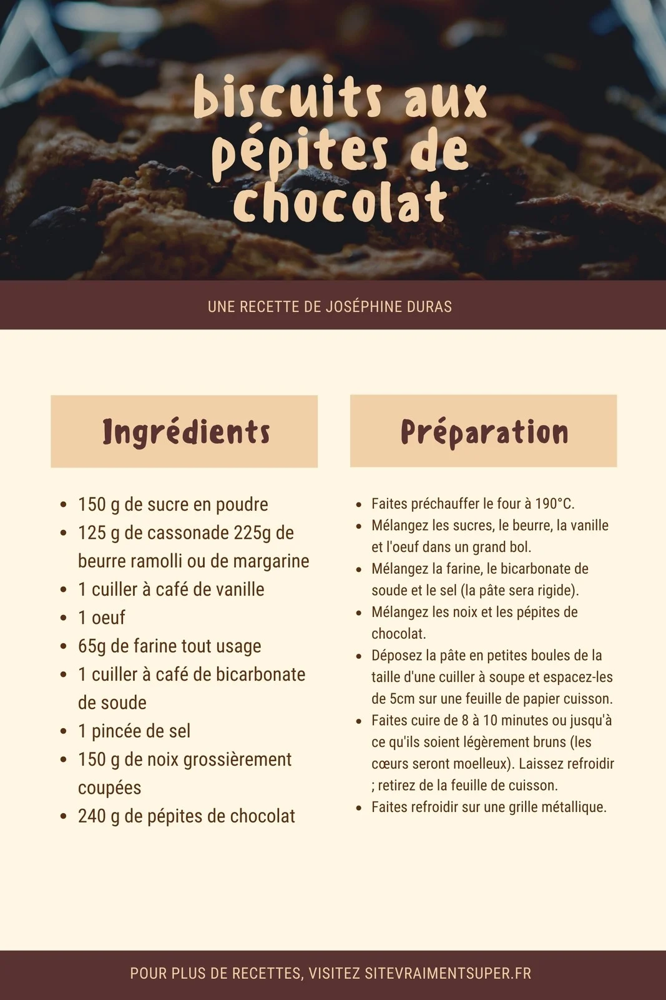
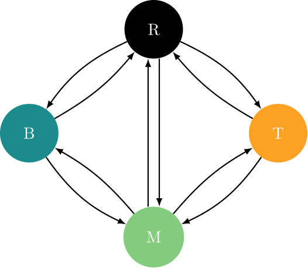
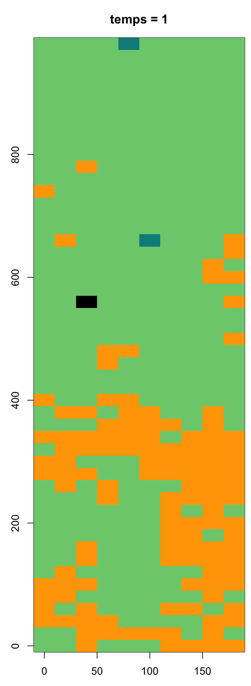

class: title-slide, middle

<style type="text/css">
  .title-slide {
    background-image: url('../assets/img/bg.jpg');
    background-color: #23373B;
    background-size: contain;
    border: 0px;
    background-position: 600px 0;
    line-height: 1;
  }
</style>

# Séance 4

<hr width="65%" align="left" size="0.3" color="orange"></hr>

## Algorithmique I

<hr width="65%" align="left" size="0.3" color="orange" style="margin-bottom:40px;"></hr>

.instructors[
  **BIO109** - Victor Cameron
]

</img>


---
class: middle, center, inverse

# Retour sur les fonctions
<hr width="65%" size="0.3" color="orange" style="margin-top:-20px;"></hr>


---

# Trucs pour essayer de programmer une fonction

Commencer en travaillant localement

```{r eval=TRUE}
quadrats = read.csv2(file="donnees/quadrats.csv", header=TRUE,
    stringsAsFactors=FALSE,row.names = 1)
X <- quadrats$acsa
```

---

# Trucs pour essayer de programmer une fonction

Tout envelopper dans une fonction

```{r eval=TRUE}
ma_fonction <- function(X) {
  print(X)
}
```


---

# Trucs pour essayer de programmer une fonction

On fait un essai sur un premier objet que l'on connait

```{r eval=TRUE}
ma_fonction(X)
```

Ensuite on fait un test sur un second objet

```{r eval=TRUE}
ma_fonction(quadrats$abba)
```

---

# Trucs pour essayer de programmer une fonction

Finalement on peut l'appliquer sur l'ensemble des données

```{r eval=FALSE}
apply(quadrats, 2, ma_fonction)
```

---
class: middle, center, inverse

# Les algorithmes
<hr width="65%" size="0.3" color="orange" style="margin-top:-20px;"></hr>

---

# Définition

"Ensemble de règles opératoires dont l'application permet de résoudre un problème énoncé au moyen d'un nombre fini d'opérations." <br>
\- Larousse -

Une recette de cuisine est un algorithme

<div style='text-align:center;'>
</img>
</div>

---
class: inverse, middle, center

# Les boucles
<hr width="65%" size="0.3" color="orange" style="margin-top:-20px;"></hr>

---

# Mise en situation

.pull-left[
Vous étudiez la démographie de la population de salamandres pourpres dans le ruisseau du massif des monts Sutton. Vos données sont très simples, vous avez une mesure d'abondance à deux points d'échantillonnage au long du ruisseau. Vous devez vérifier si la population est en croissance, stable ou en déclin sur une séquence de 5 ans.
]

.pull-right[
<div style='text-align:center;'>
</img>
</div>
]

---

# Mise en situation

Le taux de croissance est donné par l'équation suivante :

$$
\dfrac{N_{t+1} - N_t}{N_t}
$$

où <br>
$N_{t} =$ nombre d'individus à l'année $t$ et <br>
$N_{t+1} =$ nombre d'individus à l'année suivante.

---

# Mise en situation

Les données ressemblent à ce qui suit:

```{r}
donnees <- matrix(nr = 5, nc = 2)
donnees[,1] <- c(34,35,32,34,36)
donnees[,2] <- c(32,36,38,36,40)
an <- c(2010:2014)
rownames(donnees) <- an
colnames(donnees) <- c("Site1", "Site2")
head(donnees)
```

---

# Mise en situation

Les données ressemblent à ce qui suit:

```{r, out.width = '42%', dpi=300, fig.align="center"}
plot(an,donnees[,1],type = "l", xlab = "Année",ylab = "Nombre d'individus", ylim=c(32,40),cex=2)
lines(an,donnees[,2], lty = 3)
points(an,donnees[,1], pch = 19,cex=1.5)
points(an,donnees[,2], pch = 19,cex=1.5)
```

---
# Mise en situation

Maintenant, on doit calculer le taux de croissance annuel pour chaque population. Commençons pour l'intervalle entre l'an 1 et l'an 2, sur le site 1 :

```{r}
# 0. Sauvons les données dans une matrice "lambda"
lambda <- matrix(nr = 4, nc = 2)

# 1. Calculons le taux de croissance
lambda[1,1] <- (donnees[2,1] - donnees[1,1]) / donnees[1,1]
```

Ensuite, on fait l'an 2 :

```{r}
lambda[2,1] <- (donnees[3,1] - donnees[2,1]) / donnees[2,1]
```

---
# Mise en situation

Très rapidement, on réalise que c'est assez fastidieux de refaire cet exercice à la main, mais c'est faisable.

Imaginez cependant que vous découvrez un jour qu'un passionné des salamandres a déjà fait une étude similaire sur ce site, et par miracle vous obtenez des séries temporelles de 50 ans réparties sur 25 points d'échantillonnage. Il faudra changer de technique...

---
# Mise en situation

La semaine dernière, nous avons vu comment généraliser une séquence d'opérations au moyen d'une fonction. Pratique ! 

Mais nous devrions appliquer la fonction pour chacun des points d'échantillonnage. 25 appels de la fonction, avec 25 chances de se tromper...

Comment est-ce qu'on peut généraliser des opérations qui sont répétées très souvent ? C'est le principe de la boucle.

---
# Mise en situation

La solution rapide ressemblerait à

```{r}
n_sites <- ncol(donnees)
n_annees <- nrow(donnees)
lambda <- matrix(nr = n_annees-1, nc = n_sites)
for(i in 1:(n_annees-1)) {
    for(j in 1:n_sites) {
        lambda[i,j] <- (donnees[i+1,j] - donnees[i,j]) / donnees[i,j]
    }
}
```

.pull-left[
donnees
```{r echo=FALSE}
head(donnees)
```
]

.pull-right[
lambda
```{r echo=FALSE}
head(lambda)
```
]

---
# Définition

Une boucle est une commande qui permet de répéter une série d'instructions sous des conditions définies de départ et de fin. C'est une commande de base de l'algorithmique.

---
# Anatomie de la boucle

```{r}
depart <- 1
fin <- 5
for(etape in depart:fin) {
    print(etape)
}
```

`etape` est un compteur de la position dans la boucle.

L'exécution une fois d'un groupe de commandes dans un boucle s'appelle une **itération**.

---
# Quelques exemples simples

Par défaut R augmente toujours le compteur de 1 unité

```{r}
for(etape in 1:5) {
    print(etape*2)
}
```

`print` est une fonction simple qui permet d'écrire dans le terminal une information dans la console. Ici, le résultat du compteur multiplié par 2.

---
# Un premier exercice simple

Transformez en celcius une séquence de température en fahrenheit qui va de -50 à 100, par bond de 1. Rappelez vous que la conversion est (F - 32) * 5/9.

- Déterminez le point de départ de la séquence
- Déterminez le point de fin de la séquence
- Faites le calcul approprié
- Imprimez le résultat

---
# Un premier exercice simple

```{r eval=FALSE}
for(F in -50:100) {
    cat("Pour F = ",F," on obtient C = ",(F - 32) *5/9, '\n')
}
```

```{r echo=FALSE}
for(F in -50:-45) {
    cat("Pour F = ",F," on obtient C = ",(F - 32) *5/9, '\n')
}
```

`cat` est une commande similaire à `print` qui permet d'ajouter des séquences de caractères. 

---
# Boucles et indexation

Les boucles sont souvent utilisées pour accéder à des positions dans un objet de façon récursive. Le compteur de la boucle peut alors être utilisé directement comme indice pour accéder à de l'information dans l'objet. Par exemple :

```{r}
vect5 <- runif(5, 0,1)
for(etape in 1:5) {
    print(vect5[etape])
}
```

---
# Boucles et indexation

De même, on peut réaliser des opérations mathématiques sur cette variable

```{r}
vect500 <- runif(500, 0,1)
for(etape in 1:5) {
    print(vect500[etape * 5])
}
```

---
# Compteur

La séquence ne commence pas toujours par 1, et donc parfois on doit avoir un compteur indépendant pour l'indexation. Il est donc pratique de calculer à quelle position on se situe dans la boucle.

```{r eval=FALSE}
n = 1
for(etape in -2:5) {
    cat("etape = ",etape, " n = ",n, '\n')
    n <- n + 1
}
```

```{r echo=FALSE}
n = 1
for(etape in -2:1) {
    cat("etape = ",etape, " n = ",n, '\n')
    n <- n + 1
}
```

Dans cet exemple, on ne pourrait pas indexer à la position de départ (-2). On crée donc un objet `n` qui a une valeur de 1 au départ et qui augmente de 1 unité à chaque itération. On peut maintenant utiliser ce compteur pour indexer un objet (vecteur, matrice, liste etc...).

---
# Exercice

Enregistrez les résultats de votre conversion dans une matrice avec pour colonne 1 la valeur en Fahrenheit et la colonne 2 la valeur en celcius.

---
# Solution

```{r  eval=TRUE}
resultat = matrix(nr = 151, nc = 2)
n = 1
for(F in -50:100) {
    resultat[n,1] = F
    resultat[n,2] = (F-32)*5/9
    n = n + 1
}
head(resultat)
```

---
# On complexifie le problème ....

Il est possible de nicher une boucle dans une boucle. On réalise notamment cette opération pour faire des calculs sur des matrices, des listes...

```{r eval = TRUE}
ma_matrice <- matrix(nr = 3, nc = 5)
n <- 1
for(i in 1:3) {
    for(j in 1:5) {
        ma_matrice[i,j] <- n
        n <- n + 1
    }
}
ma_matrice
```

Notons qu'on remplit ici la matrice par rangée. On pourrait inverser les boucles pour y aller par colonne.

---
# La boucle while

La boucle de type *while*, pour 'pendant que', répète une série d'intructions tant qu'une condition n'a pas été atteinte. Par exemple, on peut tirer deux pièces de monnaie jusqu'à ce que l'on obtienne la combinaison pile-pile.

```{r}
piece <- c("pile","face")
combinaison = "face-face"
while(combinaison != "pile-pile") {
    essai1 <- sample(piece, 1)
    essai2 <- sample(piece, 1)
    combinaison <- paste(essai1, "-" , essai2, sep = "")
    print(combinaison)
}
```

La boucle va s'arrêter quand le résultat de la condition sera **FALSE**

---
# Exercice

Utilisez la boucle `while` pour calculez combien de fois vous avez à tirer un dé pour obtenir un 6.

- Ça prend un dé de 6 faces
- Ça prend un compteur
- et une série de tirages

---
# Solution

```{r}
de <- c(1:6)
n <- 1
tirage <- 1 # Il faut initier le tirage
while(tirage != 6) {
	tirage <- sample(de,1) # tirage du dé
	n <- n + 1 # mise à jour du compter pour tester le nombre de tirages
}
cat("Il a fallu", n, "étapes pour obtenir la valeur ", tirage, '\n')
```

---
# Solution : on répète plusieurs fois

```{r}
de <- c(1:6)
n_test <- 1000
res <- numeric(n_test)
for(i in 1:n_test) {
	n <- 1
	tirage <- 1 # Il faut initier le tirage
	while(tirage != 6) {
		tirage <- sample(de,1) # tirage du dé
		n <- n + 1 # mise à jour du compter pour tester le nombre de tirages
	}
	res[i] <- n # Enregistrement du nombre de tirage
}
mean(res)
```

---
# Solution

```{r , out.width = '50%', dpi=300, fig.align="center"}
hist(res)
```

---
class: middle, center, inverse

# Exercice intermédiaire
<hr width="65%" size="0.3" color="orange" style="margin-top:-20px;"></hr>

---
# Croissance logistique

La croissance d'une population sujette à la densité-dépendance, en temps discret, se calcul bien au moyen d'une boucle. La densité au temps $t+1$ (l'année suivante) se calcule ainsi :

$$
N_{t+1} = N_t + r \times N_t \times (1 - N_t/K)
$$

Henri Meunier a importé environ 220 cerfs sur l'île d'Anticosti au début du 20ème siècle et on compte aujourd'hui environ 200 000 bêtes, ce qui correspond à la capacité de support du milieu ( $K$ ). Si on fixe le taux de croissance ( $r$ ) à 0.3, combien de temps fut nécessaire à la population pour atteindre 50% de la capacité de support ?

> **Astuce** : On cherche à compter le nombre d'années nécessaires pour que $N$ atteingne la valeur de $K/2$.
---
# Solution 1

```{r}
r <- 0.3
N <- 220
K <- 200000
step <- 1
while(N < K/2) {
    N <- N + r * N * (1 - N/K)
    step <- step + 1
}
step
```

---
# Solution 2

```{r}
r <- 0.3
K <- 200000
n_steps <- 115
N <- numeric(n_steps+1)
N[1] <- 220

for(i in 2:(n_steps+1)) {
    N[i] <- N[i-1] + r * N[i-1] * (1 - N[i-1]/K)
}
```

---
# Solution 2

```{r, out.width = '50%', dpi=300, fig.align="center"}
plot(c(1900:2015), N, type = "l", xlab = "Année", ylab = "Population")
```
---
# Qu'est-ce qui arrive avec $r = 2.75$ ?


---
# Qu'est-ce qui arrive avec $r = 2.75$ ?

```{r, out.width = '40%', dpi=300, fig.align="center"}
n_steps <- 115
N <- numeric(n_steps+1)
N[1] <- 220
for(i in 2:(n_steps+1)) {
    N[i] <- N[i-1] + 2.75 * N[i-1] * (1 - N[i-1]/200000)
}
plot(c(1900:2015), N, type = "l", xlab = "Année", ylab = "Population")

```

---
class: middle, center, inverse

# Expressions conditionnelles
<hr width="65%" size="0.3" color="orange" style="margin-top:-20px;"></hr>


---
# Principe

Très souvent en programmation on a à prendre des décisions du type **si la condition X est remplie, alors faire Y, sinon faire Z**. Nous avons déjà vu certains exemples depuis le début du cours.

La structure de base d'une expression conditionnelle est la suivante:

```{r eval = FALSE}
if(condition) {
    # instruction 1
    }
else {
    # instruction 2
}
```

---
# Arbre décisionnel

Un exemple,

```{r eval = FALSE}
todo <- function(jour) {
    if(jour == "mardi") {
        print("Je dois aller au cours BIO109")
    }
    else {
        if(jour == "lundi") {
        print("Ai-je fais mon travail pour le cours BIO109 ?")
        }
        else {
            if(jour == "samedi") {
                print("Je peux encore dormir un peu")
            }
            else {
                print("Bof, j'ai encore du temps !")
            }
        }
    }  
}
```

---
# Astuce

L'indentation (l'utilisation d'espaces dans le code) est fort utile pour s'y retrouver lorsque les conditions deviennent nombreuses. Reprenons l'exemple précédent.

---
# Arbre décisionnel

```{r eval = FALSE}
todo <- function(jour) {
if(jour == "mardi") {
print("Je dois aller au cours BIO109")
}
else {
if(jour == "lundi") {
print("Ai-je fais mon travail pour le cours BIO109 ?")
}
else {
if(jour == "samedi") {
print("Je peux encore dormir un peu")
}
else {
print("Bof, j'ai encore du temps !")
}
}
}  
}
```

---
# Opérateurs logiques

Les classiques :

| Opérateur | Signification | Exemple |
|:---------:|:-------------:| :------:|
| == | égal à | X == Y |
| != | différent de | X != Y |
| > | supérieur à | X > Y |
| < | inférieur à | X < Y |
| >= | supérieur ou égal à | X >= Y |
| <= | inférieur ou égal à | X <= Y |

---
# Exercice

1. Tirez au hasard 10 chiffres entre 0 et 1 avec `runif()`.
2. Pour chacun de ces chiffres, déterminez s'il est plus petit ou plus grand que la valeur seuil de 0.3.
3. Inscrivez votre résultat dans un autre objet.

---

# Solution

.pull-left[

```{r, eval=FALSE}
chiffres <- runif(n = 10)
res <- numeric(10)
for(i in 1:10) {
    if(chiffres[i] < 0.3) {
        res[i] <- "plus petit"
    }
    else {
        res[i] <- "plus grand"
    }
}
cbind(chiffres,res)
```
]

.pull-right[

```{r, echo=FALSE}
X <- runif(n = 10)
res <- numeric(10)
for(i in 1:10) {
    if(X[i] < 0.3) {
        res[i] <- "plus petit"
    }
    else {
        res[i] <- "plus grand"
    }
}
cbind(X,res)
```
]


---
# Opérateurs logiques

On peut aussi combiner plusieurs conditions :

- La condition A et la condition B : `A & B`
- La condition A ou la condition B : `A | B`

---
# Exercice

Reprenez la même séquence de chiffres, mais cette fois-ci déterminez si le chiffre est situé entre les valeurs de 0.2 et 0.6.

---

# Solution

```{r, eval=FALSE}

res2 <- numeric(10)
for(i in 1:10) {
    if(chiffres[i] > 0.2 & chiffres[i] < 0.6) {
        res2[i] <- "oui"
    }
    else {
        res2[i] <- "non"
    }
}
cbind(chiffres, res2)
```


```{r, echo=FALSE}
chiffres <- runif(n = 10)
res2 <- numeric(10)
for(i in 1:10) {
    if(chiffres[i] > 0.2 & chiffres[i] < 0.6) {
        res2[i] <- "oui"
    }
    else {
        res2[i] <- "non"
    }
}
cbind(chiffres,res2)
```

---

# Conditions sur des vecteurs

R a la particularité d'être optimisé pour les objets sous forme de matrice ou de vecteur. Ainsi, vous pouvez évaluer des expressions conditionnelles sur un vecteur sans avoir à passer par une boucle. On peut reprendre l'exemple précédent, d'une façon beaucoup plus rapide :

.pull-left[

```{r, eval=FALSE}
res2 <- numeric(10)
res2[X > 0.2 & X < 0.6] <- "oui"
res2[X < 0.2 | X > 0.6] <- "non"
cbind(X,res2)
```
]


.pull-right[
    
```{r, echo=FALSE}
X <- runif(n = 10)
res2 <- numeric(10)
res2[X > 0.2 & X < 0.6] <- "oui"
res2[X < 0.2 | X > 0.6] <- "non"
cbind(X,res2)
```
]

Cette syntaxe est moins lisible et intuitive, vous n'avez pas à l'utiliser pour le cours. Il faut néanmoins pouvoir la reconnaitre et surtout savoir qu'elle est de 100 à 1000 plus rapide que la boucle `for`.

---
class: middle, inverse, center

# Travail final
<hr width="65%" size="0.3" color="orange" style="margin-top:-20px;"></hr>

---
# Répartition des domaines bioclimatiques

<div style='text-align:center;'>
</img>
</div>

Forêt tempérée -> forêt mixte -> forêt boréale -> rien

---
# La distribution des arbres à Sutton

<div style='text-align:center;'>
</img>
</div>

---
# Un modèle de communauté
<div style='text-align:center;'>
</img>
</div>

---
# Répartition des états

.pull-left[
<div style='text-align:center;'>
</img>
</div>
]

.pull-right[
La parcelle de Sutton peut être représentée par une matrice de composition :
<div style='text-align:center;'>
</img>
</div>
]


---
# Les différents états

- 'B' si présence de abba ou piru
- 'T' si présence de acsa ou beal ou fagr
- 'M' si présence de (abba ou piru) et (acsa ou beal ou fagr)
- 'R' si aucun de ces critères n'est rempli


Les données sont dans le fichier `quadrats.csv` :

```{r, echo=FALSE}
read.csv2("donnees/quadrats.csv") |> head()
```


---
# La matrice de transition entre les différents états

$$
\begin{bmatrix}
P(B_{t+1}|B_t) & P(M_{t+1}|B_t) & P(T_{t+1}|B_t) & P(R_{t+1}|B_t) \\
P(B_{t+1}|M_t) & P(M_{t+1}|M_t) & P(T_{t+1}|M_t) & P(R_{t+1}|M_t) \\
P(B_{t+1}|T_t) & P(M_{t+1}|T_t) & P(T_{t+1}|T_t) & P(R_{t+1}|T_t) \\  
P(B_{t+1}|R_t) & P(M_{t+1}|R_t) & P(T_{t+1}|R_t) & P(R_{t+1}|R_t) \\
\end{bmatrix}
$$

Se lit ainsi: la rangée correspond à l'état au temps t et la colonne correspond à l'état au temps t+1. Une ligne de ce tableau correspond à un vecteur de probabilités d'une distribution multinomiale. Donc, la somme d'une rangée doit être égale à 1.

Une entrée $P(B_{t+1} | T_t)$ se lit comme "la probabilité qu'un quadrat occupé par l'état T au temps t soit occupé par l'état B au temps t+1".

---
# La matrice de transition entre les différents états

$$
\begin{bmatrix}
0.9059 & 0.0932 & 0.0000 & 0.0009 \\  
0.0004 & 0.8454 & 0.1452 & 0.0090 \\
0.0000 & 0.0350 & 0.9594 & 0.0056 \\
0.0001 & 0.0020 & 0.0011 & 0.9968 \\
\end{bmatrix}
$$

Notez que l'intervalle de temps entre deux épisodes est 5 ans.


Une entrée $P(B_{t+1} | T_t)$ se lit comme "la probabilité qu'un quadrat occupé par l'état T au temps t soit occupé par l'état B au temps t+1".

---
# Question de recherche

Quelle sera la distribution de la forêt tempérée au sein de la Réserve écologique des Montagnes vertes dans 75 ans ?

---
# Données

- Distribution initiale de la végétation dans le fichier [quadrats.txt](./donnees/quadrats.txt)
- Matrice de transition entre les 4 états dans le fichier [matrice_transitions.txt](./donnees/matrice_transitions.txt)

---
# Modalités

## Remise

Le travail se réalisera en équipe de 2. Inscrire le nom des membres en commentaire sur les travaux (eg. `# auteurs: Victor Cameron, Benjamin Mercier`)

**7 février** : Un membre par équipe peut remettre une première version du pseudo-code sur Moodle avant la séance 5 pour une correction formative (qui n'est pas notée !)

**21 février** : Le travail terminal (pseudo code + programme) devra être remis sur Moodle avant le 21 février 23h59
   
---
# Modalités

## Programme

Votre programme devra être remis dans un dossier `projet` qui contiendra les données et les scripts suivants :

1. Transformer les abondances ([quadrats.txt](./donnees/quadrats.txt)) en états de départ
2. Fonction qui tire au hasard l'état au temps t+1 en fonction de l'état au temps t pour une cellule de coordonnées $[x,y]$ dans la matrice de composition ETATS
3. Fonction qui fait une simulation sur N pas de temps, pour une matrice de composition de départ ETATS0, et retourne la composition (proportion de chaque état sur l'ensemble de la placette) pour chaque pas de temps
4. Exécuter la fonction sur 10 et 100 pas de temps et évaluer le temps de calcul avec system.time()
5. Utiliser la sortie de la fonction pour répondre aux question suivantes : 
  > i) qu'advient-il de la forêt mixte dans 25 ans ? 50 ans ? 75 ans ?
  > ii) à quelle vitesse se transformerait une forêt entière constituée d'un mélange de feuillus et de conifères (M) au départ ?

---
# Modalités

## Pseudo-code

### 7 février

Un membre par équipe, doit remettre le pseudo-code pour les étapes 1 à 3. Inscrire `COMPUTE etat_t1` pour le tire au hasard de l'état au temps t+1. Faire le pseudo-code pour le reste de la fonction.

### 21 février

Un membre par équipe, doit remettre le programme et le pseudo-code pour chacune des fonctions, **incluant** le tirage au hasard
- Découpage en scripts séparés pour les différentes étapes. L'analyse (étapes 4-5) dans un seul script. Ce script exécute votre code, de la lecture du fichier de départ jusqu'à la production de la figure finale. 
- Moodle n'accepte qu'un seul fichier, vous pouver compresser votre répertoire de travail et remettre le fichier zip
- Attention à la reproductibilité (relire attentivement le cours 1)!

---
# Critères d'évaluation

## Pseudo-code (22%)

**Respect des bonnes pratiques enseignées**
- Les instructions sont connues et adaptées à l'utilisation
- Mise en forme correcte des instructions et variables
- Les noms de variables sont explicites

**La mise en forme adéquate d'un pseudo-code**
- Une instruction par ligne
- Le code est indenté de façon constante
- Le pseudo-code est divisé en blocs rerpésentant des algorithmes

**Justesse des processus de programmation utilisés**
- Les opérations répétées utilisent des boucles
- Les opérations logiques utilisent des déclarations conditionnelles

---

# Critères d'évaluation

## Programme (60%)

- Respect des bonnes pratiques enseignées dans le cours (40%)
- Exécution des différentes étapes du code (40%):
	+ Transformation des données sous forme d'états
	+ Programmation de la simulation sous forme d'une fonction ré-utilisable
	+ Réalisation de la simulation stochastique (tirage des transitions)
	+ Réalisation de la figure
- Capacité d'exécuter le code de A à Z, soit de la lecture du fichier de données jusqu'à la figure, sans intervenir (20 %). [les données d'entrées seront dans le répertoire de travail d'où sera exécuté le code - nous utiliserons la fonction `source` pour exécuter votre script d'analyse]

<!-- **Reproducibilité : Structure rigoureuse du programme**
- Les scripts sont divisés en fonctions
- Le code est généralisé et indépendant des données

**Exécution : Fonctionnement adéquat du programme**
- Le programme s'exécute sans intervention de l'utilisateur autre que l'appel `source()` pour lancer la simulation
- Le programme s'exécute sans erreur ou messages d'alerte
- Le programme prend en compte les arguments pour exécuter la simulation
- Le programme produit les résulats attendus
- La simulation s'exécute sur 10 et 100 pas de temps

**Application correcte des pratiques de programmation**
- Le code est bien structuré et facile à lire
- Le code est bien commenté
- Les variables et arguments sont nommés de façon explicite -->


---

# Rappel

On peut exécuter un script (par exemple pour charger une fonction) dans un autre script avec la commande `source()`

```{r eval=FALSE}
source("ma_fonction.R")
ma_fonction(x)
```

