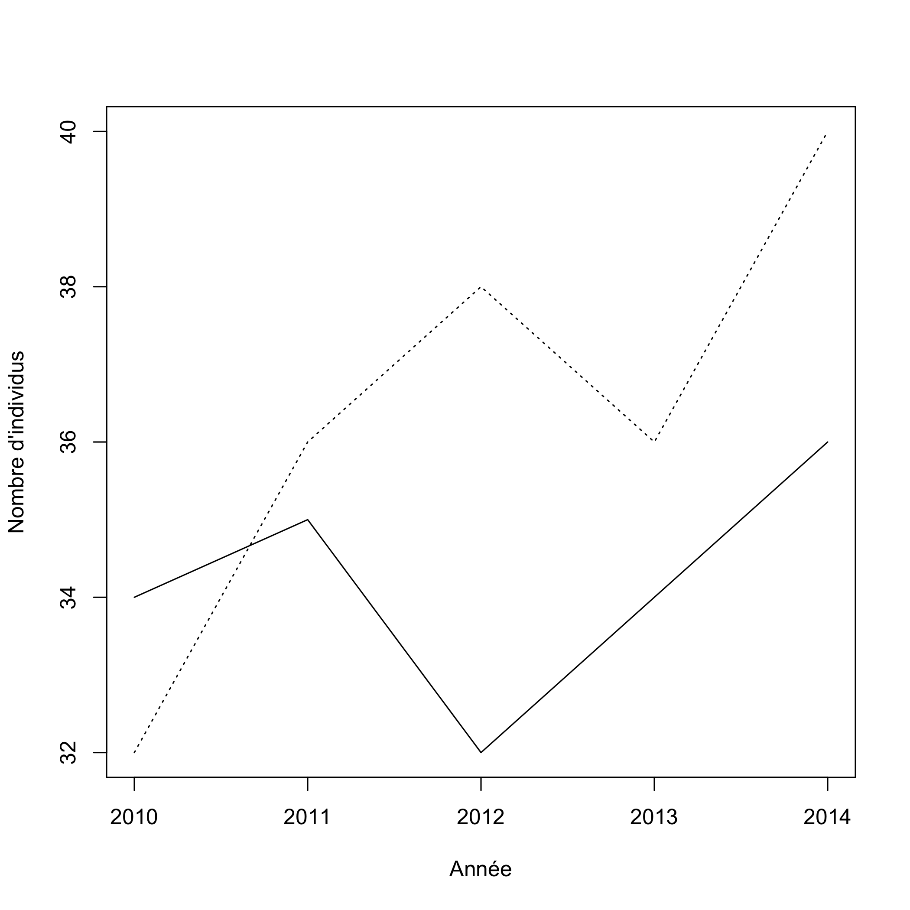
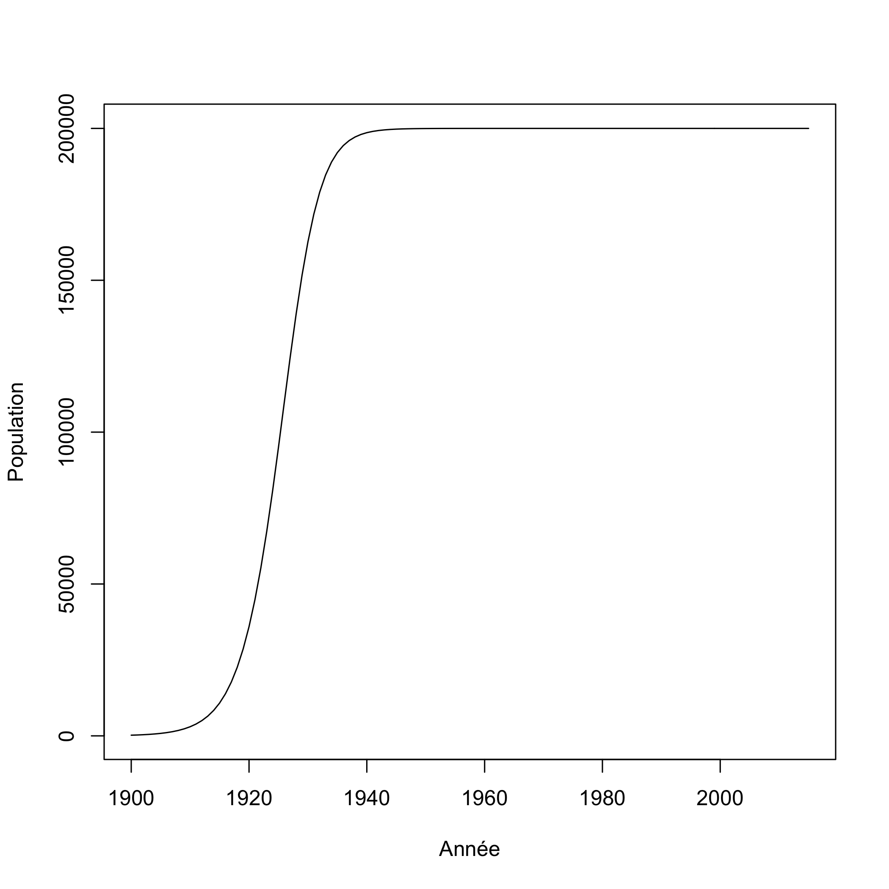

# Mise en situation

Vous étudiez la démographie de la population de salamandres pourpres dans le ruisseau du massif des monts Sutton. Vos données sont très simples, vous avez une mesure d'abondance à deux points d'échantillonnage au long du ruisseau. Vous devez vérifier si la population est en croissance, stable ou en déclin sur une séquence de 5 ans. Le taux de croissance est donné par l'équation suivante :

$$
\dfrac{N_{t+1} - N_t}{N_t}
$$

---

# Mise en situation

Les données ressemblent à ce qui suit:


```r
donnees <- matrix(nr = 5, nc = 2)
donnees[,1] <- c(34,35,32,34,36)
donnees[,2] <- c(32,36,38,36,40)
an <- c(2010:2014)
head(donnees)
```

```
##      [,1] [,2]
## [1,]   34   32
## [2,]   35   36
## [3,]   32   38
## [4,]   34   36
## [5,]   36   40
```

---

# Mise en situation

Les données ressemblent à ce qui suit:


```r
plot(an,donnees[,1],type = "l", xlab = "Année",ylab = "Nombre d'individus", ylim=c(32,40),cex=2)
lines(an,donnees[,2], lty = 3)
```



---
# Mise en situation

Maintenant, on doit calculer le taux de croissance annuel pour chaque population. Commençons pour l'intervalle entre l'an 1 et l'an 2, sur le site 1 :


```r
lambda <- matrix(nr = 4, nc = 2)
lambda[1,1] <- (donnees[2,1] - donnees[1,1]) / donnees[1,1]
```

Ensuite, on fait l'an 2 :


```r
lambda[2,1] <- (donnees[3,1] - donnees[2,1]) / donnees[2,1]
```

---
# Mise en situation

Très rapidement, on réalise que c'est assez fastidieux de refaire cet exercice à la main, mais c'est faisable.

Imaginez cependant que vous découvrez un jour qu'un passionné des salamadres a déjà fait une étude similaire sur ce site, et par miracle vous obtenez des séries temporelles de 50 ans réparties sur 10 points d'échantillonnage. Il faudra changer de technique....

---
# Mise en situation

La semaine dernière, nous avons vu comment généraliser une séquence d'opérations au moyen d'une fonction. Comment est-ce qu'on peut généraliser des opérations qui sont répétées très souvent ? C'est le principe de la boucle.

---
# Mise en situation

La solution ressemblerait à


```r
n_sites <- ncol(donnees)
n_annees <- nrow(donnees)
lambda <- matrix(nr = n_annees-1, nc = sites)
for(i in 2:n_annees) {
    for(j in 1:n_sites) {
        lambda <- (donnees[i,j] - donnees[i-1,j]) / donnees[i-1,j]
    }   
}
```

---
# Définition

Une boucle est une commande qui permet de répéter une série d'instructions sous des conditions définies de départ et de fin. C'est une commande de base de l'algorithmique.

---
# Anatomie de la boucle


```r
depart = 1
fin = 5
for(etape in depart:fin) {
    print(etape)
}
```

```
## [1] 1
## [1] 2
## [1] 3
## [1] 4
## [1] 5
```

L'exécution une fois d'un groupe de commandes dans un boucle s'appelle une itération.

---
# Quelques exemples simples

On peut mettre toutes sortes de contraintes sur l'index de la boucle


```r
for(etape in c("Bonjour", "programmeurs", "en R")) {
    print(etape)
}
```

```
## [1] "Bonjour"
## [1] "programmeurs"
## [1] "en R"
```

Dans cet exemple, notre séquence contient 3 éléments "Bonjour", "programmeurs", "en R". R va évaluer l'expression 3 fois. La variable index prendra successivement les valeurs de 1 à 3 pendant l'exécution de la boucle.

---
# Quelques exemples simples

Par défaut R augmente toujours l'index de 1 unité


```r
for(etape in 1:5) {
    print(etape*2)
}
```

```
## [1] 2
## [1] 4
## [1] 6
## [1] 8
## [1] 10
```

---
# Un premier exercice simple

Transformez en celcius une séquence de température en fahrenheit qui va de -50 à 100, par bond de 1. Rappelez vous que la conversion est (F - 32) * 5/9.

- Déterminez le point de départ de la séquence
- Déterminez le point de fin de la séquence
- Faites le calcul approprié

---
# Un premier exercice simple


```r
for(F in -50:100) {
    cat("Pour F = ",F," on obtient C = ",(F - 32) *5/9, '\n')
}
```

```
## Pour F =  -50  on obtient C =  -45.55556 
## Pour F =  -49  on obtient C =  -45 
## Pour F =  -48  on obtient C =  -44.44444 
## Pour F =  -47  on obtient C =  -43.88889 
## Pour F =  -46  on obtient C =  -43.33333 
## Pour F =  -45  on obtient C =  -42.77778 
## Pour F =  -44  on obtient C =  -42.22222 
## Pour F =  -43  on obtient C =  -41.66667 
## Pour F =  -42  on obtient C =  -41.11111 
## Pour F =  -41  on obtient C =  -40.55556 
## Pour F =  -40  on obtient C =  -40 
## Pour F =  -39  on obtient C =  -39.44444 
## Pour F =  -38  on obtient C =  -38.88889 
## Pour F =  -37  on obtient C =  -38.33333 
## Pour F =  -36  on obtient C =  -37.77778 
## Pour F =  -35  on obtient C =  -37.22222 
## Pour F =  -34  on obtient C =  -36.66667 
## Pour F =  -33  on obtient C =  -36.11111 
## Pour F =  -32  on obtient C =  -35.55556 
## Pour F =  -31  on obtient C =  -35 
## Pour F =  -30  on obtient C =  -34.44444 
## Pour F =  -29  on obtient C =  -33.88889 
## Pour F =  -28  on obtient C =  -33.33333 
## Pour F =  -27  on obtient C =  -32.77778 
## Pour F =  -26  on obtient C =  -32.22222 
## Pour F =  -25  on obtient C =  -31.66667 
## Pour F =  -24  on obtient C =  -31.11111 
## Pour F =  -23  on obtient C =  -30.55556 
## Pour F =  -22  on obtient C =  -30 
## Pour F =  -21  on obtient C =  -29.44444 
## Pour F =  -20  on obtient C =  -28.88889 
## Pour F =  -19  on obtient C =  -28.33333 
## Pour F =  -18  on obtient C =  -27.77778 
## Pour F =  -17  on obtient C =  -27.22222 
## Pour F =  -16  on obtient C =  -26.66667 
## Pour F =  -15  on obtient C =  -26.11111 
## Pour F =  -14  on obtient C =  -25.55556 
## Pour F =  -13  on obtient C =  -25 
## Pour F =  -12  on obtient C =  -24.44444 
## Pour F =  -11  on obtient C =  -23.88889 
## Pour F =  -10  on obtient C =  -23.33333 
## Pour F =  -9  on obtient C =  -22.77778 
## Pour F =  -8  on obtient C =  -22.22222 
## Pour F =  -7  on obtient C =  -21.66667 
## Pour F =  -6  on obtient C =  -21.11111 
## Pour F =  -5  on obtient C =  -20.55556 
## Pour F =  -4  on obtient C =  -20 
## Pour F =  -3  on obtient C =  -19.44444 
## Pour F =  -2  on obtient C =  -18.88889 
## Pour F =  -1  on obtient C =  -18.33333 
## Pour F =  0  on obtient C =  -17.77778 
## Pour F =  1  on obtient C =  -17.22222 
## Pour F =  2  on obtient C =  -16.66667 
## Pour F =  3  on obtient C =  -16.11111 
## Pour F =  4  on obtient C =  -15.55556 
## Pour F =  5  on obtient C =  -15 
## Pour F =  6  on obtient C =  -14.44444 
## Pour F =  7  on obtient C =  -13.88889 
## Pour F =  8  on obtient C =  -13.33333 
## Pour F =  9  on obtient C =  -12.77778 
## Pour F =  10  on obtient C =  -12.22222 
## Pour F =  11  on obtient C =  -11.66667 
## Pour F =  12  on obtient C =  -11.11111 
## Pour F =  13  on obtient C =  -10.55556 
## Pour F =  14  on obtient C =  -10 
## Pour F =  15  on obtient C =  -9.444444 
## Pour F =  16  on obtient C =  -8.888889 
## Pour F =  17  on obtient C =  -8.333333 
## Pour F =  18  on obtient C =  -7.777778 
## Pour F =  19  on obtient C =  -7.222222 
## Pour F =  20  on obtient C =  -6.666667 
## Pour F =  21  on obtient C =  -6.111111 
## Pour F =  22  on obtient C =  -5.555556 
## Pour F =  23  on obtient C =  -5 
## Pour F =  24  on obtient C =  -4.444444 
## Pour F =  25  on obtient C =  -3.888889 
## Pour F =  26  on obtient C =  -3.333333 
## Pour F =  27  on obtient C =  -2.777778 
## Pour F =  28  on obtient C =  -2.222222 
## Pour F =  29  on obtient C =  -1.666667 
## Pour F =  30  on obtient C =  -1.111111 
## Pour F =  31  on obtient C =  -0.5555556 
## Pour F =  32  on obtient C =  0 
## Pour F =  33  on obtient C =  0.5555556 
## Pour F =  34  on obtient C =  1.111111 
## Pour F =  35  on obtient C =  1.666667 
## Pour F =  36  on obtient C =  2.222222 
## Pour F =  37  on obtient C =  2.777778 
## Pour F =  38  on obtient C =  3.333333 
## Pour F =  39  on obtient C =  3.888889 
## Pour F =  40  on obtient C =  4.444444 
## Pour F =  41  on obtient C =  5 
## Pour F =  42  on obtient C =  5.555556 
## Pour F =  43  on obtient C =  6.111111 
## Pour F =  44  on obtient C =  6.666667 
## Pour F =  45  on obtient C =  7.222222 
## Pour F =  46  on obtient C =  7.777778 
## Pour F =  47  on obtient C =  8.333333 
## Pour F =  48  on obtient C =  8.888889 
## Pour F =  49  on obtient C =  9.444444 
## Pour F =  50  on obtient C =  10 
## Pour F =  51  on obtient C =  10.55556 
## Pour F =  52  on obtient C =  11.11111 
## Pour F =  53  on obtient C =  11.66667 
## Pour F =  54  on obtient C =  12.22222 
## Pour F =  55  on obtient C =  12.77778 
## Pour F =  56  on obtient C =  13.33333 
## Pour F =  57  on obtient C =  13.88889 
## Pour F =  58  on obtient C =  14.44444 
## Pour F =  59  on obtient C =  15 
## Pour F =  60  on obtient C =  15.55556 
## Pour F =  61  on obtient C =  16.11111 
## Pour F =  62  on obtient C =  16.66667 
## Pour F =  63  on obtient C =  17.22222 
## Pour F =  64  on obtient C =  17.77778 
## Pour F =  65  on obtient C =  18.33333 
## Pour F =  66  on obtient C =  18.88889 
## Pour F =  67  on obtient C =  19.44444 
## Pour F =  68  on obtient C =  20 
## Pour F =  69  on obtient C =  20.55556 
## Pour F =  70  on obtient C =  21.11111 
## Pour F =  71  on obtient C =  21.66667 
## Pour F =  72  on obtient C =  22.22222 
## Pour F =  73  on obtient C =  22.77778 
## Pour F =  74  on obtient C =  23.33333 
## Pour F =  75  on obtient C =  23.88889 
## Pour F =  76  on obtient C =  24.44444 
## Pour F =  77  on obtient C =  25 
## Pour F =  78  on obtient C =  25.55556 
## Pour F =  79  on obtient C =  26.11111 
## Pour F =  80  on obtient C =  26.66667 
## Pour F =  81  on obtient C =  27.22222 
## Pour F =  82  on obtient C =  27.77778 
## Pour F =  83  on obtient C =  28.33333 
## Pour F =  84  on obtient C =  28.88889 
## Pour F =  85  on obtient C =  29.44444 
## Pour F =  86  on obtient C =  30 
## Pour F =  87  on obtient C =  30.55556 
## Pour F =  88  on obtient C =  31.11111 
## Pour F =  89  on obtient C =  31.66667 
## Pour F =  90  on obtient C =  32.22222 
## Pour F =  91  on obtient C =  32.77778 
## Pour F =  92  on obtient C =  33.33333 
## Pour F =  93  on obtient C =  33.88889 
## Pour F =  94  on obtient C =  34.44444 
## Pour F =  95  on obtient C =  35 
## Pour F =  96  on obtient C =  35.55556 
## Pour F =  97  on obtient C =  36.11111 
## Pour F =  98  on obtient C =  36.66667 
## Pour F =  99  on obtient C =  37.22222 
## Pour F =  100  on obtient C =  37.77778
```

---
# Boucles et indexation

Les boucles sont souvent utilisées pour accéder à des positions dans un objet de façon récursive. L'index de la boucle peut alors être utilisé directement comme index pour accéder à l'objet. Par exemple :


```r
test = runif(5, 0,1)
for(etape in 1:5) {
    print(test[etape])
}
```

```
## [1] 0.02331369
## [1] 0.3327549
## [1] 0.07717755
## [1] 0.7786474
## [1] 0.2726084
```

---
# Boucles et indexation

De même, on peut réaliser des opérations mathématiques sur l'index


```r
test = runif(500, 0,1)
for(etape in 1:5) {
    print(test[etape * 5])
}
```

```
## [1] 0.4008903
## [1] 0.2637898
## [1] 0.881541
## [1] 0.9209875
## [1] 0.9077825
```

---
# Compteur

La séquence ne commence pas toujours par 1, et donc parfois on doit avoir un compteur indépendent pour l'indexation. Il est donc pratique de calculer à quelle position on se situe dans la boucle.


```r
n = 1
for(etape in -2:5) {
    cat("etape = ",etape, " n = ",n, '\n')
    n <- n + 1
}
```

```
## etape =  -2  n =  1 
## etape =  -1  n =  2 
## etape =  0  n =  3 
## etape =  1  n =  4 
## etape =  2  n =  5 
## etape =  3  n =  6 
## etape =  4  n =  7 
## etape =  5  n =  8
```

---
# Exercice

Enregistrez les résultats de votre conversion dans une matrice avec pour colonne 1 la valeur en Fahrenheit et la colonne 2 la valeur en celcius.

---
# Solution


```r
resultat = matrix(nr = 151, nc = 2)
n = n + 1
for(F in -50:100) {
    resultat[n,1] = F
    resultat[n,2] = (F-32)*5/9
    n = n + 1
}
head(resultat)
```

---
# Exercice

On peut aussi utiliser le compteur pour réaliser des opérations mathématiques récursives. Par exemple, la factorielle n! est définie comme :

$$
n! = 1 \times 2 \times 3 \times 4 \times .... n
$$

Calculez la factorielle 10 au moyen d'une boucle.

---
# Exercice


```r
n = 1
for(etape in 1:10) n = n*etape
n
```

```
## [1] 3628800
```

---
# On complexifie le problème ....

Il est possible d'incruster une boucle dans une boucle. On réalise notamment cette opération pour faire des calculs sur des matrices, des listes...


```r
ma_matrice <- matrix(nr = 5, nc = 3)
n <- 1
for(i in 1:5) {
    for(j in 1:3) {
        ma_matrice[i,j] <- n
        n <- n + 1
    }
}
ma_matrice
```

---
# La boucle while

La boucle de type *while*, pour 'pendant', répète une série d'intructions tant qu'une condition n'a pas été atteinte. C'est une version générale de la boucle *for*. Par exemple, on peut tirer deux pièces de monnaie jusqu'à ce que l'on obtienne la combinaison pile-pile.


```r
piece <- c("pile","face")
combinaison = "face-face"
while(combinaison != "pile-pile") {
    essai1 <- sample(piece, 1)
    essai2 <- sample(piece, 1)
    combinaison = paste(essai1, "-" , essai2, sep = "")
    print(combinaison)
}
```

```
## [1] "face-pile"
## [1] "face-face"
## [1] "pile-pile"
```

---
# Exercice

Calculez en moyenne combien de fois vous avez à tirer un dé à 6 faces pour obtenir la valeur 1.

--- .transition
# Exercice intermédiaire

---
# Croissance logistique

La croissance d'une population sujette à la densité-dépendance, en temps discret, se calcul bien au moyen d'une boucle. La densité au temps $t+1$ se calcul ainsi :

$$
N_{t+1} = N_t + r \times N_t \times (1 - N/K)
$$

Henri Menier a importé environ 220 cerfs sur l'île d'Anticosti au début du 20ème siècle et on en compte aujourd'hui environ à 200 000 bêtes qui corresponds à la capacité de support du milieu ($K$). Si on fixe le taux de croissance ($lambda$) à 0.3, combien de temps fut nécessaire à la population pour atteindre 50% de la capacité de support ?

---
# Solution 1


```r
lambda = 0.3
N = 220
K = 200000
step = 1
while(N < K/2) {
    N = N + lambda * N * (1 - N/K)
    step = step + 1
}
step
```

```
## [1] 27
```

---
# Solution 2


```r
lambda = 0.3
K = 200000
n_steps = 115
N = numeric(n_steps+1)
N[1] = 220

for(i in 2:(n_steps+1)) {
    N[i] = N[i-1] + lambda * N[i-1] * (1 - N[i-1]/K)
}
```

---

# Solution 2


```r
plot(c(1900:2015),N,type = "l",xlab = "Année", ylab = "Population")
```



--- .transition

# Expressions conditionnelles

---
# Principe

Très souvent en programmation on a à prendre des décisions du type **si la condition X est remplie, alors faire Y, sinon faire Z**. Nous avons déjà vu certains exemples depuis le début du cours.

La structure de base d'une expression conditionelle est la suivante:


```r
if(condition) {
    instruction(1)
    }
else {
    instruction(2)
}
```

---
# Arbre décisionnel

Un exemple,


```r
test = function(jour) {
    if(jour == "mardi") {
        print("Je dois aller au cours BIO109")
    }
    else {
        if(jour == "lundi") {
        print("Ai-je fais mon travail pour le cours BIO109 ?")
        }
        else {
            if(jour == "samedi") {
                print("Je peux encore dormir un peu")
            }
            else {
                print("Bof, j'ai encore du temps !")
            }
        }
    }  
}
```

---
# Astuce

L'indentation (l'utilisation d'espaces dans le code) est fort utile pour s'y retrouver lorsque les conditions deviennent nombreuses. Reprenons l'exemple précédent.

---
# Arbre décisionnel


```r
test = function(jour) {
if(jour == "mardi") {
print("Je dois aller au cours BIO109")
}
else {
if(jour == "lundi") {
print("Ai-je fais mon travail pour le cours BIO109 ?")
}
else {
if(jour == "samedi") {
print("Je peux encore dormir un peu")
}
else {
print("Bof, j'ai encore du temps !")
}
}
}  
}
```

---
# Opérateurs logiques

Les classiques :

- X est égal à Y : `X == Y`
- X est supérieur à Y : `X > Y`
- X est inférieur à Y : `X < Y`
- X est supérieur ou égal à Y : `X >= Y`
- X est inférieur ou égal à Y : `X <= Y`
- X est différent de Y : `X != Y`

---
# Exercice

1. Tirez au hasard 10 chiffres entre 0 et 1.
2. Pour chacun de ces chiffres, déterminez s'il est plus petit ou plus grand que la valeur seuil de 0.3.
3. Inscrivez votre résultat dans un autre objet.

--- &twocol

# Solution

*** =left


```r
X <- runif(n = 10)
res <- numeric(10)
for(i in 1:10) {
    if(X[i] < 0.3) {
        res[i] <- "plus petit"
    }
    else {
        res[i] <- "plus grand"
    }
}
cbind(X,res)
```

*** =right


```
##       X                    res         
##  [1,] "0.174428719794378"  "plus petit"
##  [2,] "0.766226450679824"  "plus grand"
##  [3,] "0.744366807164624"  "plus grand"
##  [4,] "0.0158158370759338" "plus petit"
##  [5,] "0.118239835603163"  "plus petit"
##  [6,] "0.540905090747401"  "plus grand"
##  [7,] "0.524461495922878"  "plus grand"
##  [8,] "0.0970251078251749" "plus petit"
##  [9,] "0.450602065771818"  "plus grand"
## [10,] "0.593258157605305"  "plus grand"
```

---
# Opérateurs logiques

On peut aussi combiner plusieurs conditions :

- La condition A et la condition B : `A & B`
- La condition A ou la condition B : `A | B`

---
# Exercice

Reprenez la même séquence de chiffres, mais cette fois-ci déterminez si le chiffre est situé entre les valeurs de 0.2 et 0.6.

--- &twocol

# Solution

*** =left


```r
res2 <- numeric(10)
for(i in 1:10) {
    if(X[i] > 0.2 & X[i] < 0.6) {
        res2[i] <- "oui"
    }
    else {
        res2[i] <- "non"
    }
}
cbind(X,res2)
```

*** =right


```
##       X                    res2 
##  [1,] "0.174428719794378"  "non"
##  [2,] "0.766226450679824"  "non"
##  [3,] "0.744366807164624"  "non"
##  [4,] "0.0158158370759338" "non"
##  [5,] "0.118239835603163"  "non"
##  [6,] "0.540905090747401"  "oui"
##  [7,] "0.524461495922878"  "oui"
##  [8,] "0.0970251078251749" "non"
##  [9,] "0.450602065771818"  "oui"
## [10,] "0.593258157605305"  "oui"
```

--- &twocol

# Conditions sur des vecteurs

R a la particularité d'être optimisé pour les objets sous forme de matrice ou de vecteurs. Ainsi, vous pouvez réaliser des conditions sur un vecteur sans avoir à passer par une boucle. On peut reprendre l'exemple précédent, d'une façon beaucoup plus rapide :

*** =left


```r
res2 <- numeric(10)
res2[X > 0.2 & X < 0.6] <- "oui"
res2[X < 0.2 | X > 0.6] <- "non"
cbind(X,res2)
```

*** =right


```
##       X                    res2 
##  [1,] "0.174428719794378"  "non"
##  [2,] "0.766226450679824"  "non"
##  [3,] "0.744366807164624"  "non"
##  [4,] "0.0158158370759338" "non"
##  [5,] "0.118239835603163"  "non"
##  [6,] "0.540905090747401"  "oui"
##  [7,] "0.524461495922878"  "oui"
##  [8,] "0.0970251078251749" "non"
##  [9,] "0.450602065771818"  "oui"
## [10,] "0.593258157605305"  "oui"
```

--- .transition

# Exercice final

---

# Le retour du scrabble ...

Vous avez tiré au hasard les lettres X = {E, Z, F, C, D}. Écrivez une fonction qui va trier vos lettres automatiquement pour vous, sans utiliser les fonctions `sort()` et `order()` de R. 
