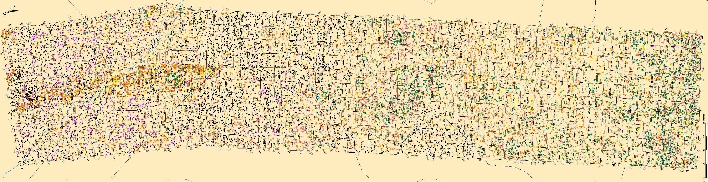

---.transition

# Exercice final

---
# Répartition des domaines bioclimatiques

<div style='text-align:center;'>
</img>
</div>

---
# La distribution des arbres à Sutton

<div style='text-align:center;'>
</img>
</div>

---
# Un modèle de communauté
<div style='text-align:center;'>
</img>
</div>

---

# Répartition des états

<div style='text-align:center;'>
</img>
</div>

---
# Les différents états

- 'B' si présence de abba ou piru
- 'T' si présence de acsa ou beal ou fagr
- 'M' si présence de (abba ou piru) et (acsa ou beal ou fagr)
- 'R' si aucun de ces critères n'est rempli

---&twocol

# Le code pour générer la figure

*** =left

```{r eval = FALSE}
coordx <- seq(0,180,20)
coordy <- seq(0,980,20)
paysage <- tapply(etats,INDEX = quadrats[,c(1:2)],sum)
par(mar = c(4,4,3,0.5))
image(x=coordx,y=coordy,z=paysage,xlab=NULL,ylab=NULL,
	col=c("black","orange","darkcyan","palegreen3"))
```

*** =right

<div style='text-align:center;'>
</img>
</div>

---
# La matrice de transition entre les différents états

$$
\begin{bmatrix}
P(B_{t+1}|B_t) & P(M_{t+1}|B_t) & P(T_{t+1}|B_t) & P(R_{t+1}|B_t) \\
P(B_{t+1}|M_t) & P(M_{t+1}|M_t) & P(T_{t+1}|M_t) & P(R_{t+1}|M_t) \\
P(B_{t+1}|T_t) & P(M_{t+1}|T_t) & P(T_{t+1}|T_t) & P(R_{t+1}|T_t) \\  
P(B_{t+1}|R_t) & P(M_{t+1}|R_t) & P(T_{t+1}|R_t) & P(R_{t+1}|R_t) \\
\end{bmatrix}
$$

Se lit ainsi: la rangée correspond à l'état au temps t et la colonne correspond à l'état au temps t+1. Une ligne de ce tableau correspond à un vecteur de probabilités d'une distribution multinomiale. Donc, la somme d'une rangée doit être égale à 1.

---
# La matrice de transition entre les différents états

$$
\begin{bmatrix}
0.9125 & 0.0866 & 0.0000 & 0.0009 \\  
0.0004 & 0.8652 & 0.1254 & 0.0090 \\
0.0000 & 0.0350 & 0.9213 & 0.0437 \\
0.0001 & 0.0020 & 0.0011 & 0.9968 \\
\end{bmatrix}
$$

Notez que l'intervalle de temps entre deux épisodes est 5 ans.


Une entrée $P(B_{t+1} | T_t)$ se lit comme "la probabilité qu'un quadrat occupé par l'état T au temps t soit occupé par l'état B au temps t+1".

---
# ATTENTION !

Bien qu'il y ait de nombreuses similarités avec le modèle de lotterie, il ne s'agit pas du même modèle. Ainsi, les étapes de mortalité et de recrutement sont combinées dans une seule étape où sont remplacés automatiquement les états d'un pas de temps à l'autre et où les probabilités sont toujours les mêmes (elles ne changent pas avec l'abondance relative).

---
# Question de recherche

Quelle sera la distribution de la forêt tempérée au sein de la Réserve écologique des Montagnes vertes dans 100 ans ?

---
# Données

- Distribution initiale de la végétation dans le fichier [quadrats.csv](./donnees/quadrats.csv)
- Matrice de transition entre les 4 états dans le fichier [matrice_transitions.txt](./donnees/matrice_transitions.txt)

---
# Étapes du travail

- Transformer les abondances en états de départ
- Préparer une fonction qui tire au hasard l'état au temps t+1 en fonction de l'état au temps t
- Préparer une fonction qui fait une simulation sur N pas de temps
- Utiliser la sortie de la fonction pour répondre à deux questions au moyen d'une figure :
	i) est-ce que les espèces de conifères seront toujours présentes dans le futur ?
	ii) combien de temps sera nécessaire pour que la forêt atteigne l'équilibre ?

---
# Modalités

- Le travail se réalisera en équipe de 4
- Le travail doit être remis **électroniquement** au plus tard le 19 février 16:00 sur Moodle
- Vous devez remettre:
	- Le pseudo-code pour la fonction principale qui réalise votre simulation
	- Le script qui exécute votre code, de la lecture du fichier de départ jusqu'à la production des figures. 
- Attention à la reproductibilité !

---
# Critères d'évaluation

- Respect des bonnes pratiques enseignées dans le cours (40%)
- Exécution des différentes étapes du code (40%):
	+ Transformation des données sous forme d'états
	+ Programmation de la simulation sous forme d'une fonction ré-utilisable
	+ Réalisation de la simulation stochastique (tirage des transitions)
	+ Réalisation des figures
- Capacité d'exécuter le code de A à Z, soit de la lecture du fichier de données jusqu'aux deux figures finales (20 %).
