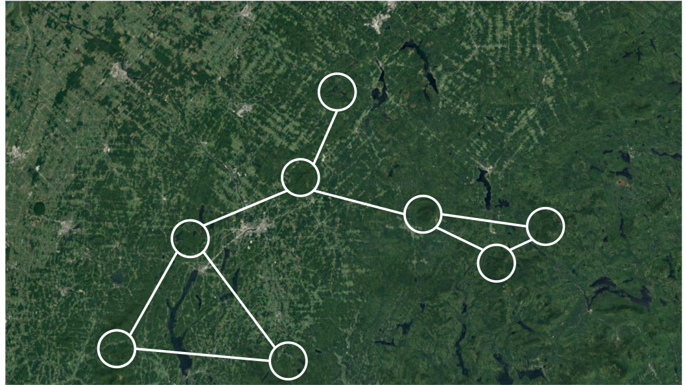

class: title-slide, middle

<style type="text/css">
  .title-slide {
    background-image: url('../assets/img/bg.jpg');
    background-color: #23373B;
    background-size: contain;
    border: 0px;
    background-position: 600px 0;
    line-height: 1;
  }
</style>

# Séance 5

<hr width="65%" align="left" size="0.3" color="orange"></hr>

## Algorithmique II

<hr width="65%" align="left" size="0.3" color="orange" style="margin-bottom:40px;"></hr>

.instructors[
  **BIO109** - Dominique Gravel
]

</img>


---
# Solution

```{r}
tri = function(x){
	# Calcul de la dimension du vecteur
	taille = length(x)
	ordre = "NON"
	# Boucle qui tourne jusqu'à ce que tout soit en ordre
	while(ordre == "NON") {
		ordre = "OUI"
		# Boucle qui passe tous les éléments en paires
		for(i in 1:(taille-1)) {
			if(x[i+1] < x[i]) {
				# Inversion des deux lettres
				x[c(i,i+1)] = x[c(i+1,i)]
				# Comme un changement a été fait, l'ordre
				# n'est pas encore garanti
				ordre = "NON"
			}
		}
	}
	return(x)
}
```

---
class: middle, center, inverse

# Les jeux de hasard
<hr width="65%" size="0.3" color="orange" style="margin-top:-20px;"></hr>

---
# Les jeux de hasard

<div style='text-align:center;'>
</img>
</div>

---
# Le hasard et l'écologie
## Les populations structurées par la taille

<div style='text-align:center;'>
</img>
</div>

---
# Le hasard et l'écologie
## Écologie du paysage

<div style='text-align:center;'>
</img>
</div>

---
# Le hasard et l'écologie
## Mouvement des individus
<div style='text-align:center;'>
</img>
</div>

---
# Le hasard et l'écologie
## Statistiques
<div style='text-align:center;'>
</img>
</div>

---
class: middle, center, inverse

# Application 1: échantillonner un vecteur
<hr width="65%" size="0.3" color="orange" style="margin-top:-20px;"></hr>

---
# Exemple : tirer une carte au hasard

<div style='text-align:center;'>
</img>
</div>

---
# Exemple : votre jeu de cartes sur R
## La fonction `sample()`

```{r}
valeurs <- c("2", "3", "4", "5", "6", "7", "8", "9", "10", "valet", "reine", "roi", "as")
couleurs <- rep(c("pique", "trèfle", "carreau", "coeur"), each = 13)
cartes <- paste(valeurs, "-", couleurs)
tirage <- function(n, cartes) {
    sample(x = cartes, size = n, replace = FALSE)
}
tirage(3, cartes)
```

---
# Exercice

Vous trouverez les lettres du scrabble dans le fichier [lettres.txt](./donnees/lettres.txt). Vous pouvez les charger et programmer votre fonction qui pigera au hasard les 7 lettres pour ce jeux.

---
class: middle, center, inverse

# Application 2: échantillonner une loi de probabilité

<hr width="65%" size="0.3" color="orange" style="margin-top:-20px;"></hr>

---
# Principe

Plutôt que de tirer un élément d'une série de chiffres ou de caractères, on peut échantillonner une loi de probabilité dont les propriétés sont connues. Fort heureusement, la plupart de ces lois de probabilité sont déjà programmées. Certaines sont intuitives et déjà utilisées dans des jeux de hasard.

---
# La lotto 6/49

## La loi uniforme

.pull-left[
<div style='text-align:center;'>
</img>
</div>
]

.pull-right[
```{r , out.width = '80%', dpi=300, fig.align="center"}
hist(floor(runif(n = 10000, min = 1,
  max = 50)))
```
]


---
# Le jeu de la courte paille
## La loi normale

.pull-left[
<div style='text-align:center;'>
</img>
</div>
]

```{r echo=FALSE}
set.seed(2)
```

.pull-right[
```{r, out.width = '80%', dpi=300, fig.align="center"}
hist(rnorm(n = 30, mean = 10, sd = 1))
```
]

---
# Une pièce de monnaie
## La loi binomiale

.pull-left[
<div style='text-align:center;'>
</img>
</div>
]

.pull-right[
```{r, out.width = '80%', dpi=300, fig.align="center"}
rbinom(n = 10, size = 1, prob = 0.5)
```
]

---

# Les dés
## La loi multinomiale

.pull-left[
<div style='text-align:center;'>
</img>
</div>
]

.pull-right[
```{r}
rmultinom(n = 3, size = 1,
  prob = rep(1/6, 6))
```
]


---

# La roulette russe
## La loi exponentielle

.pull-left[
<div style='text-align:center;'>
</img>
</div>
]


.pull-right[
```{r ,out.width = '60%', dpi=300, fig.align="center"}
hist(rexp(n = 1000, rate = 1/6), xlab =
  "Nombre d'essais avant de perdre")
```
]

---

# Exercice

Combien de fois obtient-on "pile" si on lance une pièce de monnaie 10 fois de suite ?

---

# Solution

On peut utiliser la loi binomiale pour simuler le nombre de fois où l'on obtient pile. On obtient alors un vecteur. On peut ensuite compter le nombre de 1 dans ce vecteur (le nombre de réussites).

```{r} 
tirages <- rbinom(n = 10, size = 1, prob = 0.5)
tirages
sum(tirages)
```

---

# Exercice

Quel est le résultat si on répète l'expérience 1000 fois ?

1. Insérez le code dans une boucle `for` pour répéter l'expérience 1000 fois.
2. Sauvez le résultat de chaque expérience dans un vecteur.
3. Utilisez la fonction `hist()` pour visualiser le résultat.

---

# Solution

```{r}
resultats <- c()
for (i in 1:1000) {
  tirages <- rbinom(n = 10, size = 1, prob = 0.5)
  resultats <- c(resultats, sum(tirages))
}
```

```{r, out.height = '300px', dpi=300, fig.align="center"}
hist(resultats, xlab = "Nombre de piles")
```

---

# Exercice

Qu'est-ce qui se passe si on ajoute `set.seed(123)` avant le tirage `rbinom` ?

---

# Solution

```{r}
resultats <- c()
for (i in 1:1000) {
  set.seed(123)
  tirages <- rbinom(n = 10, size = 1, prob = 0.5)
  resultats <- c(resultats, sum(tirages))
}
```

```{r, out.height = '300px', dpi=300, fig.align="center"}
summary(resultats, xlab = "Nombre de piles")
```

---

# Reproduire un tirage aléatoire

Les chiffres aléatoires sont générés aléatoirement... mais pas complètement !

La fonction `set.seed()` permet de reproduire des tirages aléatoires. Si on utilise la même graine, on obtient les mêmes tirages. Particulièrement utile si l'on veut reproduire les résultats d'une simulation ou d'une analyse statistique à tout coup.

<div style='text-align:center;'>
</img>
</div>

.content-box-red[Attention, il s'agit d'une simplification]

---
# Exercice

Une étude vous indique que la relation entre le nombre d'espèces de plantes et l'aire sur la placette de Sutton suit la relation suivante :

$$
S \sim N(\mu, \sigma)
$$

Où

$$
\mu = cA^z
$$

Vous trouvez dans la littérature des valeurs de paramètres de $c = 3$, $z = 0.15$ et $\sigma = 1.5$. Illustrez des valeurs attendues sur ce modèle pour l'interval de $A = [20, 20 000]$ correspondant à la dimension de la placette.

---
# Solution

.pull-left[
```{r, eval=FALSE}
A = 2*10^seq(1, 4, length.out = 15)
c = 3
z = 0.15
S = rnorm(15, mean = c*A^z, sd = 1.5)

plot(A, S, xlab = "Aire (m2)", ylab = "Richesse",
  log = "xy")
```
]

.pull-right[
```{r, echo=FALSE,out.width = '100%', dpi=300, fig.align="center"}
A = 2*10^seq(1, 4, length.out = 15)
c = 3
z = 0.15
S = rnorm(15, mean = c*A^z, sd = 1.5)
plot(A, S, xlab = "Aire (m2)", ylab = "Richesse",
  log = "xy")
```
]

---
class: middle, center, inverse

# Application 3: prise de décision
<hr width="65%" size="0.3" color="orange" style="margin-top:-20px;"></hr>

---
# Principe
## L'épreuve de Bernoulli

- Une épreuve de Bernoulli est une expérience aléatoire (un tirage) avec deux issues : succès ou échec;
- Les épreuves sont indépendantes: l'issue d'une seconde épreuve ne dépend pas de la première;
- La probabilité de succès est représentée par le paramètre `p`, alors que la probabilité d'un échec est représentée par `1-p`;

---
# Principe
## L'épreuve de Bernoulli

**Exemple des jeux de hasard:** la pièce de monnaie

**Exemples en écologie:**

- la mortalité;
- la détermination du sexe;
- l'occurrence d'un incendie forestier;
- la contamination par un virus après le contact entre une personne infectée et une personne susceptible;

---
# Simuler un tirage de Bernoulli

Lorsque $p = 0.5$, on tire une pièce de monnaie. Mais qu'en est-il si la pièce est biasée, par exemple si la face est plus lourde et donc la probabilité d'obtenir pile est de $p = 0.55$ ?

```{r}
set.seed(1)
p = 0.55
alea = runif(n = 1, min = 0, max = 1)
if(alea < p) res = "pile" else res = "face"
res
```

---

# Un exemple vaut mille mots

- Tirez au hasard 1000 chiffres de la loi uniforme bornée entre 0 et 1
- Créez un vecteur 'res' rempli de 0 et de 1000 unités de longueur
- Pour chaque valeur de la séquence, évaluez si le chiffre est plus petit que la valeur seuil de $p = 0.2$. Si la valeur est plus petite, inscrivez 1 dans le vecteur 'res' à la position correspondante
- Combien de fois est-ce que la valeur est inférieure à $p$ ?
- Essayez à nouveau et comparez.


---
# Un exercice est encore plus efficace...

Vous observez une personne ivre à la sortie d'un bar prendre sa voiture. Vous appelez la police pour l'avertir. Estimez la distance parcourue par ce conducteur en 10 minutes, sachant que :

- Le quartier où vous vous trouvez est un plan cartésien parfait (une grille régulière) composé de blocs de 250 m;
- À chaque intersection, votre conducteur ivre tourne à gauche ou à droite avec une probabilité de 0.5;
- Il faut environ 30 secondes à votre conducteur pour parcourir la distance entre deux arrêts.

Calculez la distance parcourue en X et en Y, puis reprenez votre calcul une centaine de fois pour estimer la distance moyenne parcourue (à vol d'oiseau).

---
# Solution

.pull-left[

```{r}
nsteps = 20
xy = matrix(0,nr = 21, nc = 2)
xy[1,] = c(0,0)
direction = 0
set.seed(2)
for(step in 2:(nsteps+1)) {
    # Ḑe quel côté tourner ?
    if(runif(1,0,1) < 0.5) {
      # Tourne à droite
      direction = direction + pi/2 
    }
    else {
      # Tourne à gauche  
      direction = direction - pi/2
    }
    # Calcul des nouvelles coordonnées
    xy[step,1] = 
      xy[step-1,1] + sin(direction)*250 
    xy[step,2] = 
      xy[step-1,2] + cos(direction)*250 
}
```
]


.pull-right[
```{r, echo=FALSE,out.width = '100%', dpi=300, fig.align="center"}
plot(xy[,1],xy[,2], type = "l", xlim = c(-2000,2000),ylim = c(-2000,2000),
    xlab = "X", ylab = "Y")
points(xy[,1],xy[,2],pch = 19)
```
]


---
class: middle, center, inverse

# Optimisation des scripts
<hr width="65%" size="0.3" color="orange" style="margin-top:-20px;"></hr>

---
# Optimisation

R est un langage de programmation et peut donc faire à peu près tout ce que l'on fera avec d'autres langages de programmation. Mais il a d'abord et surtout été développé pour l'analyse statistique de données. Par conséquent, il peut être assez lent pour réaliser certaines opérations.

**L'optimisation de code peut être réalisée de différentes façons:**

- Trouver les portions de code qui prennent le plus de temps ;
- Profiter de la structure de R (vectorielle) afin d'accéléer le calcul ;
- Écrire ses propres fonctions en C pour les portions les plus exigeantes ;

---
# Référence

L'optimisation est un sujet avancé que nous ne couvrirons pas en détails dans le cours. Il est recommandé cependant d'aller consulter l'excellente référence sur le sujet :

> Visser, M.D., McMahon, S.M., Merow, C., Dixon, P.M., Record, S., Jongejans., E. 2015. Speeding up ecological and evolutionary computations in R; Essentials of high performance computing for biologists. PLoS Computational Biology 11: e1004140.

---
# Calculer le temps écoulé

La fonction `system.time()` est un minimum pour tester la performance d'un code. Par exemple, on peut comparer la performance de notre fonction de tri à celle qui est native sur R.

---

# Notre fonction de tri

```{r}
tri <- function(x){
	# Calcul de la dimension du vecteur
	taille <- length(x)
	ordre <- "NON"
	# Boucle qui tourne jusqu'à ce que tout soit en ordre
	while(ordre == "NON") {
		ordre <- "OUI"
		# Boucle qui passe tous les éléments en paires
		for(i in 1:(taille-1)) {
			if(x[i+1] < x[i]) {
				# Inversion des deux lettres
				x[c(i,i+1)] <- x[c(i+1,i)]
				# Comme un changement a été fait, l'ordre
				# n'est pas encore garanti
				ordre <- "NON"
			}
		}
	}
	return(x)
}
```

---

# Comparée à la fonction sort

```{r}
x <- runif(1000)
identical(sort(x), tri(x))
system.time(sort(x))
system.time(tri(x))
```

---
# Calculer le temps écoulé

Certaines opérations peuvent dépendre de la taille de l'objet (ci-dessous, `res`)

.pull-left[
```{r eval=FALSE}
n <- 2*10^seq(1, 3, 0.1)
res <- numeric(length(n))
for(i in 1:length(res)) {
	x <- runif(n[i])
	res[i] <- system.time(tri(x))[3]
}
plot(n, res, type = "l", xlab = "Taille",
	ylab = "Temps")
```
]


.pull-right[

```{r echo=FALSE, echo=FALSE,out.width = '100%', dpi=300, fig.align="center"}
n = 2*10^seq(1,3,0.1)
res <- numeric(length(n))
for(i in 1:length(res)) {
	x <- runif(n[i])
	res[i] <- system.time(tri(x))[3]
}
plot(n, res, type = "l", xlab = "Taille", ylab = "Temps")
```

]


---
# Vectorisation

L'utilisation d'opérations vectorielles plutôt que les boucles augmente l'efficacité du code.

.pull-left[
```{r}
# Fonction avec boucle
f1 <- function(x) {
	taille <- length(x)
	x2 <- numeric(taille)
	for(i in 1:taille) {
    if(x[i] < 0.5) {
      x2[i] <- 1
    }
  }
}

# Fonction vectorisée
f2 <- function(x) {
	x2 <- x * 0
	x2[x < 0.5] <- 1
}
```
]


.pull-right[
```{r}
x <- runif(1000000)
system.time(f1(x))
system.time(f2(x))
```
]


---
# Utilisation de fonctions natives

Certaines fonctions sur R (voir Visser et al. 2015) sont optimisées. L'exemple suivant montre la puissance de la fonction `rowSums()`.

.pull-left[
```{r}
f1 <- function(x) {
	res <- numeric(ncol(x))
	for(j in 1:ncol(x)) {
		for(i in 1:nrow(x)){
			res[x] <- res[j] + x[i,j]
		}
	}
}
X <- matrix(runif(100 * 100),
  nr=100, nc=100)
```

]


.pull-right[

```{r, results="hold"}
system.time(rowSums(X))
system.time(apply(X,2,sum))
system.time(f1(X))
```
]

---
class: middle, inverse, center

# Travail final
<hr width="65%" size="0.3" color="orange" style="margin-top:-20px;"></hr>

---
# Mise en contexte

<div style='text-align:center;'>
</img>
</div>

---
# La Grive de Bicknell

<div style='text-align:center;'>
</img>
</div>

---
# Modèle de Levins spatialement explicite 

<div style='text-align:center;'>
</img>
</div>

---
# La théorie des métapopulations 

*Une métapopulation est un ensemble de populations locales connectées par la dispersion. La persistence est maintenue lorsque la colonisation excède les extinctions. Une métapopulation peut s’éteindre même si des habitats favorables sont disponibles dans la région.*

---
# Le modèle de Levins spatialement implicite

Dans une très grande région, la dynamique de la prévalence $p$ est décrite par : 

$\frac{dp}{dt} = cp(1-p) - ep$

Où $c$ est le taux de colonisation et $e$ est le taux d'extinction. L'équilibre est : 

$p^* = 1 - e/c$

---
# Modèle de Levins spatialement explicite 

<div style='text-align:center;'>
</img>
</div>

---
# Modèle de Levins spatialement explicite 

À chaque pas de temps $t$ et pour chaque sommet $x$: 

- Si un sommet $x$ n'est pas occupé par la grive et que l'habitat est disponible, la probabilité de colonisation du sommet $x$ est $1 - (1-c)^{n_x}$, où $n_x$ est le nombre de sommets connectés à $x$ qui sont occupés 

- Si un sommet $x$ est occupé par la grive, la probabilité d'extinction est $e/S_x$, où $S_x$ est la superficie du sommet $x$

---
# Consignes

1. Écrire un modèle de simulation stochastique sous forme de fonction ayant pour arguments la matrice de connectivité, la superficie des sommets, la disponibilité des sommets (oui/non) et la durée de simulation

2. Étudier le modèle à l'équilibre lorsque tous les sommets sont disponibles : calculer la fraction moyenne du paysage qui est occupé par la grive

3. Utiliser le modèle pour étudier quel est le sommet qui a le plus grand intérêt pour la conservation (lequel doit absolument être protégé)


---
# Données

Probabilité de **colonisation** $c = 0.025 $

Probabilité d'**extinction** $e = 0.8$

Utilisez la matrice de [connectivité](./donnees/connectivite.txt) et le vecteur de [superficie](./donnees/superficie.txt) des sommets

---
# Modalités

## Remise

Le travail se réalisera en équipe de 2. Inscrire le nom des membres en commentaire sur les travaux (eg. `# auteurs: Claire-Cécile-Juhasz, Zacharie Scalzo`)

**13 février** : Séance de dépannage au D7-2007

**20 février** : Le travail final (pseudo code + programme) devra être remis sur Moodle avant le 20 février 23h59
   
---
# Modalités

Votre programme devra être remis dans un dossier `projet` qui contiendra les scripts suivants :

1. Le pseudo-code pour la fonction principale 

2. Lecture de la matrice de connectivité et du vecteur de superficies

3. Fonction qui réalise une simulation du modèle de Levins spatialement explicite

4. Exécution du modèle sur 250 pas de temps et calcul de la prévalence à l'équilibre 

5. Simulation de retrait des sommets (un par un) afin d'évaluer l'importance de chacun des sommets pour la conservation 


---
# Critères d'évaluation : pseudo-code

**Respect des bonnes pratiques enseignées**
- Utilisation des éléments de base de la programmation (indexation, boucles, fonctions, énoncés conditionnels)
- Mise en forme des instructions et variables
- Les noms de variables sont explicites

**La mise en forme adéquate d'un pseudo-code**
- Une instruction par ligne
- Le code est indenté
- Le pseudo-code est divisé en blocs d'instructions cohérentes

**Justesse des processus de programmation utilisés**
- Les opérations répétées utilisent des boucles
- Les opérations logiques utilisent des déclarations conditionnelles


---
# Critères d'évaluation : scripts

**Respect des bonnes pratiques enseignées dans le cours (40%)**

**Exécution des différentes étapes du code (40%)**
- Lecture des données d'entrée
- Utilisation d'une fonction pour l'exécution de la simulation du modèle de Levins
- Réalisation de la simulation stochastique (tirage des transitions)
- Exécution de l'analyse

**Capacité d'exécuter le code de A à Z, soit de la lecture du fichier de données jusqu'à la figure, sans intervenir (20 %)** 
- Les données d'entrées seront dans le répertoire de travail d'où sera exécuté le code - nous utiliserons la fonction `source` pour exécuter votre script d'analyse

---
# Rappel

On peut exécuter un script (par exemple pour charger une fonction) dans un autre script avec la commande `source()`

```{r eval=FALSE}
source("ma_fonction.R")
ma_fonction(x)
```
