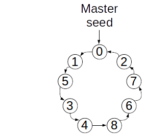
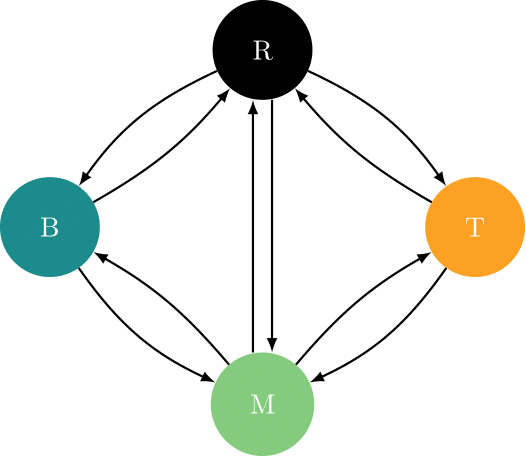

class: title-slide, middle

<style type="text/css">
  .title-slide {
    background-image: url('../assets/img/bg.jpg');
    background-color: #23373B;
    background-size: contain;
    border: 0px;
    background-position: 600px 0;
    line-height: 1;
  }
</style>

# Séance 5

<hr width="65%" align="left" size="0.3" color="orange"></hr>

## Algorithmique II

<hr width="65%" align="left" size="0.3" color="orange" style="margin-bottom:40px;"></hr>

.instructors[
  **BIO109** - Dominique Gravel
]

</img>


---

# Aujourd'hui

- Pige au hasard 
- Produire une figure
- Fonction `source()` pour charger un script
- Fonction `system.time()` pour mesurer le temps d'exécution

---
class: middle, center, inverse

# Les jeux de hasard
<hr width="65%" size="0.3" color="orange" style="margin-top:-20px;"></hr>

---
# Les jeux de hasard

<div style='text-align:center;'>
</img>
</div>

---
# Le hasard et l'écologie
## Les populations structurées par la taille

<div style='text-align:center;'>
</img>
</div>

---
# Le hasard et l'écologie
## Écologie du paysage

<div style='text-align:center;'>
</img>
</div>

---
# Le hasard et l'écologie
## Mouvement des individus
<div style='text-align:center;'>
</img>
</div>

---
# Le hasard et l'écologie
## Statistiques
<div style='text-align:center;'>
</img>
</div>

---
class: middle, center, inverse

# Application 1: échantillonner un vecteur
<hr width="65%" size="0.3" color="orange" style="margin-top:-20px;"></hr>

---
# Exemple : tirer une carte au hasard

<div style='text-align:center;'>
</img>
</div>

---
# Exemple : votre jeu de cartes sur R
## La fonction `sample()`

```{r}
valeurs <- c("2", "3", "4", "5", "6", "7", "8", "9", "10", "valet", "reine", "roi", "as")
couleurs <- rep(c("pique", "trèfle", "carreau", "coeur"), each = 13)
cartes <- paste(valeurs, "-", couleurs)
tirage <- function(n, cartes) {
    sample(x = cartes, size = n, replace = FALSE)
}
tirage(3, cartes)
```

---
# Exercice

Vous trouverez les lettres du scrabble dans le fichier [lettres.txt](./donnees/lettres.txt). Vous pouvez les charger et programmer votre fonction qui pigera au hasard les 7 lettres pour ce jeux.

---
class: middle, center, inverse

# Application 2: échantillonner une loi de probabilité

<hr width="65%" size="0.3" color="orange" style="margin-top:-20px;"></hr>

---
# Principe

Plutôt que de tirer un élément d'une série de chiffres ou de caractères, on peut échantillonner une loi de probabilité dont les propriétés sont connues. Fort heureusement, la plupart de ces lois de probabilité sont déjà programmées. Certaines sont intuitives et déjà utilisées dans des jeux de hasard.

---
# La lotto 6/49

## La loi uniforme

.pull-left[
<div style='text-align:center;'>
</img>
</div>
]

.pull-right[
```{r , out.width = '80%', dpi=300, fig.align="center"}
hist(floor(runif(n = 10000, min = 1,
  max = 50)))
```
]


---
# Le jeu de la courte paille
## La loi normale

.pull-left[
<div style='text-align:center;'>
</img>
</div>
]

```{r echo=FALSE}
set.seed(2)
```

.pull-right[
```{r, out.width = '80%', dpi=300, fig.align="center"}
hist(rnorm(n = 30, mean = 10, sd = 1))
```
]

---
# Une pièce de monnaie
## La loi binomiale

.pull-left[
<div style='text-align:center;'>
</img>
</div>
]

.pull-right[
```{r, out.width = '80%', dpi=300, fig.align="center"}
rbinom(n = 10, size = 1, prob = 0.5)
```
]

---

# Les dés
## La loi multinomiale

.pull-left[
<div style='text-align:center;'>
</img>
</div>
]

.pull-right[
```{r}
rmultinom(n = 3, size = 1,
  prob = rep(1/6, 6))
```
]


---

# La roulette russe
## La loi exponentielle

.pull-left[
<div style='text-align:center;'>
</img>
</div>
]


.pull-right[
```{r ,out.width = '60%', dpi=300, fig.align="center"}
hist(rexp(n = 1000, rate = 1/6), xlab =
  "Nombre d'essais avant de perdre")
```
]

---

# Exercice

Combien de fois obtient-on "pile" si on lance une pièce de monnaie 10 fois de suite ?

---

# Solution

On peut utiliser la loi binomiale pour simuler le nombre de fois où l'on obtient pile. On obtient alors un vecteur. On peut ensuite compter le nombre de 1 dans ce vecteur (le nombre de réussites).

```{r} 
tirages <- rbinom(n = 10, size = 1, prob = 0.5)
tirages
sum(tirages)
```

---

# Exercice

Quel est le résultat si on répète l'expérience 1000 fois ?

1. Insérez le code dans une boucle `for` pour répéter l'expérience 1000 fois.
2. Sauvez le résultat de chaque expérience dans un vecteur.
3. Utilisez la fonction `hist()` pour visualiser le résultat.

---

# Solution

```{r}
resultats <- c()
for (i in 1:1000) {
  tirages <- rbinom(n = 10, size = 1, prob = 0.5)
  resultats <- c(resultats, sum(tirages))
}
```

```{r, out.height = '300px', dpi=300, fig.align="center"}
hist(resultats, xlab = "Nombre de piles")
```

---

# Exercice

Qu'est-ce qui se passe si on ajoute `set.seed(123)` avant le tirage `rbinom` ?

---

# Solution

```{r}
resultats <- c()
for (i in 1:1000) {
  set.seed(123)
  tirages <- rbinom(n = 10, size = 1, prob = 0.5)
  resultats <- c(resultats, sum(tirages))
}
```

```{r, out.height = '300px', dpi=300, fig.align="center"}
summary(resultats, xlab = "Nombre de piles")
```

---

# Reproduire un tirage aléatoire

Les chiffres aléatoires sont générés aléatoirement... mais pas complètement !

La fonction `set.seed()` permet de reproduire des tirages aléatoires. Si on utilise la même graine, on obtient les mêmes tirages. Particulièrement utile si l'on veut reproduire les résultats d'une simulation ou d'une analyse statistique à tout coup.

<div style='text-align:center;'>
</img>
</div>

.content-box-red[Attention, il s'agit d'une simplification]

---
class: middle, center, inverse

# Application 3: prise de décision
<hr width="65%" size="0.3" color="orange" style="margin-top:-20px;"></hr>

---
# Principe
## L'épreuve de Bernoulli

- Une épreuve de Bernoulli est une expérience aléatoire (un tirage) avec deux issues : succès ou échec;
- Les épreuves sont indépendantes: l'issue d'une seconde épreuve ne dépend pas de la première;
- La probabilité de succès est représentée par le paramètre `p`, alors que la probabilité d'un échec est représentée par `1-p`;

---
# Principe
## L'épreuve de Bernoulli

**Exemple des jeux de hasard:** la pièce de monnaie

**Exemples en écologie:**

- la mortalité;
- la détermination du sexe;
- l'occurrence d'un incendie forestier;
- la contamination par un virus après le contact entre une personne infectée et une personne susceptible;

---
# Simuler un tirage de Bernoulli

Lorsque $p = 0.5$, on tire une pièce de monnaie. Mais qu'en est-il si la pièce est biasée, par exemple si la face est plus lourde et donc la probabilité d'obtenir pile est de $p = 0.55$ ?

```{r, out.height = '250px', dpi=300, fig.align="center"}
set.seed(1)
out <- numeric(10)
for (i in 1:10) {
   out[i] <- rbinom(n = 1, size = 1, prob = 0.55)
}
hist(out)
```

---
# En d'autres mots...

Si un événement aléatoire se répète suffisamment de fois, alors la fréquence de l'événement se rapproche de la probabilité de l'événement.

---
# La loi multinomiale

La situation se complique lorsqu'il y a plus que 2 résultats possibles à notre épreuve aléatoire. 

Par exemple, le conducteur peut tourner à gauche avec une probabilité de 0.25, poursuivre en ligne droite avec une probabilité de 0.5 ou encore tourner à droite avec une probabilité de 0.25.

La loi multinomiale est une généralisation de la loi binomiale qui permet d'avoir plus de 2 résultats possibles

---
# La loi multinomiale

- La somme des probabilités d'observer chacun des événements doit être obligatoirement de 1.

- Dans ce contexte, la décision est prise en comparant la valeur aléatoire à la distribution cumulative, pour chacun des événements possibles.

**Prenons la séquence de probabilités $p = \{0.25, 0.5, 0.25 \}$.**

- La distribution cumulative des événements est de $\{0.25, 0.75, 1\}$.
- La décision est prise en tirant un chiffre au hasard et en trouvant où il se situe dans cet intervalle.

---
# Exemple

```{r}
etats <- c("gauche", "ligne droite", "doite")
p <- c(0.25, 0.5, 0.25)
sum(p)

# On utilise cumsum pour calculer la probabilité cumulative
cump <- cumsum(p)
cump
```

---
# Exemple

```{r}
alea <- runif(1, 0 , 1)
alea
n_etats = 3; i <- 1; plus_petit <- FALSE
while(plus_petit == FALSE) {
    if(alea < cump[i]) {
        decision <- etats[i]
        plus_petit <- TRUE
    }
    else {
        i = i + 1
    }
}
decision
```

---
# Une façon plus rapide d'y arriver ....
## Profitons de la fonction `rmultinom()` qui simplifie les opérations

```{r}
tirage <- function(etats, p) {
    res <- rmultinom(n=1, size=1, prob=p)
    etats[which(res==1)]
}

etats <- c("A", "B", "C", "D", "E")
p <- c(0.1, 0.2, 0.3, 0.2, 0.2)

tirage(etats, p)
```

---
class: middle, center, inverse

# La fonction source
<hr width="65%" size="0.3" color="orange" style="margin-top:-20px;"></hr>

---

# La fonction source

La fonction `source()` permet d'exécuter le code contenu dans un fichier externe. 

---

# Exercice

1. Créez un fichier `exemple_source.R` contenant le code suivant :

```{r, eval=FALSE}
# ================================
# Exemple de code
# ================================
# 1. Créer des données
x <- 1:10
print(x)

y <- x^2
print(y)

# 2. Tracer la courbe
plot(x, y)
```

\2. Créez un fichier `appel_source.R` qui appelle le fichier `exemple_source.R` et faites l'addition de x et y.

---
class: middle, center, inverse

# Optimisation des scripts
<hr width="65%" size="0.3" color="orange" style="margin-top:-20px;"></hr>

---
# Optimisation

R est un langage de programmation et peut donc faire à peu près tout ce que l'on fera avec d'autres langages de programmation. Mais il a d'abord et surtout été développé pour l'analyse statistique de données. Par conséquent, il peut être assez lent pour réaliser certaines opérations.

**L'optimisation de code peut être réalisée de différentes façons:**

- Trouver les portions de code qui prennent le plus de temps ;
- Profiter de la structure de R (vectorielle) afin d'accéléer le calcul ;
- Écrire ses propres fonctions en C pour les portions les plus exigeantes ;

---
# Référence

L'optimisation est un sujet avancé que nous ne couvrirons pas en détails dans le cours. Il est recommandé cependant d'aller consulter l'excellente référence sur le sujet :

> Visser, M.D., McMahon, S.M., Merow, C., Dixon, P.M., Record, S., Jongejans., E. 2015. Speeding up ecological and evolutionary computations in R; Essentials of high performance computing for biologists. PLoS Computational Biology 11: e1004140.

---
# Calculer le temps écoulé

La fonction `system.time()` est un minimum pour tester la performance d'un code. Par exemple, on peut comparer la performance de notre fonction de tri à celle qui est native sur R.

---

# Notre fonction de tri

```{r}
tri <- function(x){
	# Calcul de la dimension du vecteur
	taille <- length(x)
	ordre <- "NON"
	# Boucle qui tourne jusqu'à ce que tout soit en ordre
	while(ordre == "NON") {
		ordre <- "OUI"
		# Boucle qui passe tous les éléments en paires
		for(i in 1:(taille-1)) {
			if(x[i+1] < x[i]) {
				# Inversion des deux lettres
				x[c(i,i+1)] <- x[c(i+1,i)]
				# Comme un changement a été fait, l'ordre
				# n'est pas encore garanti
				ordre <- "NON"
			}
		}
	}
	return(x)
}
```

---

# Comparée à la fonction sort

```{r}
x <- runif(1000)
identical(sort(x), tri(x))
system.time(sort(x))
system.time(tri(x))
```

---
# Calculer le temps écoulé

Certaines opérations peuvent dépendre de la taille de l'objet (ci-dessous, `res`)

.pull-left[
```{r eval=FALSE}
n <- 2*10^seq(1, 3, 0.1)
res <- numeric(length(n))
for(i in 1:length(res)) {
	x <- runif(n[i])
	res[i] <- system.time(tri(x))[3]
}
plot(n, res, type = "l", xlab = "Taille",
	ylab = "Temps")
```
]


.pull-right[

```{r echo=FALSE, echo=FALSE,out.width = '100%', dpi=300, fig.align="center"}
n = 2*10^seq(1,3,0.1)
res <- numeric(length(n))
for(i in 1:length(res)) {
	x <- runif(n[i])
	res[i] <- system.time(tri(x))[3]
}
plot(n, res, type = "l", xlab = "Taille", ylab = "Temps")
```

]


---
# Vectorisation

L'utilisation d'opérations vectorielles plutôt que les boucles augmente l'efficacité du code.

.pull-left[
```{r}
# Fonction avec boucle
f1 <- function(x) {
	taille <- length(x)
	x2 <- numeric(taille)
	for(i in 1:taille) {
    if(x[i] < 0.5) {
      x2[i] <- 1
    }
  }
}

# Fonction vectorisée
f2 <- function(x) {
	x2 <- x * 0
	x2[x < 0.5] <- 1
}
```
]


.pull-right[
```{r}
x <- runif(1000000)
system.time(f1(x))
system.time(f2(x))
```
]


---
# Utilisation de fonctions natives

Certaines fonctions sur R (voir Visser et al. 2015) sont optimisées. L'exemple suivant montre la puissance de la fonction `rowSums()`.

.pull-left[
```{r}
f1 <- function(x) {
	res <- numeric(ncol(x))
	for(j in 1:ncol(x)) {
		for(i in 1:nrow(x)){
			res[x] <- res[j] + x[i,j]
		}
	}
}
X <- matrix(runif(100 * 100),
  nr=100, nc=100)
```

]


.pull-right[

```{r, results="hold"}
system.time(rowSums(X))
system.time(apply(X,2,sum))
system.time(f1(X))
```
]

---
class: middle, inverse, center

# Travail final
<hr width="65%" size="0.3" color="orange" style="margin-top:-20px;"></hr>

---
# Répartition des domaines bioclimatiques

<div style='text-align:center;'>
</img>
</div>

Forêt tempérée -> forêt mixte -> forêt boréale -> rien

---
# La distribution des arbres à Sutton

<div style='text-align:center;'>
</img>
</div>

---
# Un modèle de communauté
<div style='text-align:center;'>
</img>
</div>

---
# Répartition des états

.pull-left[
<div style='text-align:center;'>
</img>
</div>
]

.pull-right[
La parcelle de Sutton peut être représentée par une matrice de composition :
<div style='text-align:center;'>
</img>
</div>
]


---
# Les différents états

- 'B' si présence de abba ou piru
- 'T' si présence de acsa ou acpe ou beal ou fagr
- 'M' si présence de (abba ou piru) et (acsa ou acpe ou beal ou fagr)
- 'R' si aucun de ces critères n'est rempli


Les données sont dans le fichier `quadrats.txt` :

```{r, echo=FALSE}
head(read.csv2("donnees/quadrats.txt"))
```


---
# La matrice de transition entre les différents états

$$
\begin{bmatrix}
P(B_{t+1}|B_t) & P(M_{t+1}|B_t) & P(T_{t+1}|B_t) & P(R_{t+1}|B_t) \\
P(B_{t+1}|M_t) & P(M_{t+1}|M_t) & P(T_{t+1}|M_t) & P(R_{t+1}|M_t) \\
P(B_{t+1}|T_t) & P(M_{t+1}|T_t) & P(T_{t+1}|T_t) & P(R_{t+1}|T_t) \\  
P(B_{t+1}|R_t) & P(M_{t+1}|R_t) & P(T_{t+1}|R_t) & P(R_{t+1}|R_t) \\
\end{bmatrix}
$$

Se lit ainsi: la rangée correspond à l'état au temps t et la colonne correspond à l'état au temps t+1. Une ligne de ce tableau correspond à un vecteur de probabilités d'une distribution multinomiale. Donc, la somme d'une rangée doit être égale à 1.

Une entrée $P(B_{t+1} | T_t)$ se lit comme "la probabilité qu'un quadrat occupé par l'état T au temps t soit occupé par l'état B au temps t+1".

---
# La matrice de transition entre les différents états

$$
\begin{bmatrix}
0.9059 & 0.0932 & 0.0000 & 0.0009 \\  
0.0004 & 0.8454 & 0.1452 & 0.0090 \\
0.0000 & 0.0350 & 0.9594 & 0.0056 \\
0.0001 & 0.0020 & 0.0011 & 0.9968 \\
\end{bmatrix}
$$

Notez que l'intervalle de temps entre deux épisodes est 5 ans.


Une entrée $P(B_{t+1} | T_t)$ se lit comme "la probabilité qu'un quadrat occupé par l'état T au temps t soit occupé par l'état B au temps t+1".

---
# Question de recherche

Quelle sera la distribution de la forêt mixte au sein de la Réserve écologique des Montagnes vertes dans 75 ans ?

---
# Données

- Distribution initiale de la végétation dans le fichier [quadrats.txt](./donnees/quadrats.txt)
- Matrice de transition entre les 4 états dans le fichier [matrice_transitions.txt](./donnees/matrice_transitions.txt)

---
# Modalités

## Remise

Le travail se réalisera en équipe de 2. Inscrire le nom des membres en commentaire sur les travaux (eg. `# auteurs: Victor Cameron, Benjamin Mercier`)

**7 février** : Un membre par équipe peut remettre une première version du pseudo-code sur Moodle avant la séance 5 pour une correction formative (qui n'est pas notée !)

**21 février** : Le travail terminal (pseudo code + programme) devra être remis sur Moodle avant le 21 février 23h59
   
---
# Modalités - Programme

Votre programme devra être remis dans un dossier `projet` qui contiendra les scripts suivants :

1. Transformer les abondances ([quadrats.txt](./donnees/quadrats.txt)) en états de départ
2. Fonction qui tire au hasard l'état au temps t+1 en fonction de l'état au temps t pour une cellule de coordonnées $[x,y]$ dans la matrice de composition `etats`
3. Fonction qui fait une simulation sur N pas de temps, pour une matrice de composition de départ `etats_0`, et retourne la composition (proportion de chaque état sur l'ensemble de la placette) pour chaque pas de temps
4. Exécuter la fonction sur 10 et 100 pas de temps et évaluer le temps de calcul avec system.time()
5. Utiliser la sortie de la fonction pour répondre aux question suivantes : 

---
# Modalités - Programme

\5. Utiliser la sortie de la fonction pour répondre aux question suivantes : 
  > i) qu'advient-il de la forêt mixte dans 25 ans ? 50 ans ? 75 ans ? <br>
  > ii) Quelle sera la composition dans 75 ans d'une forêt entièrement constituée d'un mélange de feuillus et de conifères (M) au départ ? <br>
  > iii) Présenter une figure qui représente la composition de la forêt tempérée au cours du temps (10, 25, 50, 75 ans) <br>

---
# Modalités - Pseudo-code

### 7 février

Un membre par équipe, doit remettre le pseudo-code pour les étapes 1 à 3. Inscrire `DRAW etat_t1` pour le tire au hasard de l'état au temps t+1. Faire le pseudo-code pour le reste de la fonction.

### 21 février

Un membre par équipe, doit remettre le programme et le pseudo-code pour chacune des fonctions
- Découpage en scripts séparés pour les différentes étapes. L'analyse (étapes 4-5) dans un seul script. Ce script exécute votre code, de la lecture du fichier de départ jusqu'à la production de la figure finale. 
- Moodle n'accepte qu'un seul fichier, vous pouver compresser votre répertoire de travail et remettre le fichier zip
- Attention à la reproductibilité (relire attentivement le cours 1)!

---
# Critères d'évaluation

## Pseudo-code (22%)

**Respect des bonnes pratiques enseignées**
- Les instructions sont connues et adaptées à l'utilisation
- Mise en forme correcte des instructions et variables
- Les noms de variables sont explicites

**La mise en forme adéquate d'un pseudo-code**
- Une instruction par ligne
- Le code est indenté de façon constante
- Le pseudo-code est divisé en blocs rerpésentant des algorithmes

**Justesse des processus de programmation utilisés**
- Les opérations répétées utilisent des boucles
- Les opérations logiques utilisent des déclarations conditionnelles

---

# Critères d'évaluation

## Programme (60%)

**Respect des bonnes pratiques enseignées dans le cours (40%)**

**Exécution des différentes étapes du code (40%)**
- Transformation des données sous forme d'états
- Programmation de la simulation sous forme d'une fonction ré-utilisable
- Réalisation de la simulation stochastique (tirage des transitions)
- Réalisation de la figure

**Capacité d'exécuter le code de A à Z, soit de la lecture du fichier de données jusqu'à la figure, sans intervenir (20 %)** 
- Les données d'entrées seront dans le répertoire de travail d'où sera exécuté le code - nous utiliserons la fonction `source` pour exécuter votre script d'analyse

<!-- **Reproducibilité : Structure rigoureuse du programme**
- Les scripts sont divisés en fonctions
- Le code est généralisé et indépendant des données

**Exécution : Fonctionnement adéquat du programme**
- Le programme s'exécute sans intervention de l'utilisateur autre que l'appel `source()` pour lancer la simulation
- Le programme s'exécute sans erreur ou messages d'alerte
- Le programme prend en compte les arguments pour exécuter la simulation
- Le programme produit les résulats attendus
- La simulation s'exécute sur 10 et 100 pas de temps

**Application correcte des pratiques de programmation**
- Le code est bien structuré et facile à lire
- Le code est bien commenté
- Les variables et arguments sont nommés de façon explicite -->


---

# Rappel

On peut exécuter un script (par exemple pour charger une fonction) dans un autre script avec la commande `source()`

```{r eval=FALSE}
source("ma_fonction.R")
ma_fonction(x)
```
