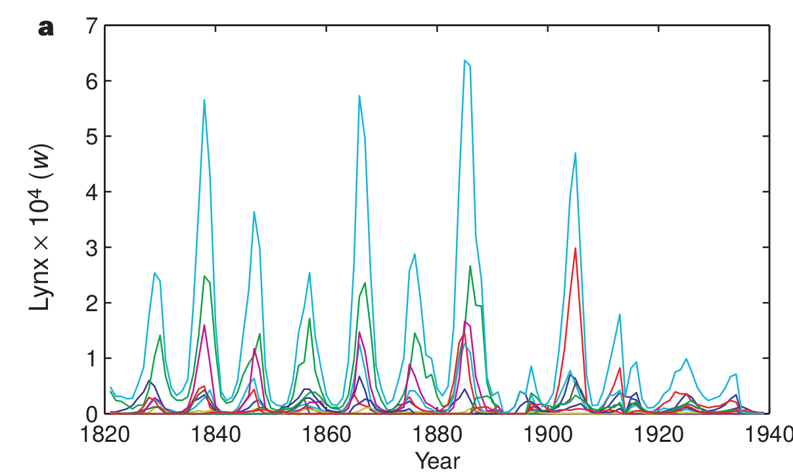
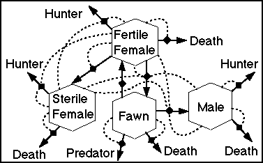
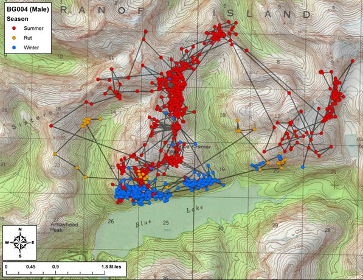
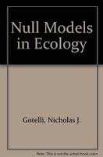
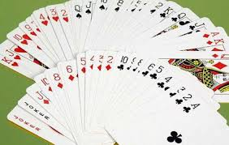
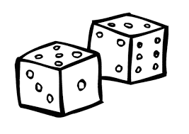
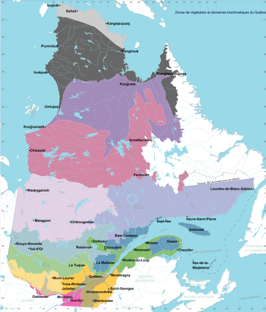
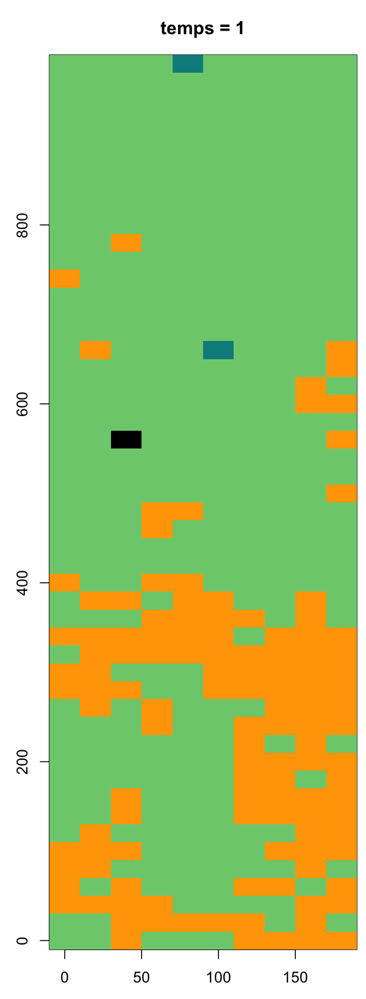
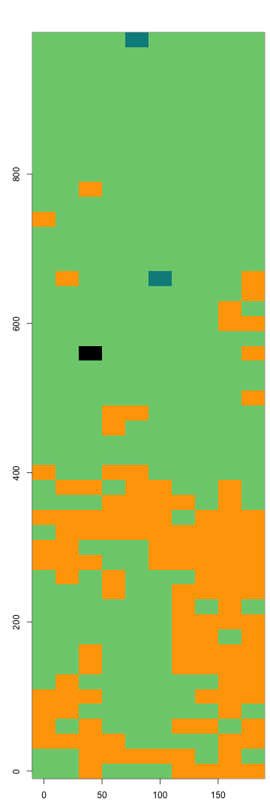

class: title-slide, middle

<style type="text/css">
  .title-slide {
    background-image: url('../assets/img/bg.jpg');
    background-color: #23373B;
    background-size: contain;
    border: 0px;
    background-position: 600px 0;
    line-height: 1;
  }
</style>

# Séance 5

<hr width="65%" align="left" size="0.3" color="orange"></hr>

## Algorithmique II

<hr width="65%" align="left" size="0.3" color="orange" style="margin-bottom:40px;"></hr>

.instructors[
  **BIO109** - Dominique Gravel
]

</img>


---
class: middle, center, inverse

# Solution du tri
<hr width="65%" size="0.3" color="orange" style="margin-top:-20px;"></hr>


---
# Solution


```{r}
tri <- function(x){
	# Calcul de la dimension du vecteur
	taille = length(x)
	ordre = "NON"
	# Boucle qui tourne jusqu'à ce que tout soit en ordre
	while(ordre == "NON") {
		ordre = "OUI"
		# Boucle qui passe tous les éléments en paires
		for(i in 1:(taille-1)) {
			if(x[i+1] < x[i]) {
				# Inversion des deux lettres
				x[c(i,i+1)] = x[c(i+1,i)]
				# Comme un changement a été fait, l'ordre
				# n'est pas encore garanti
				ordre = "NON"
			}
		}
	}
	return(x)
}
```


---
class: middle, center, inverse

# Les jeux de hasard
<hr width="65%" size="0.3" color="orange" style="margin-top:-20px;"></hr>

---
# Les jeux de hasard

<div style='text-align:center;'>
</img>
</div>

---
# Le hasard et l'écologie
## La dynamique de populations

<div style='text-align:center;'>
</img>
</div>

---
# Le hasard et l'écologie
## Les populations structurées par la taille

<div style='text-align:center;'>
</img>
</div>

---
# Le hasard et l'écologie
## Écologie du paysage

<div style='text-align:center;'>
</img>
</div>

---
# Le hasard et l'écologie
## Mouvement des individus
<div style='text-align:center;'>
</img>
</div>

---
# Le hasard et l'écologie
## Statistiques
<div style='text-align:center;'>
</img>
</div>

---
class: middle, center, inverse

# Application 1: échantillonner un vecteur
<hr width="65%" size="0.3" color="orange" style="margin-top:-20px;"></hr>

---
# Exemple : tirer une carte au hasard

<div style='text-align:center;'>
</img>
</div>

---
# Exemple : votre jeu de cartes sur R
## La fonction `sample()`

```{r}
valeurs = c("2", "3", "4", "5", "6", "7", "8", "9", "10", "valet", "reine", "roi", "as")
couleurs = rep(c("pique", "trèfle", "carreau", "coeur"),each = 13)
cartes = paste(valeurs,"-",couleurs)
tirage = function(n, cartes) {
    sample(x = cartes, size = n, replace = FALSE)
}
tirage(3, cartes)
```

---
# Exercice

Vous trouverez les lettres du scrabble dans le fichier [lettres.txt](./donnees/lettres.txt). Vous pouvez les charger et programmer votre fonction qui vous pigera au hasard les 7 lettres pour ce jeux.

---
class: middle, center, inverse

# Application 2: échantillonner une loi de probabilité

<hr width="65%" size="0.3" color="orange" style="margin-top:-20px;"></hr>

---
# Principe

Plutôt que de tirer un élément d'une série de chiffres ou de caractères, on peut échantillonner une loi de probabilité dont les propriétés sont connues. Fort heureusement, la plupart de ces lois de probabilité sont déjà programmées. Certaines sont intuitives et déjà utilisées dans des jeux de hasard.

---
# La lotto 6/49

## La loi uniforme

.pull-left[
<div style='text-align:center;'>
</img>
</div>
]

.pull-right[
```{r , out.width = '80%', dpi=300, fig.align="center"}
hist(floor(runif(n = 10000, min = 1, max = 50)))
```
]


---
# Le jeu de la courte paille
## La loi normale

.pull-left[
<div style='text-align:center;'>
</img>
</div>
]


.pull-right[
```{r, out.width = '80%', dpi=300, fig.align="center"}
hist(rnorm(n = 30, mean = 10, sd = 1))
```
]

---
# Une pièce de monnaie
## La loi binomiale

.pull-left[
<div style='text-align:center;'>
</img>
</div>
]

.pull-right[
```{r, out.width = '80%', dpi=300, fig.align="center"}
rbinom(n = 10, size = 1, prob = 0.5)
```
]

---

# Les dés
## La loi multinomiale

.pull-left[
<div style='text-align:center;'>
</img>
</div>
]

.pull-right[
```{r}
rmultinom(n = 3, size = 1, prob = rep(1/6, 6))
```
]


---

# La roulette russe
## La loi exponentielle

.pull-left[
<div style='text-align:center;'>
</img>
</div>
]


.pull-right[
```{r ,out.width = '60%', dpi=300, fig.align="center"}
hist(rexp(n = 1000, rate = 1/6),
xlab = "Nombre d'essais avant de perdre")
```
]

---
# Critères de classification des lois de probabilité

- Type de variable : continue ou discrète
- Valeurs extrêmes : bornées ou non ?
- Forme de la distribution : centrée, biaisée
- Moments: moyenne, variance, kurtosis, skewness

---
# Exercice

Une étude vous indique que la relation entre le nombre d'espèces de plantes et l'aire sur la placette de Sutton suit la relation suivante :

$$
S \sim N(\mu, \sigma)
$$

Où

$$
\mu = cA^z
$$

Vous trouvez dans la littérature des valeurs de paramètres de $c = 3$, $z = 0.15$ et $\sigma = 1.5$. Illustrez des valeurs attendues sur ce modèle pour l'interval de $A = [20, 20 000]$ correspondant à la dimension de la placette.

---
# Solution

.pull-left[
```{r, eval=FALSE}
A = 2*10^seq(1, 4, length.out = 15)
c = 3
z = 0.15
S = rnorm(15, mean = c*A^z, sd = 1.5)

plot(A, S, xlab = "Aire (m2)", ylab = "Richesse",
  log = "xy")
```
]

.pull-right[
```{r, echo=FALSE,out.width = '100%', dpi=300, fig.align="center"}
A = 2*10^seq(1, 4, length.out = 15)
c = 3
z = 0.15
S = rnorm(15, mean = c*A^z, sd = 1.5)
plot(A, S, xlab = "Aire (m2)", ylab = "Richesse",
  log = "xy")
```
]


---
class: middle, center, inverse

# Application 3: prise de décision
<hr width="65%" size="0.3" color="orange" style="margin-top:-20px;"></hr>

---
# Principe
## L'épreuve de Bernoulli

- Une épreuve de Bernoulli est une expérience aléatoire (un tirage) avec deux issues : succès ou échec;
- Les épreuves sont indépendantes: l'issue d'une seconde épreuve ne dépend pas de la première;
- La probabilité de succès est représentée par le paramètre `p`, alors que la probabilité d'un échec est représentée par `1-p`;

---
# Principe
## L'épreuve de Bernoulli

**Exemple des jeux de hasard:** la pièce de monnaie

**Exemples en écologie:**

- la mortalité;
- la détermination du sexe;
- l'occurrence d'un incendie forestier;
- la contamination par un virus après le contact entre une personne infectée et une personne susceptible;

---
# Simuler un tirage de Bernoulli

Lorsque $p = 0.5$, on tire une pièce de monnaie. Mais qu'en est-il si la pièce est biasée, par exemple si la face est plus lourde et donc la probabilité d'obtenir pile est de $p = 0.55$ ?

```{r}
set.seed(1)
p <- 0.55
alea <- runif(n = 1, min = 0, max = 1)
if(alea < p) res = "pile" else res = "face"
res
```

---
# En d'autres mots...

Si $U$ est une variable aléatoire distribuée selon la loi uniforme entre 0 et 1, alors la chance que $U < p$ est exactement de valeur $p$. Si on réalise $n$ tirage, alors l'espérance du nombre de succès est exactement $np$.

---

# Un exemple vaut mille mots

- Tirez au hasard 1000 chiffres de la loi uniforme bornée entre 0 et 1
- Créez un vecteur 'res' rempli de 0 et de 1000 unités de longueur
- Pour chaque valeur de la séquence, évaluez si le chiffre est plus petit que la valeur seuil de $p = 0.2$. Si la valeur est plus petite, inscrivez 1 dans le vecteur 'res' à la position correspondante
- Combien de fois est-ce que la valeur est inférieure à $p$ ?
- Essayez à nouveau et comparez.

---
# Un exercice est encore plus efficace...

Vous observez une personne ivre à la sortie d'un bar prendre sa voiture. Vous appelez la police pour l'avertir. Estimez la distance parcourue par ce conducteur en 10 minutes, sachant que :

- Le quartier où vous vous trouvez est un plan cartésien parfait (une grille régulière) composé de blocs de 250 m;
- À chaque intersection, votre conducteur ivre tourne à gauche ou à droite avec une probabilité de 0.5;
- Il faut environ 30 secondes à votre conducteur pour parcourir la distance entre deux arrêts.

Calculez la distance parcourue en X et en Y, puis reprenez votre calcul une centaine de fois pour estimer la distance moyenne parcourue (à vol d'oiseau).

---
# Solution

.pull-left[

```{r}
nsteps = 20
xy = matrix(0,nr = 21, nc = 2)
xy[1,] = c(0,0)
direction = 0
set.seed(2)
for(step in 2:(nsteps+1)) {
    # Ḑe quel côté tourner ?
    if(runif(1,0,1) < 0.5) {
      # Tourne à droite
      direction = direction + pi/2 
    }
    else {
      # Tourne à gauche  
      direction = direction - pi/2
    }
    # Calcul des nouvelles coordonnées
    xy[step,1] = xy[step-1,1] + sin(direction)*250 
    xy[step,2] = xy[step-1,2] + cos(direction)*250 
}
```
]


.pull-right[
```{r, echo=FALSE,out.width = '100%', dpi=300, fig.align="center"}
plot(xy[,1],xy[,2], type = "l", xlim = c(-2000,2000),ylim = c(-2000,2000),
    xlab = "X", ylab = "Y")
points(xy[,1],xy[,2],pch = 19)
```
]


---
# La loi multinomiale

La situation se complique lorsqu'il y a plus que 2 résultats possibles à notre épreuve aléatoire. Par exemple, le conducteur peut tourner à gauche avec une probabilité de 0.25, poursuivre en ligne droite avec une probabilité de 0.5 ou encore tourner à droite avec une probabilité de 0.25.

La loi multinomiale est une généralisation de la loi binomiale qui permet d'avoir plus de 2 résultats possibles

---
# La loi multinomiale

- La somme des probabilités d'observer chacun des événements doit être obligatoirement de 1.

- Dans ce contexte, la décision est prise en comparant la valeur aléatoire à la distribution cumulative, pour chacun des événements possibles.

**Prenons la séquence de probabilités $p = \{0.25, 0.5, 0.25 \}$.**

- La distribution cumulative des événements est de $\{0.25, 0.75, 1\}$.
- La décision est prise en tirant un chiffre au hasard et en trouvant où il se situe dans cet intervalle.

---
# Exemple

```{r}
etats <- c("A", "B", "C", "D", "E")
p = c(0.1, 0.5, 0.2, 0.05, 0.15)
sum(p)

# On utilise cumsum pour calculer la probabilité cumulative
cump <- cumsum(p)
cump
```

---
# Exemple

```{r}
alea <- runif(1,0,1)
alea
n_etats <- 5; i = 1; plus_petit = FALSE
while(plus_petit == FALSE) {
    if(alea < cump[i]) {
        decision = etats[i]
        plus_petit = TRUE
    }
    else {
        i = i + 1
    }
}
decision
```

---
# Une façon plus rapide d'y arriver ....
## Profitons de la fonction `rmultinom()` qui simplifie les opérations

```{r}
tirage <- function(p) {
    etats <- c("A", "B", "C", "D", "E")
    res <- rmultinom(n=1,size=1,prob=p)
    etats[which(res==1)]
}
tirage(p)
```

---
# Exemple intégrateur

Le modèle de lotterie est à la base de nombreuses théories en écologie. Le travail final de ce cours en sera d'ailleurs fortement inspiré.

Imaginez une forêt où un nombre limité d'arbres peuvent atteindre la canopée. Ce nombre est constant dans le temps puisque, lorsque survient une petite perturbation qui crée une ouverture, un seul individu viendra remplacer l'arbre qui est mort.

---
# Exemple intégrateur

Le nom de "lotterie" vient de la façon dont s'effectue le recrutement. Imaginez que l'on place une trappe à graines au centre de l'ouverture et que l'on pige une semence au hasard dans cette trappe, pour la placer ensuite dans le sol. La probabilité de recrutement d'une espèce, $p_i$, est tout simplement égale à son abondance relative dans la forêt avoisinante, soit $N_i /K$, où $N_i$ est le nombre d'individus de l'espèce $i$ et $K$ est le nombre total d'individus dans la forêt.


---
# Exemple intégrateur

Le vecteur $N$ représente le nombre d'individu de chaque espèce. Les étapes de la simulation du modèle de lotterie sont les suivantes, à chaque pas de temps :

- Identification de quel arbre meurt (on en pige un seul au hasard parmi les $K$ arbres)
- Retrait d'un individu de cette espèce ($N_i-1$)
- Calcul de l'abondance relative de chaque espèce ($N_i /K$).
- Identification de l'espèce recrutée
- Ajout d'un individu de cette espèce ($N_i+1$)

---
# Solution

```{r}
nsteps <- 1000
S <- 5
K <- 100
N <- matrix(nr = nsteps, nc = S)

# Une fonction utile pour faire des tirages
# Elle retourne la position de l'espèce pigée au hasard
tirage  <- function(p) {
    res <- rmultinom(n=1,size=1,prob=p)
    return(which(res==1))
}
```

---
# Solution

```{r}
# On démarre la simulation avec 20 individus par espèce
N[1,] =rep(K/S, S)

# La boucle principale
for(step in 2:nsteps) {

    # Calcul de l'abondance relative
    p = N[step-1,] / K

    # On tire l'identité de l'espèce qui meurt
    ID_mort = tirage(p)

    # On applique le changement
    N[step,] = N[step-1,]
    N[step,ID_mort] = N[step,ID_mort] - 1

    # On tire l'identité de la recrue
    ID_recrue = tirage(p)
    N[step,ID_recrue] = N[step,ID_recrue] + 1
}
```

---
# Solution

```{r, echo=FALSE,out.width = '55%', dpi=300, fig.align="center"}
# Illustration des résultats
plot(c(1:nsteps), N[,1], type = "l", ylim = c(0,K),
    xlab = "Temps", ylab = "Densité")
for(i in 2:S) lines(c(1:nsteps), N[,i])
```


---
class: middle, center, inverse

# Optimisation des scripts
<hr width="65%" size="0.3" color="orange" style="margin-top:-20px;"></hr>

---
# Optimisation

R est un langage de programmation et peut donc faire à peu près tout ce que l'on fera avec d'autres langages de programmation. Mais il a d'abord et surtout été développé pour l'analyse statistique de données. Par conséquent, il peut être assez lent pour réaliser certaines opérations.

**L'optimisation de code peut être réalisée de différentes façons:**

- Trouver les portions de code qui prennent le plus de temps ;
- Profiter de la structure de R (vectorielle) afin d'accéléer le calcul ;
- Écrire ses propres fonctions en C pour les portions les plus exigeantes ;

---
# Référence

L'optimisation est un sujet avancé que nous ne couvrirons pas en détails dans le cours. Il est recommandé cependant d'aller consulter l'excellente référence sur le sujet :

> Visser, M.D., McMahon, S.M., Merow, C., Dixon, P.M., Record, S., Jongejans., E. 2015. Speeding up ecological and evolutionary computations in R; Essentials of high performance computing for biologists. PLoS Computational Biology 11: e1004140.

---
# Calculer le temps écoulé

La fonction `system.time()` est un minimum pour tester la performance d'un code. Par exemple, on peut comparer la performance de notre fonction de tri à celle qui est native sur R.


```{r}
x = runif(1000)
system.time(sort(x))
system.time(tri(x))

```

---
# Calculer le temps écoulé

Certaines opérations peuvent dépendre de la taille de l'objet (ci-dessous, `res`)

.pull-left[
```{r eval=FALSE}
n = 2*10^seq(1,3,0.1)
res = numeric(length(n))
for(i in 1:length(res)) {
	x = runif(n[i])
	res[i] = system.time(tri(x))[3]
}
plot(n,res, type = "l", xlab = "Taille",
	ylab = "Temps")
```
]


.pull-right[

```{r echo=FALSE, echo=FALSE,out.width = '100%', dpi=300, fig.align="center"}
n = 2*10^seq(1,3,0.1)
res = numeric(length(n))
for(i in 1:length(res)) {
	x = runif(n[i])
	res[i] = system.time(tri(x))[3]
}
plot(n,res, type = "l", xlab = "Taille", ylab = "Temps")
```

]


---
# Vectorisation

L'utilisation d'opérations vectorielles plutôt que les boucles augmente l'efficacité du code.

.pull-left[
```{r}
f1 <- function(x) {
	taille <- length(x)
	x2 <- numeric(taille)
	for(i in 1:taille) if(x[i] < 0.5) x2[i] <- 1
}
f2 <- function(x) {
	x2 <- x*0
	x2[x<0.5] <- 1
}
```
]


.pull-right[
```{r}
x = runif(1000000)
system.time(f1(x))
system.time(f2(x))
```
]


---
# Utilisation de fonctions natives

Certaines fonctions sur R (voir Visser et al. 2015) sont optimisées. L'exemple suivant montre la puissance de la fonction `rowSums()`.

.pull-left[
```{r}
f1 <- function(x) {
	res <- numeric(ncol(x))
	for(j in 1:ncol(x)) {
		for(i in 1:nrow(x)){
			res[x] = res[j] + x[i,j]
		}
	}
}
X = matrix(runif(100*100),nr=100,nc=100)
```

]


.pull-right[

```{r, results="hold"}
system.time(rowSums(X))
system.time(apply(X,2,sum))
system.time(f1(X))
```
]


---
class: middle, inverse, center

# Exercice final
<hr width="65%" size="0.3" color="orange" style="margin-top:-20px;"></hr>

---
# Répartition des domaines bioclimatiques

<div style='text-align:center;'>
</img>
</div>

---
# La distribution des arbres à Sutton

<div style='text-align:center;'>
</img>
</div>

---
# Un modèle de communauté
<div style='text-align:center;'>
</img>
</div>

---
# Répartition des états

.pull-left[
<div style='text-align:center;'>
</img>
</div>
]

.pull-right[
<div style='text-align:center;'>
</img>
</div>
]


---
# Les différents états

- 'B' si présence de abba ou piru
- 'T' si présence de acsa ou beal ou fagr
- 'M' si présence de (abba ou piru) et (acsa ou beal ou fagr)
- 'R' si aucun de ces critères n'est rempli

---

# Le code pour générer la figure

.pull-left[
```{r eval = FALSE}
coordx <- seq(0,180,20)
coordy <- seq(0,980,20)
paysage <- tapply(etats,INDEX = quadrats[,c(1:2)],sum)
par(mar = c(4,4,3,0.5))
image(x=coordx,y=coordy,z=paysage,xlab=NULL,ylab=NULL,
	col=c("black","orange","darkcyan","palegreen3"))
```

]


.pull-right[
<div style='text-align:center;'>
</img>
</div>
]


---
# La matrice de transition entre les différents états

$$
\begin{bmatrix}
P(B_{t+1}|B_t) & P(M_{t+1}|B_t) & P(T_{t+1}|B_t) & P(R_{t+1}|B_t) \\
P(B_{t+1}|M_t) & P(M_{t+1}|M_t) & P(T_{t+1}|M_t) & P(R_{t+1}|M_t) \\
P(B_{t+1}|T_t) & P(M_{t+1}|T_t) & P(T_{t+1}|T_t) & P(R_{t+1}|T_t) \\  
P(B_{t+1}|R_t) & P(M_{t+1}|R_t) & P(T_{t+1}|R_t) & P(R_{t+1}|R_t) \\
\end{bmatrix}
$$

Se lit ainsi: la rangée correspond à l'état au temps t et la colonne correspond à l'état au temps t+1. Une ligne de ce tableau correspond à un vecteur de probabilités d'une distribution multinomiale. Donc, la somme d'une rangée doit être égale à 1.

---
# La matrice de transition entre les différents états

$$
\begin{bmatrix}
0.9225 & 0.0766 & 0.0000 & 0.0009 \\  
0.0004 & 0.8552 & 0.1354 & 0.0090 \\
0.0000 & 0.0350 & 0.9243 & 0.0407 \\
0.0001 & 0.0020 & 0.0011 & 0.9968 \\
\end{bmatrix}
$$

Notez que l'intervalle de temps entre deux épisodes est 5 ans.


Une entrée $P(B_{t+1} | T_t)$ se lit comme "la probabilité qu'un quadrat occupé par l'état T au temps t soit occupé par l'état B au temps t+1".

---
# ATTENTION !

Bien qu'il y ait de nombreuses similarités avec le modèle de lotterie, il ne s'agit pas du même modèle. Ainsi, les étapes de mortalité et de recrutement sont combinées dans une seule étape où sont remplacés automatiquement les états d'un pas de temps à l'autre et où les probabilités sont toujours les mêmes (elles ne changent pas avec l'abondance relative).

---
# Question de recherche

Quelle sera la distribution de la forêt tempérée au sein de la Réserve écologique des Montagnes vertes dans 100 ans ?

---
# Données

- Distribution initiale de la végétation dans le fichier [quadrats.txt](./donnees/quadrats.txt)
- Matrice de transition entre les 4 états dans le fichier [matrice_transitions.txt](./donnees/matrice_transitions.txt)

---
# Étapes du travail

- Transformer les abondances en états de départ
- Préparer une fonction qui tire au hasard l'état au temps t+1 en fonction de l'état au temps t
- Préparer une fonction qui fait une simulation sur N pas de temps et enregistre la composition (proportion de chaque état sur l'ensemble de la placette) à chaque pas de temps
- Exécuter la fonction sur 10 et 100 pas de temps et évaluer le temps de calcul
- Utiliser la sortie de la fonction pour répondre à deux questions au moyen d'une figure :
	i) est-ce que les espèces de conifères seront toujours présentes dans le futur ?
	ii) combien de temps sera nécessaire pour que la composition de la forêt atteigne l'équilibre (soit constante) ?

---
# Modalités

- Le travail se réalisera en équipe de 4
- Le travail doit être remis **électroniquement** au plus tard le 18 février 23:59 sur Moodle
- Vous devez remettre:
	- Le pseudo-code pour la fonction principale qui réalise votre simulation (le pseudo code peut être inscrit sous forme de commentaire dans le script)
	- Le script qui exécute votre code, de la lecture du fichier de départ jusqu'à la production des figures. 
- Attention à la reproductibilité !

---
# Critères d'évaluation

- Respect des bonnes pratiques enseignées dans le cours (40%)
- Exécution des différentes étapes du code (40%):
	+ Transformation des données sous forme d'états
	+ Programmation de la simulation sous forme d'une fonction ré-utilisable
	+ Réalisation de la simulation stochastique (tirage des transitions)
	+ Réalisation de la figure
- Capacité d'exécuter le code de A à Z, soit de la lecture du fichier de données jusqu'à la figure, sans intervenir (20 %). [les données d'entrées seront dans le répertoire de travail d'où sera exécuté le code]