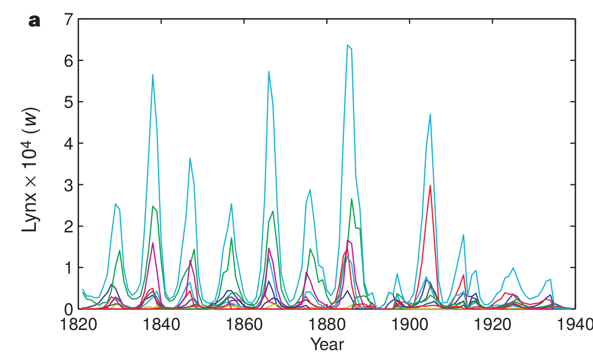
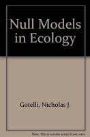
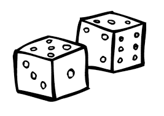

# Les jeux de hasard

<div style='text-align:center;'>
</img>
</div>

---
# Le hasard et l'écologie
## La dynamique de populations

<div style='text-align:center;'>
</img>
</div>

---
# Le hasard et l'écologie
## Les populations structurées par la taille

<div style='text-align:center;'>
</img>
</div>

---
# Le hasard et l'écologie
## Écologie du paysage

<div style='text-align:center;'>
</img>
</div>

---
# Le hasard et l'écologie
## Mouvement des individus
<div style='text-align:center;'>
</img>
</div>

---
# Le hasard et l'écologie
## Statistiques
<div style='text-align:center;'>
</img>
</div>

--- .transition
# Application 1: échantillonner un vecteur

---
# Exemple : tirer une carte au hasard

<div style='text-align:center;'>
</img>
</div>

---
# Exemple : votre jeu de cartes sur R
## La fonction 'sample()'

```{r}
valeurs = c("2", "3", "4", "5", "6", "7", "8", "9", "10", "valet", "reine", "roi", "as")
couleurs = rep(c("pique", "trèfle", "carreau", "coeur"),each = 13)
cartes = paste(valeurs,"-",couleurs)
tirage = function(n, cartes) {
    sample(x = cartes, size = n, replace = FALSE)
}
tirage(3, cartes)
```

---
# Exercice

Vous trouverez les lettres du scrabble dans le fichier 'lettres.txt'. Vous pouvez les charger et programmer votre fonction qui vous pigera au hasrad les 7 lettres pour ce jeux.

--- .transition
# Application 2: échantillonner une loi de probabilité

---
# Principe

Plutôt que de tirer un élément d'une série de chiffres ou de caractères, on peut échantillonner une loi de probabilité dont les propriétés sont connues. Fort heureusement, la plupart de ces lois de probabilité sont connues. Certaines sont intuitives et déjà utilisées dans des jeux de hasard.

--- &twocolw w1:40% w2:60%

# La lotto 6/49
## La loi uniforme

*** =left

<div style='text-align:center;'>
</img>
</div>

*** =right

```{r fig.width=100%, res=300}
hist(runif(n = 10000, min = 1, max = 50))
```

--- &twocol
# Le jeu de la courte paille
## La loi normale

*** =left

<div style='text-align:center;'>
</img>
</div>

*** =right

```{r}
hist(rnorm(n = 10000, mean = 0, sd = 1))
```

--- &twocol
# Une pièce de monnaie
## La loi binomiale

*** =left

<div style='text-align:center;'>
</img>
</div>

*** =right

```{r}
rbinom(n = 10, size = 1, prob = 0.5)
```

--- &twocol
# Les dés
## La loi multinomiale

*** =left

<div style='text-align:center;'>
</img>
</div>

*** =right

```{r}
rmultinom(n = 3, size = 1, prob = rep(1/6, 6))
```

--- &twocol
# La roulette russe
## La loi exponentielle

*** =left

<div style='text-align:center;'>
</img>
</div>

*** =right

```{r}
hist(rexp(n = 1000, rate = 1/6), xlab = "Espérance du nombre d'essais")
```

---
# Critères de classification des lois de probabilité

- Type de variable : continue ou discrète
- Valeurs extrêmes : bornées ou non ?
- Forme de la distribution : centrée, biaisée
- Moments: moyenne, variance, kurtosis, skewness

---
# Exercice

Une étude vous indique que la relation entre le nombre d'espèces de plantes et l'aire sur la placette de Sutton suit la relation suivante :

$$
S ~ N(\mu, \sigma)
$$

Où

$$
\mu = cA^z
$$

Vous trouvez dans la littérature des valeurs de paramètres de $c = 3$, $z = 0.15$ et $\sigma = 1.5$. Illustrez des valeurs attendues sur ce modèle pour l'interval de $A = [20,20 000]$ correspondant à la dimension de la placette.

--- .transition
# Application 3: prise de décision

---
# Principe
## L'épreuve de Bernoulli

- Une épreuve de Bernoulli est une expérience aléatoire (un tirage) avec deux issus : succès ou échec.
- Les épreuves sont indépendantes; l'issue d'une seconde épreuve ne dépend pas de la première ;
- La probabilité de succès est représentée par le paramètre 'p', alors que la probabilité d'un échec est représentée par '1-p'

---
# Principe
## L'épreuve de Bernoulli

Exemple des jeux de hasard : la pièce de monnaie

Exemples en écologie :
- la mortalité
- la détermination du sexe
- l'occurrence d'un incendie forestier
- la contamination par un virus après le contact entre une personne infectée et une personne susceptible

---
# Simuler un Bernoulli

Lorsque $p = 0.5$, on tire une pièce de monnaie. Mais qu'en est-il si la pièce est biasée, par exemple si la face est plus lourde et donc la probabilité d'obtenir pile est de $p = 0.55$ ?

```{r}
set.seed(1)
p <- 0.55
alea <- runif(n = 1, min = 0, max = 1)
if(alea < p) res = "pile" else res = "face"
res
```

---
# En d'autres mots...

Si 'U' est une variable aléatoire distribuée selon la loi uniforme entre 0 et 1, alors la chance que $U < p/$ est exactement de valeur $p$. Si on réalise $n$ tirage, alors l'espérance du nombre de succès est exactement $np$.

---
# Un exemple vaut mille mots

- Tirez au hasard 1000 chiffres de la loi uniforme bornée entre 0 et 1
- Créez un vecteur 'res' rempli de 0 de 1000 unités de longueur
- Pour chaque valeur de la séquence, évaluez si le chiffre est plus petit que la valeur seuil de $p = 0.2$. Si la valeur est plus petite, inscrivez 1 dans le vecteur 'res' à la position correspondante
- Combien de fois est-ce que la valeur est inférieure à $p$ ?
- Essayez à nouveau et comparez.

---
# Un exercice est encore plus efficace...

Vous observez une personne ivre à la sortie d'un bar prendre sa voiture. Vous appelez la police pour l'avertir. Estimez la distance parcourue par ce conducteur en 10 minutes, sachant que :
- Le quartier où vous vous trouvez est un plan cartésien parfait (une grille régulière) composé de blocs de 250 m;
- À chaque intersection, votre conducteur ivre tourne à gauche ou à droite avec une probabilité de 0.5 puis avance jusqu'à la prochaine intersection;
- Il faut environ 30 secondes à votre conducteur pour parcourir la distance entre deux arrêts.

Calculez la distance parcourue en X et en Y, puis reprenez votre calcul une centaine de fois pour estimée la distance moyenne parcourue (à vol d'oiseau).

---
# La loi multinomiale

La situation se complique lorsqu'il y a plus que 2 résultats possibles à notre épreuve aléatoire. Par exemple, le conducteur peut tourner à gauche avec une probabilité de 0.25, poursuivre en ligne droite avec une probabilité de 0.5 ou encore tourner à droite avec une probabilité de 0.25.

Prenez le temps d'imaginer comment vous pourriez simuler ce phénomène.

---
# La loi multinomiale

La loi multinomiale est une généralisation de la loi binomiale. La somme des probabilités d'observer chacun des événements doit être obligatoirement de 1.

Dans ce contexte, la décision est prise en comparant la valeur aléatoire à la distribution cumulative, pour chacun des événements possibles.

Prenons la séquence de probabilités $p = {0.25, 0.5, 0.25}$.

La distribution cumulative des événements est de ${0.25, 0.75, 1}$. La décision est prise en tirant un chiffre au hasard et en trouvant où il se situe dans cet intervalle.

---
# Exemple

```{r}
etats <- c("A", "B", "C", "D", "E")
p = c(0.1, 0.5, 0.2, 0.05, 0.15)
sum(p)

# On utilise cumsum pour calculer la probabilité cumulative
cump <- cumsum(p)
cump
```

---
# Exemple

```{r}
alea <- runif(1,0,1)
alea
n_etats <- 5
i = 1
plus_petit = FALSE
while(plus_petit == FALSE) {
    if(alea < cump[i]) {
        decision = etats[i]
        plus_petit = TRUE
    }
    else {
        i = i + 1
    }
}
decision
```

---
# Une façon plus rapide d'y arriver ....
## Profitons de la fonction rmultinom qui simplifie les opérations

```{r}
tirage <- function(p) {
    etats <- c("A", "B", "C", "D", "E")
    tirage <- rmultinom(n=1,size=1,prob=p)
    etats[which(tirage==1)]
}
tirage(p)
```

---
# Exercice intégrateur
## Le modèle de lotterie

Le modèle de lotterie est à la base de nombreuses théories en écologie. Le travail final de ce cours en sera d'ailleurs fortement inspiré.

Imaginez une forêt où un nombre limité d'arbres peuvent atteindre la canopée. ce nombre est constant dans le temps puisque lorsque survient une petite perturbation qui crée une ouverture, un individu vient remplacer l'arbre qui est mort.

Le nom de 'lotterie' vient de la façon dont s'effectue le recrutement. Imaginez que l'on place une trappe à graines au centre de l'ouverture et que l'on pige une semence au hasard dans cette trappe, pour la placer ensuite dans le sol. La probabilité de recrutement d'une espèce, $p_i$, est tout simplement égale à sont abondance relative dans la forêt avoisinage, soit $P_i = N_i /K$, où $N_i$ est le nombre d'individus de l'espèce $i$ et $K$ est le nombre total d'individus dans la forêt.

---
# Exercice intégrateur
## Le modèle de lotterie

Le vecteur N représente le nombre d'individu de chaque espèce. Les étapes de la simulation du modèle de lotterie sont les suivantes, à chaque pas de temps :

- identification de quel arbre meurt (on en pige un seul au hasard parmi les K arbres)
- retrait d'un individu de cette espèce de N
- calcul de l'abondance relative de chaque espèce.
- identification de l'espèce recrutée
- ajout d'un individu de cette espèce à N

Commencez par tester un seul pas de temps. Si ça marche, continuez sur 1000 pas de temps, et enregistrer le changement des abondances relatives au fil du temps. On commence la simulation avec 5 espèces et 100 individus, toutes à abondance égale.
---

- Optimisation des scripts
- Utilité : lorsque le temps de calcul devient long, peut être utile d'évaluer la performance de certaines sections de code
- Calculer le temps pour réaliser une fonction
- Exemple : comparaison de l'efficacité d'une boucle versus de la structure vectorielle
	- fonction1: avec boucle
	- fonction2: avec vecteur
- Exercice : comparer l'efficacité de la fonction sort() vs la fonction sort_scrabble() du cours précédent
